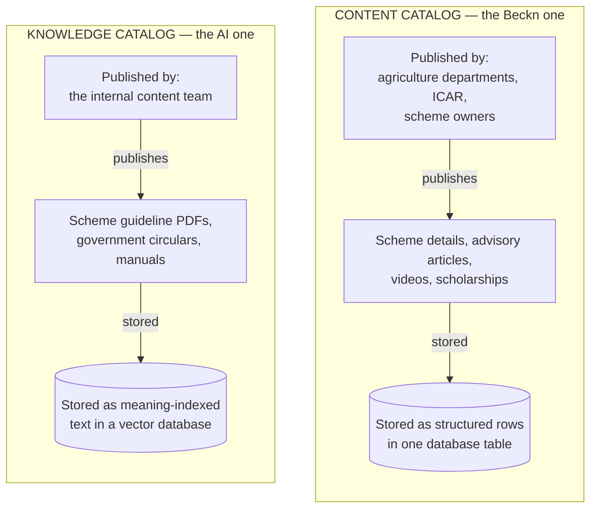
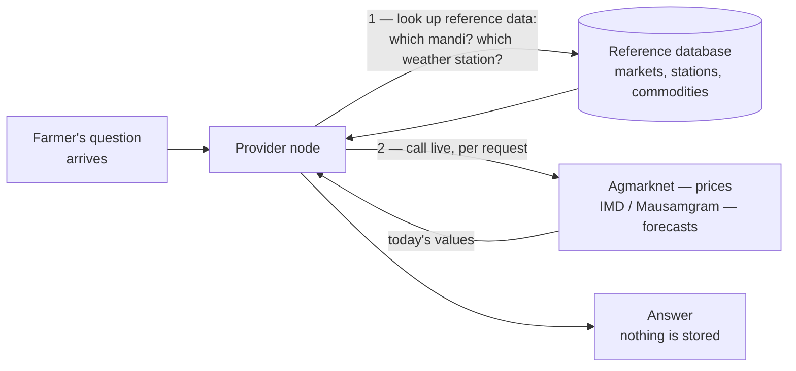
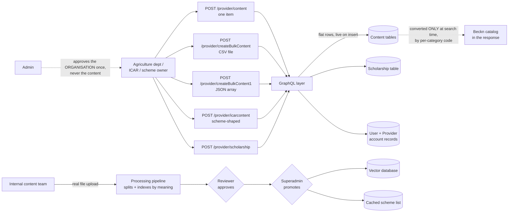
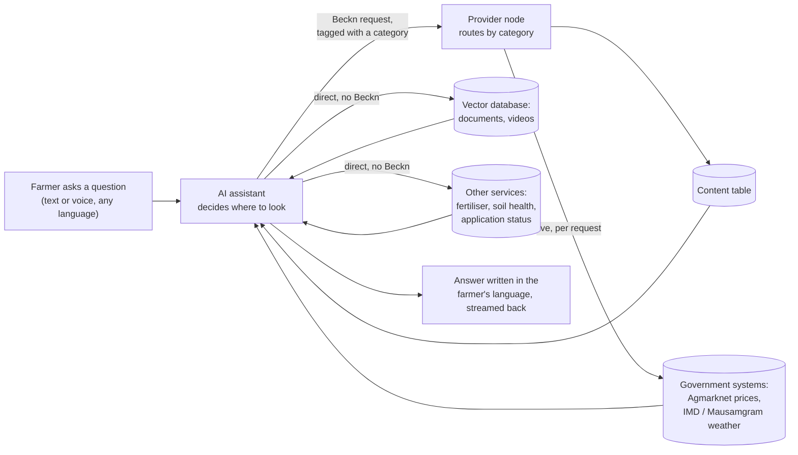

# OpenAgriNet — How publish and discover work

A plain-language explanation of how the platform works today, written as the baseline for moving onto the current Beckn protocol.

---

## 1. The three products

All three are the same thing wearing different clothes: an **AI assistant that answers farmers' questions** in their own language, by voice or text. They are built from one common codebase and then customised.

| | **BharatVistaar** | **MahaVistaar** | **Amul** |
|---|---|---|---|
| Who uses it | Farmers nationally, via central and state agriculture departments | Farmers in Maharashtra, under the state's POCRA programme | Dairy farmers in the Amul network |
| How they reach it | Website and Android/iOS app | Website and iOS app | Mostly by **phone call**, in Gujarati |
| What it answers | Schemes, crop advice, mandi prices, weather, insurance, fertiliser guidance | Same, focused on Maharashtra schemes | Dairy and farming guidance |
| Runs its own provider node | **Yes** | No — uses a shared node run elsewhere | No |
| Uses the Beckn network | Yes | Yes | **Yes** — as a client of others |

**The short version:** BharatVistaar is the full implementation and the only one operating its own provider node. MahaVistaar is a state variant. Amul is voice-first and dairy-specific.

**They also call each other.** All three are Beckn clients of one another — MahaVistaar can query BharatVistaar, BharatVistaar can query MahaVistaar, and Amul gets its weather, mandi prices and scheme information by querying the Vistaar network rather than building its own. So "is X on the network" has two answers: whether it *operates* a node, and whether it *uses* one. Only BharatVistaar does the first; all three do the second.

---

## 2. Start here: three sources of answers

Every answer a farmer gets comes from one of three places. Two of them are catalogs — someone publishes into them and the content sits there until searched. The third has no catalog behind it at all.

| | **Content catalog** | **Knowledge catalog** | **Live data** |
|---|---|---|---|
| Who publishes | agriculture departments, ICAR, scheme owners | the internal content team | **nobody** |
| What | scheme details, advisory articles, videos, scholarships | scheme guideline PDFs, circulars, manuals | mandi prices, weather forecasts |
| Approval | organisation approved once, content never checked | two humans, in sequence | not applicable |
| Stored | yes — structured rows | yes — meaning-indexed passages | **no** — only reference data |
| Searched by | matching on category and fields | closeness of meaning | fetched fresh per request |

**Why live data isn't called a catalog:** nothing is ever published into it and no answer is kept. Today's tomato price exists only for the duration of one request. What *is* stored is the lookup table behind it — which markets exist, which weather stations exist, which commodity names are valid — and that does need maintaining. So it's a live proxy with a reference table in front, not a catalog.

It matters for the redesign because the three behave differently under Beckn: catalogs can be published and cached, live data cannot.

**The two catalogs.** Something is published, it is stored, it is searched later.



They have **different publishers, different approval rules, different storage, and completely different search mechanics**. A request to "add a new scheme to the catalog" means two different jobs depending on which one is meant.

**And the third source, drawn out.** When a farmer asks, the provider node calls the government system and passes back whatever it says:



---

## 3. Publish — what goes in, and how

### The content catalog

**Who publishes.** External organisations — state agriculture departments, ICAR, scheme-owning bodies. They register, an admin approves the account, and they get a login.

**The four ways to publish content.** All four write to the same place. They differ only in what you hand over:

| Route | You send | Notes |
|---|---|---|
| `POST /provider/content` | one item as JSON | the normal path |
| `POST /provider/createBulkContent` | a **CSV file** | bulk load — the spreadsheet version of the above |
| `POST /provider/createBulkContent1` | a JSON array | same job as the CSV route, different input format |
| `POST /provider/icarcontent` | one item, scheme-shaped | adds scheme fields like eligibility and benefits |

Two of those four are the same operation with different wrappers. There is no reason a publisher needs to know which to pick beyond "do I have a file or not."

**Scholarships are separate.** `POST /provider/scholarship` has its own 23-field shape — amount, deadline, eligibility, selection criteria, contact — and its own table. It is not content.

**Supporting routes:** `POST /provider/collection` and `/contentCollection` group items together; `POST /provider/uploadImage` uploads a thumbnail. Edit and delete variants exist for each.

**What actually gets published.** Not the content itself — a *pointer* to it:

| Type | What the node receives | What the node keeps |
|---|---|---|
| Advisory article | title, description, category, language, **link** | metadata + link |
| PDF | same | metadata + link — **the file stays on the publisher's server** |
| Video | same | metadata + link |
| Scheme listing | scheme fields + link | fields + link |

Only thumbnails are genuinely uploaded. Everything else is a URL, and **nothing checks those URLs.** If a department deletes a PDF, the node keeps advertising it and the farmer gets a dead link.

**Nobody publishes in Beckn format.** Publishers send flat fields. Nothing they touch resembles Beckn structure.

**Nothing is stored in Beckn format either.** The database holds flat rows.

**Beckn exists only in the response.** When a search arrives, the node converts flat rows into a Beckn catalog on the spot. And it does this with **separate converters per category** — one for ICAR schemes, one for PM-Kisan, another for foundational-literacy content, with the mandi and weather services building their catalogs inline themselves. There is no shared mapper.

> This is the single most important fact for the re-architecture: **there is no Beckn data model to migrate.** There is flat content plus scattered translation code. You would be building the model, not moving it.

**Who approves it.** *Nobody, at the item level.* An admin approves the **organisation** once. After that, everything it publishes goes live on insertion. No review queue, no second pair of eyes.

**Where it lands.** A content table in a standard database, reached only through a GraphQL layer. In practice there are several content-ish tables — a main one, a second one with nearly the same purpose, and one for foundational-literacy material — plus a separate scholarship table.

**Who the publisher is, as far as the system knows.** A **User** row holds the login, role and approval state. A **Provider** row holds the organisation — and only four fields: an id, a link to the user, the organisation name, and a source code. Content links back by user, so every row knows who published it.

That is the whole notion of a provider. No contact detail, no endpoint, no signing key, no domain — enough to say "this login belongs to ICAR" and nothing a network would need to treat it as a participant.

### The knowledge catalog

**Who publishes:** the internal team, not external organisations.

**What they publish:** long-form government documents — scheme guideline PDFs, circulars, operational manuals. The things too dense for a farmer to read, that the assistant needs to be able to quote from.

**How it works:** the document goes through an automated pipeline that splits it into small passages and converts each passage into a numeric representation of its *meaning*. This is what lets the assistant find "the bit about eligibility" without anyone tagging it.

**Who approves it:** **two humans**, in sequence. A reviewer signs off after the document is processed, and then a superadmin promotes it to production. This is genuinely reviewed content, unlike the content catalog.

**Where it lands:** a vector database for the passages, plus a summary list of available schemes that is cached separately. That cache is what lets a newly-added scheme become searchable **without redeploying the assistant**.

### The whole publish picture



**Three things to read off this diagram:**

1. **The two paths have opposite trust models.** External publishers get no item review; the internal team requires two approvals. The content strangers publish is checked less than the content staff publish.
2. **Beckn appears only on the dotted line** — at search time, in code. It is never a publish format and never a storage format.
3. **Only the internal path uploads real files.** Everything on the external path is a link to somebody else's server.

### Live data — nothing to publish

Nobody publishes mandi prices or weather forecasts. What *is* maintained is the reference data behind them — the list of markets, weather stations and commodities used to work out which mandi or station a farmer's location maps to. That list is loaded and kept in a database. The prices and forecasts themselves are fetched per request and never stored.

---

## 4. Discover — how a search actually works

### The farmer never searches

This is the key point. There is no search box and no browsing. The farmer **asks a question in plain language** — typed or spoken, in their own language. Everything after that is the assistant's job.

The assistant reads the question, works out what's being asked, and picks where to look. It has roughly seventeen different sources it can reach for.

### Voice questions take the same path

Speaking is just another way to type. Once speech becomes text, **the search is identical** — same tools, same sources, same routing. There is no voice-specific index and no separate voice search.

Only the ends differ:

| | **Web and app** | **Phone (Amul)** |
|---|---|---|
| Speech → text | the platform does it | the telephone provider does it |
| Steps | three calls: transcribe, then ask, then speak the answer | one continuous streaming call |
| Language handling | detect the spoken language, then transcribe in it | translate to English, reason, translate back |
| Answer format | text on screen, optionally read aloud | speech only — no formatting, short sentences |

Two things exist only on the phone side. The conversation is held per call, and if the caller drops and redials, the older in-flight reply is stopped so it can't write stale history. And when a lookup is slow, the assistant says something brief — "I'm getting back to you, please wait" — because silence on a phone line reads as a dropped call.

### Three different ways it looks things up

**1. Structured lookup — for schemes and published content**
The assistant sends a request across the Beckn network describing what it wants. The provider node reads the *category* of that request and routes it to the matching internal service, which queries the database and returns matching rows dressed up in Beckn's catalog format.

**2. Meaning-based search — for documents and videos**
The assistant converts the farmer's question into the same kind of numeric meaning-representation used when the documents were indexed, then finds the passages that sit closest to it. This is why a farmer can ask "will I get money if my crop fails" and get back the right paragraph from an insurance scheme document that never uses those words.

This search **does not go through Beckn at all.** The assistant queries the vector database directly.

**3. Live proxy — for prices and weather**
The assistant does **not** call the government system itself. It sends an ordinary Beckn search, exactly as it would for a scheme. The provider node recognises the category, and *it* makes the outbound call — first resolving which market or weather station applies, then fetching the current values. The assistant cannot tell the difference between this and a stored-catalog answer; both come back in the same shape.

### How the provider node decides

Everything hinges on the category label in the request:

| Category in the request | What the node does |
|---|---|
| price discovery, item = mandi | resolves the nearest market, then calls **Agmarknet** for today's prices |
| weather forecast | resolves the weather station, then calls the **IMD** station service |
| weather forecast (Mausamgram) | calls **Mausamgram** by coordinates instead |
| ICAR schemes | queries its own content database — no external call |
| crop insurance | calls the external insurance service |
| anything it doesn't recognise | falls through to a general-purpose search service |

That last row matters — an unrecognised category doesn't fail, it silently produces a generic answer. See §7.

### How it decides which provider to call

There is **no registry**. Nothing in the system looks up who is on the network.

Selection happens in two steps, neither of which is discovery:

1. **The assistant picks a tool.** The language model reads the question, decides it's a mandi question, and calls the mandi tool. That is the whole routing decision.
2. **The tool has one address, fixed in configuration.** Each destination is a separate deploy-time setting — one for the main provider node, one for the Amul network, one for the booking node, one for the Vistaar network, one for the Maharashtra benefit-transfer node.

The request does carry a provider identifier and URL in its header, but those are *asserted* by the sender, not the result of a lookup, and nothing verifies them.

| Beckn expects | Today |
|---|---|
| a registry to find participants | addresses hardcoded in configuration |
| a gateway that broadcasts one search to many providers | one fixed address per tool |
| signatures checked against registered keys | no verification |
| participants joining and leaving | redeploy with a new setting |

Two consequences worth carrying into the redesign. **Adding a provider is a config change and a release**, not an onboarding step. And because there is no gateway fan-out, **a search can only ever reach one provider** — the network cannot grow beyond what someone wired in by hand.

### What comes back

The assistant takes whatever the source returned, writes an answer in the farmer's language, and streams it back sentence by sentence so the farmer sees it appear as it's written rather than waiting for the whole thing.



---

## 5. Who publishes what, who discovers what

| | **Publishes** | **Discovers** |
|---|---|---|
| Agriculture departments, ICAR, scheme owners | Scheme details, advisory articles, videos, scholarships | nothing |
| Internal content team | Scheme guideline documents and circulars | nothing |
| Government systems (Agmarknet, IMD, Mausamgram, insurance) | nothing — they expose live data on request | nothing |
| **The AI assistant** | nothing | **everything** — it is the only thing that searches |
| **The other two products** | nothing | each other's catalogs, over Beckn |
| Farmers | nothing | nothing directly — they ask the assistant |

**In Beckn terms:** the assistant is the buyer-side app (BAP). The provider node is the seller-side platform (BPP). The departments are the providers. Farmers are the end users, one step removed — they never touch the network themselves.

**One clarification worth making,** because the words collide: the **provider node** is software — one deployment, run by the platform team, that answers searches. The **providers** are the organisations that publish into it. Many providers, one node. A department doesn't run anything; it just has a login.

---

## 6. A worked example

**A farmer asks: "What's the tomato price in Pune today?"**

1. The question arrives — possibly spoken in Marathi, transcribed to text.
2. The assistant identifies this as a price question and picks the mandi tool.
3. It builds a Beckn request tagged as a price enquiry and sends it to the provider node.
4. The node sees the price category and routes it to the mandi handler.
5. The mandi service first resolves which market the farmer's location maps to, using reference data it holds locally, then calls Agmarknet live for that market's current prices.
6. It returns the prices formatted as a Beckn catalog — **immediately, in the same reply**.
7. The assistant turns the numbers into a sentence in Marathi and streams it back.
8. Separately and in the background, a record of the interaction goes to the analytics system.

The whole thing is one round trip. Step 6 is where today's system differs most from real Beckn — see below.

---

## 7. Where this differs from the current Beckn protocol

The reason for this document. Restated plainly:

1. **Answers come back immediately.** Real Beckn expects the provider to say "got it" and send results separately a moment later, so many providers can answer the same question at their own pace. Today it's a single question-and-answer, like any ordinary web request. This is the biggest change, and it affects the assistant too — it would need to start *receiving* results rather than just waiting for them.

2. **Requests aren't signed.** Beckn expects each participant to cryptographically sign its messages so the other side can verify who sent them. None of that happens in the application. It may be handled by the network component the system runs behind, but that has not been confirmed — worth checking before assuming it exists.

3. **There's no directory of participants.** Real Beckn has a registry you consult to find out who's on the network. Here, the assistant talks to exactly one provider address, fixed in configuration. It cannot discover anyone else.

4. **Everything appears under one provider name.** All knowledge results come back attributed to a single provider, regardless of who actually published them. A real network needs each department to appear as itself.

5. **The catalog isn't really a catalog.** There is no stored notion of catalogs or items — just flat content rows reshaped into Beckn's format at the moment of answering. A provider record does exist, but it carries only an organisation name and a source code: no endpoint, no key, no domain. Enough for an account, not enough for a network participant.

6. **Nobody checks individual content.** Approval is at the organisation level only. If the new network requires per-item trust, that's new work, not a migration.

7. **One search path is silently broken.** The assistant's scheme-document search sends a category label that the provider node doesn't recognise, so it quietly falls through to generic search instead. Verified on both sides. Fix it or remove it — don't carry it forward.

8. **Decide what belongs on the network.** Today the document/video search deliberately bypasses Beckn while structured content goes through it. That split happened by accident rather than design. Choose it consciously this time.

8b. **Nobody publishes in Beckn format, and no content is actually held.** Publishers send flat fields in four different shapes; the node converts to Beckn at query time. Files are never uploaded — only links to the publisher's own server, which nothing validates, so dead links are advertised indefinitely. Two questions for the redesign: should publishers produce Beckn structure directly, and should the network hold content or keep pointing at other people's servers?

9. **Only one product operates a node, but all three use the network.** BharatVistaar runs the only provider node examined here. MahaVistaar uses a shared node nobody has looked at. Amul runs no node yet is a client of several — it queries the Vistaar network for weather, prices and schemes, its own Amul network for documents and union schemes, and a separate node to place call bookings. The products also query each other. So the network already has real cross-traffic; it just has no registry, no signing and no discovery underneath it. That makes the redesign more urgent, not less.

---

## 8. Appendix — the actual APIs

For engineers. The rest of the document deliberately avoids these.

**Publishing into the content catalog** (provider node)

| Endpoint | Purpose |
|---|---|
| `POST /auth/registerUser`, `POST /auth/login` | organisation registers, then gets a token |
| `PATCH /admin/approval/:id` | admin approves the **organisation** — the only approval that exists |
| `POST /provider/content` | publish one item |
| `POST /provider/createBulkContent` | spreadsheet upload, 30-column layout — but see the warning below |
| `POST /provider/icarcontent` | scheme-shaped items |
| `POST /provider/collection`, `/contentCollection` | group items |
| `POST /provider/scholarship`, `/uploadImage` | scholarships, media |

**Publishing into the knowledge catalog** (ingestion pipeline)

| Endpoint | Purpose |
|---|---|
| `POST /documents/{id}/approve-ingestion` | reviewer sign-off |
| `POST /documents/{id}/approve-prod` | superadmin promotes to production |

**Discovery** (provider node) — `POST /mobility/search` is the one that matters. `select`, `init`, `confirm`, `rating`, `status` exist under the same prefix. A legacy `/dsep/*` set still runs alongside it. Routing is decided by `message.intent.category.descriptor.name` / `.code`:

| Category value | Goes to |
|---|---|
| `knowledge-advisory` | general search service |
| `Weather-Forecast` | IMD station lookup |
| `Weather-Forecast-Mausamgram` | Mausamgram by coordinates |
| `schemes-agri` | PM-Kisan handler |
| `icar-schemes` | content database via GraphQL |
| `price-discovery` + item code `mandi` | Agmarknet |
| `pmfby` (or any code starting `pmfby`) | crop insurance service |
| *unmatched* | general search service |

> Two traps here. `schemes-agri` and `icar-schemes` do **not** go where their names suggest. And the assistant sends `scheme-agri-qdrant`, which matches nothing — it lands in the unmatched row.

**Outbound calls the provider node makes**

| Call | Notes |
|---|---|
| `GET {MANDI_BASE_URL}/v1/fetch-agmarknet-vistaar` | 15s timeout, retries with a relaxed query if empty |
| `GET {IMD_WEATHER_API_URL}?id={stationId}` | 30s timeout, 3 attempts, 2s backoff |
| `GET {MAUSAMGRAM_ENDPOINT}/get-daily?lat=&lon=` | Basic auth, same retry policy |

Market and station reference data comes from a separate database the node connects to directly, not from these APIs.

**Assistant-facing** — `GET /api/chat/` streams the answer as server-sent events. Supporting routes: `POST /api/token` (plus `/api-key` and `/play-integrity`), `POST /api/transcribe/`, `POST /api/tts/`, `POST /api/telemetry/{events,feedback,error}`.

**Configuration trap:** the variable named `BAP_ENDPOINT` holds the **provider node's** URL. The assistant is the BAP; that setting is where it sends to, not what it is.

---

## 9. Examples

### Publishing one item

`POST /provider/content`, with the organisation's token. The owning organisation is taken from the token, not the body.

```json
{
  "content_id": "ICAR-WHEAT-2026-014",
  "title": "Wheat sowing advisory for late rabi",
  "description": "Recommended varieties and sowing window for delayed rabi planting.",
  "contentType": "Article",
  "category": "Crop Advisory",
  "themes": "Rabi, Wheat, Sowing",
  "domain": "Agriculture",
  "language": "hi",
  "url": "https://example.gov.in/advisories/wheat-late-rabi.pdf",
  "urlType": "external",
  "mimeType": "application/pdf",
  "publisher": "ICAR",
  "sourceOrganisation": "ICAR-IIWBR",
  "author": "Dr. A. Sharma",
  "image": "https://example.gov.in/img/wheat.png",
  "collection": false
}
```

It goes live on insertion. No review step follows.

**Note what this is not.** The publisher does not send Beckn format. They send flat fields, and the node converts them into a Beckn catalog only when someone searches. Nobody outside the node ever sees or produces Beckn structure.

**And no file is uploaded.** `url` is a pointer to the publisher's own server — the PDF or video stays there. The node stores metadata and a link, nothing more. If the department deletes that file, the node keeps advertising it and the farmer gets a dead link; nothing checks or refreshes these URLs. The only genuine file upload is for thumbnail images.

**There are four different publish shapes**, none of them Beckn:

| Content type | How it's published | What's stored |
|---|---|---|
| Advisory article | flat JSON, or a CSV row | fields + link |
| PDF | same | fields + link — file stays external |
| Video | same | fields + link |
| Scheme details | same, or a scheme-specific endpoint | fields in the content table |
| Scholarship | its own endpoint and its own 23-field shape | its own table |

Scholarships don't share the content shape at all — different endpoint, different fields (amount, deadline, eligibility, selection criteria, contact), different table.

**Don't confuse this with the scheme PDFs the assistant quotes from.** Those go through the knowledge catalog below: real file uploads, processed, reviewed by two people, indexed by meaning — and never touching Beckn. Same word "scheme", two unrelated pipelines.

### Publishing in bulk

`POST /provider/createBulkContent` with a CSV. The header row must contain these 30 columns:

```
content id, Name, Description, Icon, Crop, Branch, Publisher, Collection,
URL_Type, URL, Mime_Type, Language, Content Type, Category, Themes,
Min age, Max age, Author, Domain, Curricular Goals, Competencies,
Learning Outomes, District, State, Expiry Date, File Type,
Month Or Season, Publish Date, Region, Target Users
```

> ⚠️ **Three things to know before relying on this.**
> 1. **The header check does not run.** The code computes whether the headers are valid and then ignores the result — the import proceeds unconditionally. A malformed file will be accepted and produce rows full of nulls.
> 2. **Only 18 of the 30 columns are stored.** Crop, Category, Themes, Min age, Max age, Author, Domain, Curricular Goals, Competencies, Learning Outcomes, District, URL_Type and Mime_Type are read from the file and then dropped. Publishers filling them in are wasting effort.
> 3. **`Learning Outomes` is misspelled** in the expected header, so a correctly spelled file mismatches — which currently doesn't matter only because of point 1.
>
> The vocabulary is also inherited from an education platform — "Curricular Goals", "Competencies", "Learning Outcomes", "Min age"/"Max age" have no agricultural meaning. Worth dropping in the redesign.

### A search request

`POST /mobility/search`. This is the mandi example from §6:

```json
{
  "context": {
    "domain": "schemes:vistaar",
    "action": "search",
    "version": "1.1.0",
    "bap_id": "vistaar-assistant",
    "bap_uri": "https://assistant.example.in",
    "bpp_id": "vistaar-provider",
    "bpp_uri": "https://provider.example.in",
    "transaction_id": "2f7c1e40-...",
    "message_id": "9b3d55a1-...",
    "timestamp": "2026-08-11T09:14:22.517Z",
    "ttl": "PT10M",
    "location": { "country": { "code": "IND" }, "city": { "code": "*" } },
    "tags": { "session_id": "sess-8821", "question_id": "q-4417" }
  },
  "message": {
    "intent": {
      "category": { "descriptor": { "code": "price-discovery", "name": "price-discovery" } },
      "item": { "descriptor": { "code": "mandi", "name": "tomato" } }
    }
  }
}
```

**`category.descriptor` is the routing key** — it alone decides which internal service handles the request. `item.descriptor` carries the actual question.

### The response

Comes back **in the same HTTP reply** — there is no separate callback:

```json
{
  "context": { "action": "on_search", "transaction_id": "2f7c1e40-...", "...": "..." },
  "message": {
    "catalog": {
      "providers": [{
        "descriptor": { "name": "Agri Acad" },
        "items": [{
          "descriptor": { "name": "Tomato — Pune (Khadki)", "short_desc": "Agmarknet mandi prices" },
          "tags": [{ "descriptor": { "code": "modal_price" }, "value": "2450" }]
        }]
      }]
    }
  }
}
```

Note two things. The action says `on_search`, but this is a plain response body, not a callback to `bap_uri` — the shape is Beckn, the mechanics are not. And the provider name is a fixed label, not the organisation that actually published the data.

---

---

## 9. What this document doesn't cover

- **MahaVistaar's network node** — run from a shared repository that was not examined. Don't assume it behaves like BharatVistaar's.
- **The underlying network component** — the off-the-shelf Beckn software the provider node runs behind was never inspected. Claims that signing and registry lookup "happen there" are assumptions.
- **The general knowledge search service** — an external hybrid-search service holding the bulk of advisory content, treated here as a black box.

---

*Traced August 2026 against the running codebase. Where something was inferred rather than confirmed, it says so.*
