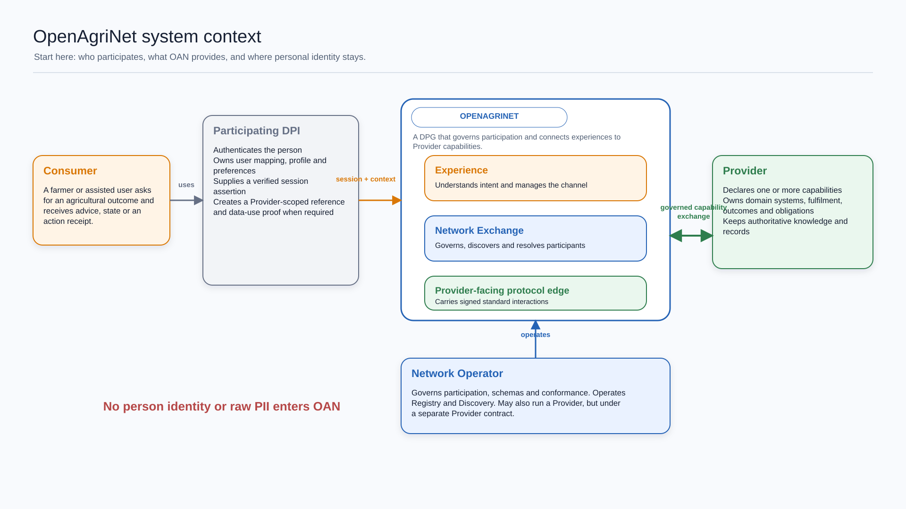
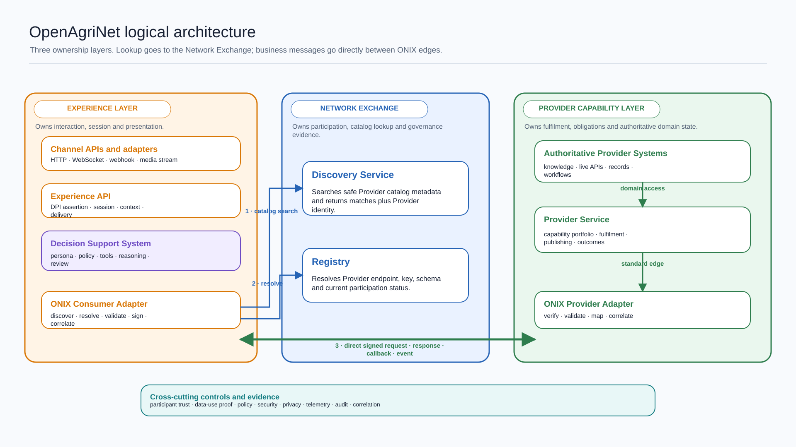
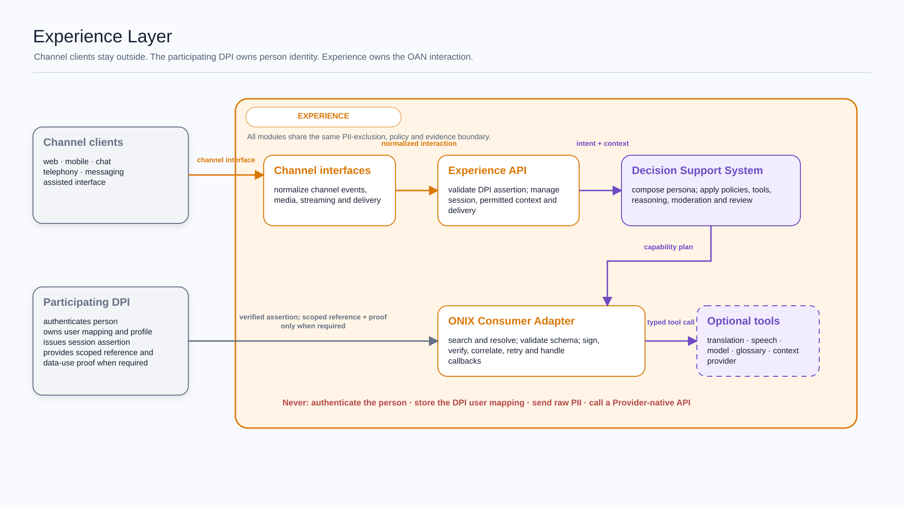
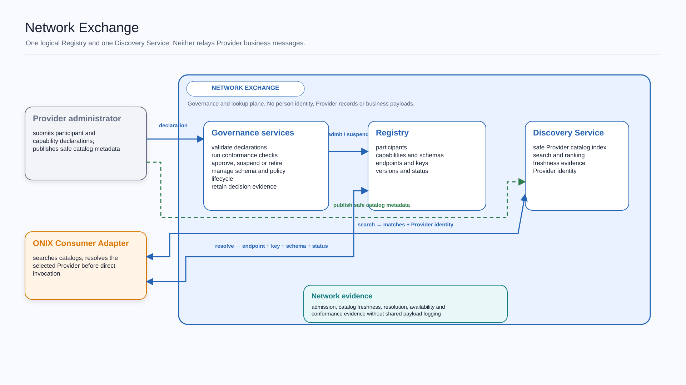
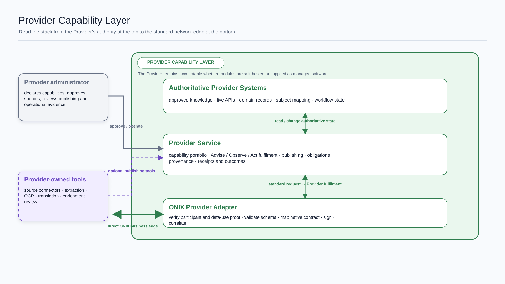
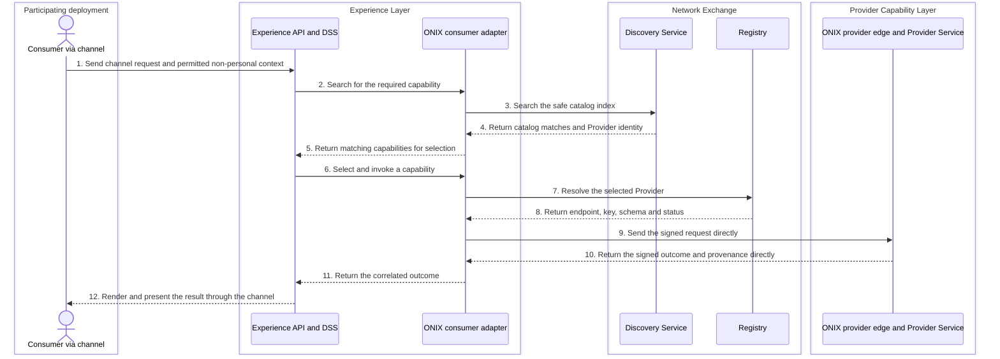
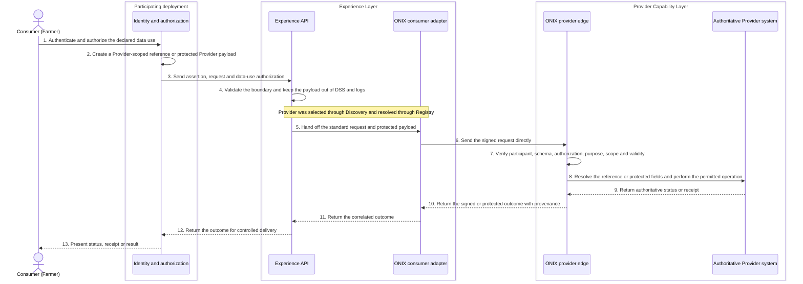
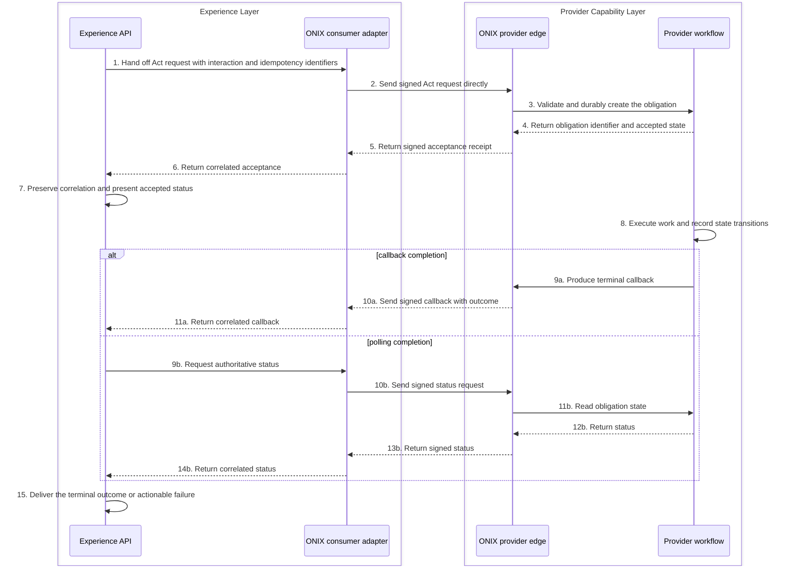
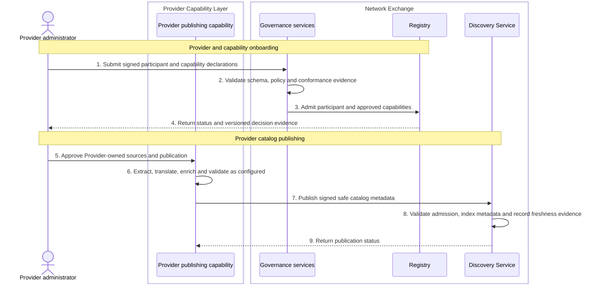
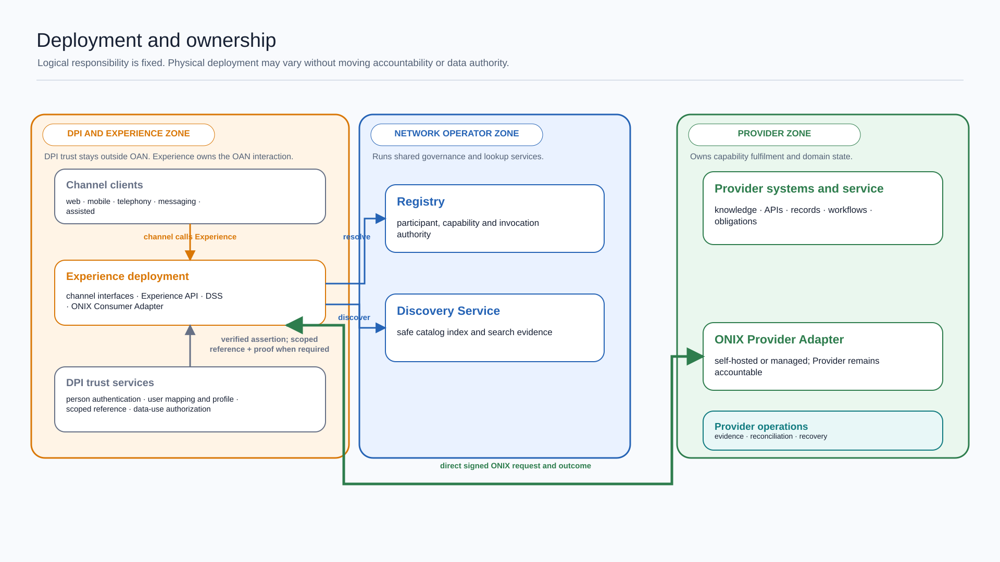

# OpenAgriNet architecture

Status: Proposed to be reviewed with DC

## The idea

OpenAgriNet lets a farmer use a familiar channel to find and use an agricultural capability, which is a named outcome a Provider promises to deliver. It separates the farmer-facing experience from the organisation that provides knowledge, data, or an action. It also separates both from the operator that governs who may participate.

**The network governs trust and findability. The selected Provider owns the result.** OpenAgriNet first finds a suitable Provider and resolves its current protocol details. The two protocol edges then exchange the signed business message directly. Shared network services do not become the Provider and do not collect person identity or raw personal data.

## Who does what

OpenAgriNet has three accountable actor roles: Consumer, Provider, and Network Operator. One organisation may perform more than one role, but it acts under one role's contract in each interaction.

### Consumer

The Consumer's job is to express an agricultural need, authorize a personal data use when required, and receive an understandable outcome. The Consumer is commonly a farmer. An assisted user, expert, Provider administrator, or Network Operator may also be a Consumer of a role-specific capability.

| Does | Never does | Assumptions |
|---|---|---|
| Uses a channel, states a need, supplies permitted context, and receives advice, state, a receipt, status, callback, or event | Does not need to know a Provider's native API, internal workflow, deployment, or protocol details; does not send personal data into shared network services | An accessible channel exists and any required authentication and data-use authorization are supplied outside the Consumer role |

### Provider

The Provider's job is to declare one or more capabilities and remain accountable for their domain behavior and outcomes. Knowledge, weather, mandi prices, livestock services, scheme services, credit services, and action workflows are Provider capabilities.

| Does | Never does | Assumptions |
|---|---|---|
| Publishes safe catalog metadata, fulfils admitted capabilities, owns domain state and obligations, returns provenance and status, and emits operational evidence | Does not move authoritative knowledge or records into Network Exchange by default; does not let an adapter invent a domain result | The Provider can meet its declared schema, trust, privacy, failure, and service obligations |

### Network Operator

The Network Operator's job is to govern participation and operate Network Exchange. It onboards Providers and capabilities, manages schemas and participation status, and keeps Registry, the participation authority, and Discovery, the catalog index, trustworthy.

| Does | Never does | Assumptions |
|---|---|---|
| Defines participation rules, validates declarations, records approved Providers and capabilities, operates Registry and Discovery, suspends non-conformant participants, and observes network outcomes | Does not become the authority for Provider content or results; does not silently change a Provider response; does not treat Registry as an architecture layer | Governance decisions are versioned, reviewable, and backed by conformance evidence |

Each role treats the other roles as stakeholders. Each internal building block applies the same rule to its callers and dependencies.

## Purpose, audience, and status

This document explains the proposed domain and system architecture for OpenAgriNet. It is written for the Design Council, Network Operators, Provider teams, experience builders, participating-deployment integrators, security and privacy reviewers, implementers, and operators.

The document answers five questions:

- Who participates, and who owns each outcome?
- Which problems shape the design?
- Which logical boundaries and building blocks are proposed?
- How do discovery, direct invocation, personal operations, publishing, and asynchronous completion work?
- Which specifications and decisions are still needed before implementation?

Every statement in this document is a proposal until reviewed by DC. Product names, deployment products, exact service-level objectives, and network federation are not decided here.

## Scope and system boundary

OpenAgriNet is a digital public good, or DPG. It provides reusable software, standard interfaces, schemas, participation rules, conformance tools, and operational evidence contracts. The DPG is not a runtime actor and does not itself own a person account, Provider record, or operational deployment.

A participating deployment integrates the OpenAgriNet DPG into its application, authentication, customisation, and delivery environment. A participating deployment may be a formal digital public infrastructure, or DPI, a public programme, a cooperative platform, or another application ecosystem. Its formal classification does not change its OpenAgriNet boundary.

An implementer selects a deployment profile and enables only the required modules and adapters. One deployment may operate only a channel, another may also operate Experience, and another may operate all three logical layers and one or more Provider capabilities. A module that is not operated locally is consumed through its defined interface; the logical responsibility and conformance contract do not change.

Person authentication is a conditional deployment integration. When a capability requires an authenticated person, the implementer enables an authentication adapter against its chosen identity system. The adapter supplies a verified deployment assertion and, when required, a Provider-scoped reference and data-use proof. Experience validates the assertion but does not become the person-identity authority or receive the person's credentials.

A participating deployment may own channel applications, branding, bot identity, authentication when required, user mapping, profile and language preferences, notification subscriptions, and capture of data-use authorization. Public Advise and Observe interactions may remain anonymous. A personal Observe or Act interaction requires the authentication and authorization declared by that capability.

OpenAgriNet includes:

- channel-facing interfaces and interaction management
- interpretation of an actor's intent into a governed capability request
- Provider and capability onboarding
- safe catalog publication and discovery
- resolution of the selected Provider's endpoint, key, schema, and participation status
- direct signed exchange between Consumer-side and Provider-side protocol adapters
- Provider fulfilment, status, receipts, callbacks, and events
- non-personal operational evidence and conformance checks

OpenAgriNet does not include:

- a central person identity, account, profile, or user-mapping service
- storage or logging of personal payloads in shared OAN services
- a central copy of Provider knowledge, records, or workflow state
- a mandatory relay for Provider requests and responses
- the Provider's native implementation
- telephony networks, messaging networks, or channel applications
- network-to-network federation in this architecture baseline

[Edit the system context](diagrams/01-system-context.excalidraw) or [open the editable architecture room](diagrams/OpenAgriNet%20architecture%20room.excalidraw).

A participating deployment is an allocation of modules to an implementer, not a fourth OAN actor role or a fixed external system boundary. Channel, authentication, and authorization components call Experience APIs even when they are operated by the same implementer. They do not call the ONIX Consumer Adapter directly. After interpreting a request, Experience invokes the ONIX Consumer Adapter to search and resolve governed capabilities and to exchange the selected business message. Experience selects from the returned catalog matches. In the structural diagrams, “Participating DPI” represents deployment-owned channel and trust services outside Experience; it does not describe the deployment's complete operational footprint or assert that every deployment is formally a DPI.

## Domain and interaction model

### Interaction types

Advise, Observe, and Act are working names proposed for review. An interaction type answers one question: what kind of outcome is the Consumer asking the Provider to own?

| Interaction | Provider promise                                                                             | Typical examples                                                                                |
| ----------- | -------------------------------------------------------------------------------------------- | ----------------------------------------------------------------------------------------------- |
| Advise      | Return guidance, explanation, recommendation, or learning content with provenance and limits | Crop advisory, cattle health guidance, scheme explanation, learning module                      |
| Observe     | Return authoritative, measured, or derived state without changing external state             | Weather, mandi price, milk record, eligibility, application status, API health                  |
| Act         | Create or change state and return a receipt or durable obligation                            | Book a service, apply for a scheme, submit a grievance, update a profile, escalate to an expert |

### Trigger and completion patterns

Trigger, completion, channel, and representation are separate from interaction type:

| Dimension      | Supported forms                                                                       |
| -------------- | ------------------------------------------------------------------------------------- |
| Trigger        | Request, event, schedule                                                              |
| Completion     | Immediate response, stream, accepted then callback, accepted then polling, push event |
| Channel        | Web, mobile, chat, telephony, messaging, assisted                                     |
| Representation | Structured data, text, voice, image, document, media                                  |

A weather alert is Observe, triggered by an event and delivered as a push. A voice call changes the channel and representation, not the interaction type.

An accepted response is not a completed result. It means the Provider has durably accepted an obligation and can return its authoritative status until the work reaches a terminal outcome.

### Capability portfolio

A Provider registers once and declares a portfolio of named capabilities. Each capability states its outcome, interaction contract, information profile, authority, supported completion patterns, schema version, and operational obligations. A capability can be approved, versioned, suspended, or retired without changing the Provider's other capabilities.

| Provider example | Named capability | Advise | Observe | Act |
|---|---|:---:|:---:|:---:|
| Knowledge Provider | Crop advisory | Yes | No | No |
| Knowledge Provider | Scheme explanation | Yes | No | No |
| Mandi Provider | Current mandi price | No | Yes | No |
| Mandi Provider | Price-based selling guidance | Yes | Yes | No |
| Livestock Provider | Cattle health guidance | Yes | No | No |
| Livestock Provider | Milk-pouring records | No | Yes | No |
| Livestock Provider | Book insemination service | No | No | Yes |
| Scheme Provider | Scheme discovery | Yes | No | No |
| Scheme Provider | Application status | No | Yes | No |
| Scheme Provider | Submit application | No | No | Yes |

The table shows that one Provider can expose several interaction types through separate capabilities. A composed capability, such as selling guidance based on current prices, may use more than one interaction type, but each contract boundary and accountable result remains explicit.

Knowledge publishing is a Provider lifecycle operation. It is not a Consumer-facing Act merely because it changes Provider state.

## Requirements and design forces

Five OAN-level problems shape the architecture. Detailed requirements should trace to one or more of these forces.

| Design force                                    | What the architecture must make possible                                                                                                     |
| ----------------------------------------------- | -------------------------------------------------------------------------------------------------------------------------------------------- |
| Many channels, languages, and personas          | Add web, mobile, chat, telephony, messaging, or assisted access without copying Provider logic into each channel                             |
| Diverse Providers and native systems            | Admit knowledge, data, advisory, diagnostic, financial, and workflow Providers without requiring a common internal implementation            |
| Governance without centralized domain authority | Establish participant trust, schema conformance, and findability while Provider knowledge, records, and results remain Provider-owned        |
| Different outcomes and completion semantics     | Require each capability to declare its outcome and completion patterns; support immediate response, streaming, accepted-then-callback, accepted-then-polling, and event delivery without creating another interaction type |
| Accountability without centralising personal data | Correlate failures and measure outcomes across organisations using random interaction identifiers and safe evidence rather than personal or Provider data |

## Architecture principles

| Principle | Architectural consequence |
|---|---|
| Start with the outcome | Advise, Observe, and Act define the semantic contract independently of channel, trigger, representation, and completion pattern |
| A Provider exposes a capability portfolio | A new Provider capability does not create a new architecture layer or require a Network Exchange rebuild |
| Authority follows responsibility | Experience owns interaction state; Registry owns participation resolution; Discovery owns its catalog index; Provider owns domain state and outcomes |
| Govern through declarations | Provider identity, capability, schema, endpoint, key, and status are explicit, versioned, and testable |
| Discover through catalogs, then invoke directly | Network Exchange helps select and resolve a Provider; the ONIX edges exchange the business message |
| Adapt at the accountable boundary | Channel adaptation stays in Experience, protocol mapping stays at ONIX edges, and Provider-native mapping stays with the Provider |
| Keep person identity outside OAN | A participating deployment authenticates the person and creates a Provider-scoped reference; shared control-plane services never receive personal data, while the direct data plane may transport an authorized Provider-specific payload |
| AI is an implementation choice, not an authority | An AI feature follows the policy, evidence, and failure rules of the building block that contains it |
| Health means the promised outcome works | Each component measures delivery, correctness signals, latency, dependency failure, and recovery, not only process uptime |

## Logical architecture

OpenAgriNet has three logical ownership layers. Registry, Discovery, the Decision Support System, adapters, telemetry, privacy controls, and tools are modules or features inside these boundaries. They are not additional layers.

[Edit the logical architecture](diagrams/02-logical-architecture.excalidraw).

The blue paths are lookup paths. Discovery returns safe catalog matches and Provider identity. Registry returns current invocation details. The green path is the direct signed business exchange between the ONIX Consumer Adapter and ONIX Provider Adapter. Network Exchange is not in that path after resolution.

| Layer                     | Core job                                                                                            | Never does                                                                                                               | Assumes                                                                                                       |
| ------------------------- | --------------------------------------------------------------------------------------------------- | ------------------------------------------------------------------------------------------------------------------------ | ------------------------------------------------------------------------------------------------------------- |
| Experience Layer          | Adapt actors and channels to governed capabilities, manage the interaction, and present the outcome | Does not own Provider truth, authenticate the person, store a deployment user mapping, expose personal payloads to shared tools or logs, or call Provider-native APIs around ONIX | A participating deployment can supply a verified assertion and, when required, a scoped reference, protected personal payload, and data-use proof |
| Network Exchange          | Govern participation, index safe Provider catalogs, and resolve invocation details                  | Does not own Provider content, manufacture domain outcomes, or relay the direct business exchange                        | Providers publish safe metadata and keep Registry declarations current                                        |
| Provider Capability Layer | Publish capabilities and fulfil them against authoritative Provider systems                         | Does not delegate domain accountability to Network Exchange or Experience                                                | The Provider can map the standard contract to its systems without changing its meaning                        |

## Layer detail

### Experience Layer

Experience Layer is a working name proposed for review. Its stable responsibility is to own channel integration, session and conversation state, presentation, policy application, and conversion of actor intent into a standard capability interaction. A deployment may extend or configure this behavior without changing the Provider contract, interaction semantics, or authority boundaries.

Web applications and telephony services are channel clients outside Experience. They connect to channel APIs and interfaces exposed by Experience. A telephony company is a channel provider, not the OAN Provider actor that owns an agricultural capability. A bot name such as Sarla is a deployment-specific persona and branding extension, not a person identity, participant identity, Provider, or architecture layer.

A telephony integrator terminates the call or media channel. A telephony or media adapter inside Experience normalizes call events and audio streams. Speech-to-text and text-to-speech are optional Experience tools behind adapters and may run locally or through an external service. If an external speech service receives audio or text, that service processes the content and must follow the participating deployment's privacy and authorization policy.

[Edit the Experience view](diagrams/03-experience-layer.excalidraw).

| Module or feature              | Core capability                                                                                                                                      | Extension points                                                                   | Never does                                                                                          |
| ------------------------------ | ---------------------------------------------------------------------------------------------------------------------------------------------------- | ---------------------------------------------------------------------------------- | --------------------------------------------------------------------------------------------------- |
| Channel interfaces             | Terminate HTTP, WebSocket, webhook, media-stream, callback, or assisted interactions and normalize channel semantics                                 | Channel adapter, telephony adapter, codec, speech service, delivery profile         | Does not contain agricultural logic or call a Provider-native API                                   |
| Experience API                 | Validate a participating-deployment assertion, establish the OAN session, coordinate streaming and delivery, and enforce disclosure policy            | Assertion profile and verifier, session store, rate policy, streaming transport | Does not authenticate the person, own the deployment's user mapping, or decide which Provider result is true |
| Decision Support System        | Compose persona, interpret permitted non-personal context, plan capability use, apply moderation, use typed skills or tools, and review the response | Persona, skill, tool, model, context provider, language behavior, policy, reviewer | Does not become another layer, receive a personal payload, act as an authorization grant, or bypass ONIX |
| ONIX Consumer Adapter          | Search catalogs, resolve a selected Provider, validate and sign protocol messages, correlate requests, transport a protected Provider payload, and verify responses | Protocol profile, signing suite, schema version, payload-protection profile, retry and correlation policy | Does not call Provider-native APIs, turn protocol mapping into domain reasoning, or expose a protected personal payload to shared tools |
| Boundary and evidence features | Keep personal payloads out of shared tools and logs, validate authorization proof presence, minimise fields, and emit safe telemetry and audit evidence | Personal-data guard, authorization validator, retention rule, evidence exporter    | Does not store personal profiles, application references, authorization artifacts, or rejected payloads in telemetry |

### Network Exchange

Network Exchange contains one logical Registry and a separate Discovery Service. One implementation may deploy them together, but their contracts and authoritative state remain separate.

[Edit the Network Exchange view](diagrams/04-network-exchange.excalidraw).

| Module or feature | Core capability | Extension points | Never does |
|---|---|---|---|
| Registry | Record admitted participants, capabilities, schemas, endpoints, keys, versions, and participation status; resolve current invocation details | Participant type, capability schema, credential profile, lifecycle policy | Does not index Provider content, store person identity, or become an architecture layer |
| Discovery Service | Index safe catalog metadata and return matching offerings plus Provider identity | Catalog profile, ranking, filter, language index, freshness policy | Does not return keys or endpoints, store authoritative Provider knowledge, or relay a business request |
| Governance services | Validate declarations, execute approval and suspension, manage schema and policy lifecycle, and retain conformance evidence | Validation rule, conformance suite, review workflow, audit policy | Does not approve without evidence, silently rewrite a declaration, or admit person identity into shared state |
| Network evidence | Report safe admission, catalog freshness, resolution, availability, and conformance evidence | Evidence sink, aggregation rule, retention profile, operator dashboard | Does not log business payloads, prompts, scoped references, authorization artifacts, or Provider records |

### Provider Capability Layer

A Provider may expose several capabilities at once. Knowledge is a Provider capability even when the organisation that runs Network Exchange also runs the knowledge service. In that deployment the organisation performs two roles under separate contracts and evidence boundaries.

[Edit the Provider view](diagrams/05-provider-capability-layer.excalidraw).

The Provider diagram is arranged by authority, not call order. Authoritative systems sit at the top, the Provider Service is in the middle, and the ONIX Provider Adapter is at the bottom so both ONIX edges align on the direct business path.

| Module or feature | Core capability | Extension points | Never does |
|---|---|---|---|
| Provider-owned tools | Extract, translate, enrich, classify, validate, and curate Provider-owned sources | Parser, OCR, translation model, glossary, enrichment model, review workflow | Does not publish or serve material without Provider approval and provenance |
| Publishing capability | Turn approved Provider sources into governed content and publish safe catalog metadata | Source connector, schedule, catalog generator, validation hook | Does not move private or full Provider content into Discovery by default |
| Provider Service | Fulfil Advise, Observe, and Act; own obligations; produce outcomes, receipts, provenance, and status | Domain model, rules engine, workflow, agent, connector, notification adapter | Does not transfer domain authority to an adapter or return an untraceable result |
| ONIX Provider Adapter | Verify participant signatures and data-use proof, validate the request, map standard and native representations, and sign responses, callbacks, or events | Protocol profile, authorization verifier, native mapper, retry and callback policy | Does not authenticate the person, expose user mapping, invent an outcome, or own the Provider workflow |
| Authoritative Provider Systems | Hold approved knowledge, live data, records, subject mapping, APIs, and workflow state | Storage, domain application, API, model, workflow platform | Do not become network contracts or shared Network Exchange state |

### Optionality and managed adapters

| Classification     | Meaning                                                                     | Conformance rule                                                              |
| ------------------ | --------------------------------------------------------------------------- | ----------------------------------------------------------------------------- |
| Core               | Required for the layer to keep its architectural promise                    | Every conformant implementation supplies the behavior                         |
| Conditional        | Required only when a Provider or experience declares the related capability | The declaration activates the contract and conformance tests                  |
| Optional extension | Adds behavior without changing the base contract                            | It may be replaced or removed without changing standard messages or authority |

If a Provider cannot expose the standard ONIX interface, a Provider-side adapter maps its native API to ONIX. The adapter may be reusable software or a managed service, including one operated by the Network Operator. It still runs inside the Provider accountability boundary. Moving Provider-native mapping into Experience or Network Exchange would make those layers responsible for Provider semantics and would break the proposed ownership model.

## Runtime architecture

### Public advice or observation

This is the baseline flow for a public capability that does not require personal processing.

Discovery need not call Registry during search. Admission and schema constraints apply when a Provider and its catalog are published. At Experience's request, the ONIX Consumer Adapter resolves the selected Provider immediately before invocation so it uses current trust and endpoint state.

### Personal observation or action

Application status, milk records, credit, scheme applications, and similar operations may require personal processing by the intended Provider. Shared control-plane services do not receive that personal payload. The direct data plane may transport only the fields authorized for the selected Provider and capability.

The Provider-specific payload may contain an application number, submitted form fields, documents, or other personal data that the capability requires. Those fields are not masked before the intended Provider receives them. They are minimized, protected in transit, excluded from Discovery, Registry, shared DSS tools, logs, telemetry, and analytics, and never disclosed to another Provider.

An application number or subject reference is scoped to the intended Provider. Experience may transport or temporarily correlate it for controlled delivery, but shared services do not persist or log it. A different Provider receives a different scoped reference.

The data-use authorization may be a compact signed artifact carried in the direct request or a reference resolved through a deployment-controlled trust interface. Consent may be one authorization basis, but the architecture uses the broader term because other declared legal or programme bases may apply. The exact transport and revocation mechanism remain open.

If Experience, an ONIX adapter, or a speech or translation tool decrypts, interprets, maps, or transforms personal fields, that component is processing personal data and must accept the corresponding privacy responsibilities. The preferred boundary keeps the personal payload opaque and end-to-end protected between the participating deployment and the intended Provider.

### Asynchronous action

An accepted response creates a durable Provider obligation. Acceptance is returned only after durable state or durable queue admission.

Retries preserve the idempotency identifier. A Provider exposes authoritative obligation state and reconciliation evidence so an operator can recover work that was accepted but not completed.

### Provider onboarding and catalog publishing

Onboarding admits a Provider and its capabilities. Publishing makes an admitted capability discoverable. These are lifecycle flows, not Consumer interactions.

The Provider retains its full content and authoritative data. Discovery stores only metadata safe for network search.

## Information, privacy, trust, and evidence

### Information authority

**A building block owns the state required to keep its promise and no more.** Cross-boundary correlation uses a random interaction identifier and safe evidence fields rather than copied payloads.

| Concept | Meaning | Authority |
|---|---|---|
| Person identity | The identity by which a participating deployment knows and authenticates a person | Participating deployment, outside shared OAN services |
| Provider-scoped subject reference | An opaque value that one Provider can resolve inside its trusted system | Participating-deployment-to-Provider mapping and Provider system; never Discovery or Registry |
| Participant identity | Governed identity of a Provider, Network Operator, or service endpoint | Registry |
| Capability declaration | Versioned promise to fulfil a named Advise, Observe, or Act outcome | Provider proposes; Network Operator admits; Registry records status |
| Catalog entry | Safe metadata used to find an offering and formulate a later Provider query | Provider publishes; Discovery indexes |
| Interaction | Requested outcome, permitted context, schema version, correlation, completion preference, and optional protected Provider payload | Experience creates the interaction envelope; both ONIX edges preserve it; Provider owns payload semantics |
| Protected personal payload | Minimized personal fields or documents protected for one intended Provider and capability | Participating deployment creates or obtains; intermediaries transport without retaining or logging; intended Provider processes |
| Data-use authorization | Signed proof or reference that binds scope, Provider, capability, purpose, permitted data, operation, validity, and revocation status | Participating deployment issues or obtains; Provider verifies |
| Outcome | Provider result, status, receipt, callback, or event with provenance | Provider |
| Obligation | Durable Provider promise created when work is accepted but not complete | Provider |
| Evidence event | Non-personal operational fact about processing, policy, delivery, failure, or recovery | Emitting module; Network Operator governs the shared evidence contract |

### Personal-data boundaries

OAN does not operate a central person identity service, user database, or profile. **The control plane remains free of personal data; the direct data plane may transport an authorized Provider-specific payload.** The following checkpoints enforce that boundary:

- channel and participating-deployment integrations send a verified assertion, not person credentials
- Experience and DSS use non-personal context or opaque references for planning; personal payloads bypass DSS and shared tools
- Discovery and Registry reject person identifiers, personal attributes, authorization artifacts, scoped references, personal payloads, and Provider records
- a personal Provider request carries only the scoped reference or protected fields and data-use authorization required by the declared capability
- Experience and both ONIX edges do not persist or log the protected payload; any component that decrypts or transforms it becomes an explicit personal-data processor
- the intended Provider validates the authorization before resolving the reference or processing protected fields inside its trusted boundary
- shared logs, telemetry, evidence stores, and analytics reject payloads, application numbers, personal records, raw prompts or transcripts, authorization artifacts, and Provider-native identifiers
- the participating deployment controls delivery of a personal result to the authenticated Consumer

### Data-use authorization

Authentication proves to the participating deployment which user is present. Data-use authorization states what a named Provider may do for a declared purpose. Consent may be one authorization basis. A login token, persona, session identifier, or interaction identifier is not consent or data-use authorization.

The minimum authorization contract contains:

- artifact identifier and version
- Provider-scoped subject or application reference
- issuing participating deployment and intended Provider
- capability and purpose
- permitted data categories or fields and permitted operation
- issue time, expiry, and revocation or status reference
- proof of user action or another declared authorization basis
- issuer signature and integrity proof

The Provider validates this proof. Discovery, Registry, shared DSS tools, shared logs, and network telemetry do not receive its underlying personal data. Experience and ONIX may transport the protected payload and proof, but they do not persist or log them.

### Operational evidence and observability

Every module emits evidence for the stakeholders that depend on its promised outcome.

| Boundary | Questions the evidence must answer |
|---|---|
| Channel and Experience | Did the interaction enter with a valid participating-deployment assertion, keep any protected personal payload out of shared tools and logs, preserve permitted context, and reach the Consumer in the expected representation? |
| DSS | Which persona, policies, context providers, tools, and review checks affected the plan and response? |
| Discovery | Which query and index version produced the catalog matches, and were freshness and eligibility rules applied? |
| Registry | Which participant, capability, schema, key, endpoint, and status version were resolved? |
| ONIX edges | Was the message signed, validated, correlated, retried, and delivered without replay, schema drift, or disclosure of a protected payload beyond the intended Provider? |
| Provider | Did domain work start, create a valid outcome or obligation, and recover from dependency failure? |

Each layer observes its internal health and exposes a safe boundary view. Network-level observability aggregates only the evidence contract needed to assess participation, discovery, resolution, delivery, and Provider outcome health. Process liveness alone is insufficient when the stakeholder outcome is failing.

## Extensibility and supportability

The architecture extends at the boundary accountable for the behavior. A feature may be AI-based or deterministic. That choice does not change its contract, authority, failure behavior, or evidence obligation.

Every extension preserves:

- the declared capability and schema
- state authority and policy boundaries
- personal-data boundaries and data-use authorization behavior
- correlation, error, retry, idempotency, and replay semantics
- outcome evidence and conformance tests
- compatibility for callers that do not enable the extension

### Supportability scenarios

| Stakeholder goal | Architecture support | Verifiable outcome |
|---|---|---|
| Experience team adds a channel without Provider changes | Channel adapter interface and channel-independent capability contract | Conformance test invokes the same Provider capability through the old and new channels |
| Provider team joins without a Network Exchange rebuild | Signed capability declaration, Provider-side ONIX adapter, catalog publication, and conformance suite | Provider is admitted, discovered, resolved, invoked, suspended, and restored through lifecycle APIs |
| AI team replaces a model or translation tool | Typed DSS tool contract, Provider tool adapter, policy checkpoints, and evaluation evidence | Replacement passes the same contract, safety, language, and failure tests without changing ONIX messages |
| Network operator diagnoses a failed outcome without payload access | Shared interaction identifier, safe evidence events, dependency health, and reconciliation views | Operator traces the failed boundary and owner without reading personal data, prompts, Provider records, or payloads |
| Governance team suspends one unsafe capability | Capability-level status and independently versioned declarations | Suspended capability stops resolving while the Provider's other capabilities remain available |
| Provider operator recovers incomplete accepted work | Durable obligations, idempotency, authoritative status, retries, and reconciliation | Accepted work either reaches a terminal state or appears in an actionable recovery queue |

These scenarios make modifiability, analyzability, testability, deployability, and manageability visible as system behavior rather than vague qualities.

## Deployment and ownership

Logical ownership is fixed by contract. Physical deployment is assembled from independently operable modules and may vary.

An implementation manifest declares which modules are enabled locally, which adapters satisfy their required interfaces, and which capabilities are consumed as managed services. Authentication is enabled only for deployments and capabilities that require it. Omitting local authentication does not make Experience the identity provider; anonymous capabilities remain anonymous, while identity-bound capabilities require a compatible deployment assertion.

[Edit the deployment view](diagrams/06-deployment-and-ownership.excalidraw).

| Deployment choice | Allowed arrangement | Boundary that must remain true |
|---|---|---|
| Modular deployment profile | An implementer may operate a channel only, channel plus Experience, all three logical layers, or any independently conformant Provider capability | Every enabled module retains its interface, authority, evidence, and conformance contract; omitted modules are reached through those same interfaces |
| Conditional authentication | The implementer enables an authentication adapter against its chosen identity system when declared capabilities require person authentication | The adapter remains deployment-owned; Experience validates its assertion but does not own credentials, accounts, or user mapping |
| Participating deployment integration | Channel clients and deployment trust services run outside OAN | Person identity, user mapping, profile, preferences, authorization capture, and personal delivery remain deployment-owned |
| Shared Network Exchange | Registry, Discovery, governance, and network evidence may share infrastructure | Registry and Discovery retain separate contracts and authoritative state |
| Managed Provider adapter | A reusable adapter may be hosted by the Provider, a service partner, or the Network Operator | Provider remains accountable for native mapping, fulfilment, security, evidence, and recovery |
| Network Operator as Knowledge Provider | The same organisation may run Network Exchange and a knowledge Provider | Provider capability, state, operations, and evidence remain separate from Network Exchange |
| Scaled Experience | Experience API, DSS, channel adapters, and ONIX consumer edge may be split into deployables | They remain one Experience ownership boundary with stable internal contracts |

No deployment topology may place personal data, Provider records, or full Provider content in Registry, Discovery, shared logs, or network telemetry. A protected personal payload may cross Experience and ONIX only on the direct path to its intended Provider under the declared authorization contract.

## From architecture to specifications

This architecture defines responsibility and interaction topology. The next documents define exact contracts. Each specification should have one owner and should be independently testable.

| Specification | What it fixes |
|---|---|
| Capability declaration | Provider identity, named outcome, interaction type, information profile, schema, completion patterns, policy class, service obligation, and lifecycle |
| Provider onboarding and governance | Submission, validation, conformance, approval, update, suspension, retirement, and decision evidence |
| Catalog publication and discovery | Safe metadata, signatures, indexing, search, ranking, filters, freshness, and search evidence |
| Registry resolution | Participant, capability, endpoint, key, schema, version, status, caching, and revocation semantics |
| ONIX interaction envelope | Request, response, status, receipt, error, signature, schema version, correlation, idempotency, and replay rules |
| Callback, polling, event, and subscription | State machines, delivery, retry, acknowledgement, expiry, and terminal failure |
| Data-use authorization profile | Issuer, audience, subject reference, purpose, scope, data categories, operation, validity, revocation, proof, and privacy tests |
| Protected personal payload profile | Intended Provider, capability, allowed fields and documents, payload protection, intermediary handling, permitted processors, delivery, and deletion tests |
| Evidence and observability | Safe event schema, correlation, indicators, redaction, retention, aggregation, access, and diagnostic workflows |
| Conformance suites | Positive, negative, compatibility, personal-data boundary, authorization, retry, recovery, and suspension tests |

Each building block also needs an implementation contract:

| Contract section | Question it must answer |
|---|---|
| Job and boundary | What single promise does the component own, and what does it never own? |
| Stakeholders | Which callers depend on it, and which dependencies does it treat as stakeholders? |
| Provides and requires | Which outcomes does it provide, and which external promises does it require? |
| Interfaces and schemas | Which requests, responses, callbacks, events, versions, and compatibility rules exist? |
| State and authority | Which records are authoritative here, and how do they transition? |
| Privacy and trust | Which assertion, scoped reference, data-use proof, protected-payload, signature, rejection, processing, and retention rules apply? |
| Failure behavior | Which errors, timeouts, retries, idempotency keys, replay rules, and recovery paths exist? |
| Evidence and indicators | How can each stakeholder prove that the promised outcome works? |
| Extensions | Which plugins, tools, policies, models, or connectors preserve the core contract? |
| Conformance | Which success, failure, privacy, authorization, compatibility, and recovery tests must pass? |

Provider onboarding and knowledge publishing should be a companion implementation guide. It can explain how a Provider declares several capabilities, uses publishing tools, exposes ONIX directly or through a managed adapter, completes conformance, publishes catalog metadata, and operates the capability. It should refer to this architecture instead of redefining it.

## Decisions proposed for review

| Decision | Status | Consequence |
|---|---|---|
| Use three ownership layers, with the working names Experience, Network Exchange, and Provider Capability | Proposed for review | Responsibilities remain stable even if DC changes a layer name; controls and tools stay inside accountable boundaries rather than becoming layers |
| Use Advise, Observe, and Act as the working interaction vocabulary | Proposed for review | Each term names the Provider outcome independently of trigger, channel, representation, and completion pattern |
| Keep DSS inside Experience | Proposed for review | Persona, reasoning, tools, moderation, and review remain Experience responsibilities |
| Use one logical Registry for participants, capabilities, schemas, endpoints, keys, and status | Proposed for review | Registry is a Network Exchange module, not a layer |
| Treat Discovery as an index of safe Provider catalog metadata | Proposed for review | Discovery returns metadata and Provider identity, not endpoints, keys, full content, or domain outcomes |
| Invoke directly through ONIX edges after discovery and resolution | Proposed for review | Network Exchange is not a mandatory business-message relay |
| Treat knowledge as a Provider capability | Proposed for review | A Network Operator may also deploy a knowledge Provider, but roles and evidence remain separate |
| Keep person authentication, user mapping, and profile outside OAN; permit protected personal payloads only on the direct Provider data plane | Proposed for review | A participating deployment owns person identity; shared control-plane services remain free of personal data; the intended Provider receives only authorized fields |
| Require verifiable data-use authorization for personal processing | Proposed for review | A Provider validates a signed artifact or trusted reference before resolving a scoped reference or processing protected personal fields |

## Risks and mitigations

| Risk | Architectural mitigation | Residual decision or evidence needed |
|---|---|---|
| Network Operator and first-party Provider responsibilities become coupled | Separate Provider registration, interfaces, state, evidence, and conformance | Deployment review must prove replacement without Network Exchange change |
| Discovery metadata leaks sensitive Provider or person information | Safe catalog schema, publication validation, field allow-list, and rejection tests | Domain catalog profiles need privacy review |
| Direct Provider invocation creates inconsistent availability | Current Registry resolution, Provider health evidence, retry rules, and explicit failure | Service obligations and failover semantics remain open |
| AI-generated advice is unsafe or untraceable | Policy checkpoints, source provenance, response review, evaluation evidence, and human escalation | Minimum network evaluation criteria remain open |
| Accepted work is lost or duplicated | Durable obligation before acceptance, idempotency, state machine, callback or poll semantics, reconciliation | Common action state profile remains open |
| Personal authorization is confused with login | Separate data-use proof, Provider validation, purpose and scope, expiry and revocation | Carried artifact versus resolvable reference remains open |
| Experience becomes an undeclared personal-data processor | Prefer an opaque end-to-end protected Provider payload; make any decryption, speech processing, translation, mapping, or field validation an explicit deployment responsibility | Payload-protection profile and permitted processors remain open |
| Shared telemetry becomes a shadow data store | Payload-free evidence schema, minimization, access control, retention, and conformance tests | Exact evidence fields and retention remain open |

## Open items

| Open item | Options and tradeoff | Decision owner |
|---|---|---|
| Data-use authorization transport and revocation | A carried signed artifact avoids another runtime call; a resolvable reference gives current revocation status but adds an availability dependency | DC with privacy, protocol, and Provider owners |
| Personal payload transport and processing boundary | An end-to-end protected opaque envelope keeps shared components outside the processing path; schema-aware decryption or transformation enables richer validation but creates processor obligations | DC with privacy, Experience, protocol, and Provider owners |
| Exact Experience API and DSS deployment boundary | One deployable is simpler; separate deployables allow independent scaling and ownership but need a stable internal contract | DC and Experience implementation team |
| Working architecture vocabulary | Retain Experience Layer and Advise, Observe, and Act, or rename them while preserving their defined responsibilities and conformance behavior | DC |
| Catalog publication and search contracts | A minimal common catalog is easier to adopt; domain profiles improve relevance but increase governance and conformance work | Network Operator and Provider representatives |
| Callback, polling, and event semantics | One network profile improves interoperability; capability profiles fit domains better but fragment client behavior | Protocol and Provider teams |
| Action risk and authorization classes | A uniform rule is simple but may be too strict or weak; risk tiers need capability classification and clearer participating-deployment behavior | Governance, privacy, and domain owners |
| AI evaluation and human escalation | Common criteria aid comparability; domain evaluation preserves expertise but needs shared minimum evidence | DC and domain Providers |
| Outcome service levels and support ownership | Network-wide targets are easy to communicate; capability-specific targets are more realistic but harder to aggregate | Network Operator and Providers |
| Physical deployment and scale model | Shared services reduce initial cost; separated services improve isolation and scaling but add operational overhead | Platform and operations teams |
| Network-to-network federation | Exclude it from the first baseline, or define a separate federation architecture before claiming the use case | DC and Network Operators |

## Terminology

| Term | Meaning in this document |
|---|---|
| Consumer | Role that asks for and receives an outcome. Commonly a farmer |
| Provider | Role accountable for one or more agricultural capabilities and their outcomes |
| Network Operator | Role that governs participation and operates Network Exchange |
| Participating deployment | Implementation-specific allocation of OpenAgriNet modules and external integrations. It may operate only a channel, add Experience, operate all logical layers, or expose Provider capabilities. It may be a DPI, but the architecture does not assume every deployment is one |
| Authentication adapter | Conditional deployment-owned integration with the implementer's identity system. It supplies a verified assertion to Experience without making OAN the person-identity authority |
| DPI | Formal digital public infrastructure classification. A participating deployment may be a DPI; the OpenAgriNet boundary does not change with that classification |
| DPG | Reusable public-good software, standards, schemas, and conformance assets. It is not a runtime actor or the operating authority for every deployment |
| Experience Layer | Working name for the boundary that owns channel integration, session and conversation state, presentation, policy application, and conversion of actor intent into a standard capability interaction |
| Channel provider | Telephony, messaging, web, mobile, or assisted-access service that connects to Experience. It is not the agricultural Provider that owns a capability outcome |
| Capability | Versioned Provider promise for a named Advise, Observe, or Act outcome |
| Catalog entry | Safe metadata that lets Discovery find a Provider offering |
| Registry | Governed authority for participants, capabilities, schemas, endpoints, keys, versions, and status |
| Discovery Service | Searchable index of safe Provider catalog metadata |
| DSS | Decision Support System inside Experience. It composes persona, policy, tools, reasoning, moderation, and review |
| Persona | Versioned, immutable configuration of role behavior, branding, language behavior, skills, policies, context providers, and reviewers. It may give a bot a name such as Sarla, but it is neither person identity nor a data-use authorization grant |
| ONIX Consumer Adapter | Experience-side protocol edge for discovery, resolution, validation, signing, correlation, and callback handling |
| ONIX Provider Adapter | Provider-side protocol edge for verification, validation, standard-to-native mapping, signing, and correlation |
| Person identity | Identity known to and authenticated by the participating deployment. It is outside shared OAN services |
| Participant identity | Governed organisation or service identity recorded in Registry. It is not person identity |
| Provider-scoped reference | Opaque reference that only the intended Provider can resolve inside its trusted system |
| Protected personal payload | Minimized personal fields or documents protected for one intended Provider and transported without persistence or logging by intermediaries |
| Data-use authorization | Verifiable proof of a permitted data operation for a declared Provider, capability, purpose, scope, and validity. Consent may be one authorization basis |
| Interaction identifier | Random correlation value for one interaction. It is not derived from person identity |
| Obligation | Durable Provider promise created when an asynchronous action is accepted |

## Use-case responsibility map

This map is a conformance check, not a product backlog. It tests whether the proposed boundaries can explain every known case without inventing another layer. “Discover and resolve” means Discovery returns matching catalog metadata and Provider identity, then Registry returns invocation details.

“Participating deployment + Experience” separates two responsibilities in one compact column. The participating deployment authenticates the person when required, owns user mapping and authorization, and supplies scoped references, protected Provider payloads, and proof. Experience interprets the request, keeps personal payloads out of shared tools and logs, invokes the capability, and presents the outcome.

### AMUL

| Use case | Interaction or lifecycle | Participating deployment + Experience responsibility | Network Exchange responsibility | Provider responsibility | Completion |
|---|---|---|---|---|---|
| Artificial insemination booking | Act | Obtain applicable data-use proof; pass scoped cattle and location references; capture slot and language; present receipt | Discover and resolve livestock booking capability | Validate cattle and availability; create booking; own booking status | Accepted plus result or callback |
| Microloan approval number | Advise + Observe + Act | Obtain data-use proof and scoped profile references; explain eligibility and present reference | Discover and resolve credit capability and schema | Evaluate eligibility, create approval reference, preserve decision evidence | Accepted plus result |
| Dairy scheme information | Advise | Understand scheme question and preferred language | Discover and resolve scheme knowledge capability | Return current scheme explanation, provenance, and limits | Immediate |
| Milk pouring data | Observe | Use a participating-deployment-authenticated, Provider-scoped reference and minimise the requested date range | Discover and resolve milk-record capability | Return authoritative farmer-specific milk records | Immediate or polling |
| Cattle health and productivity guidance | Advise | Capture symptoms and livestock context; present localized guidance | Discover and resolve livestock advisory capability | Produce accountable guidance and escalation limits | Immediate |
| Union or society bonus information | Observe + Advise | Use a participating-deployment-authenticated, Provider-scoped reference and explain the returned bonus information | Discover and resolve bonus information capability | Return authoritative declaration and explanation | Immediate |

### OAN Kenya

| Use case | Interaction or lifecycle | Participating deployment + Experience responsibility | Network Exchange responsibility | Provider responsibility | Completion |
|---|---|---|---|---|---|
| Mandi price advisory | Observe + Advise | Capture commodity, market, location, and language | Discover and resolve market-data capability | Return current prices with timestamp and optional selling guidance | Immediate |
| Weather and climate advisory | Observe + Advise | Resolve permitted location and preferred language | Discover and resolve weather capability | Return forecast, provenance, validity window, and advisory | Immediate or event |
| Crop sowing recommendation | Advise | Combine permitted location, season, and farmer context | Discover and resolve crop advisory capability | Recommend crops using declared data sources and limits | Immediate |
| Crop planning assistance | Advise | Capture crop intent, window, location, and language | Discover and resolve crop planning capability | Return sowing window, crop choice, and cultivation guidance | Immediate |
| Market intelligence advisory | Observe + Advise | Capture crop, location, time horizon, and presentation preference | Discover and resolve market intelligence capability | Return price trends, demand outlook, and nearby opportunities | Immediate |
| Agricultural advisory services | Advise | Interpret question and media; preserve permitted farm context | Discover and resolve agronomy capability | Return irrigation, pest, fertilizer, or crop-health guidance | Immediate or expert callback |
| Integrated weather-to-crop decision support | Advise | Coordinate permitted weather, farm, and market context; explain composite result | Discover and resolve each required capability | Each Provider owns its source outcome; the advisory Provider owns the composed recommendation | Immediate or accepted plus result |
| Provider answers multilingual farmer queries | Advise + Observe | Supply multilingual interaction and permitted context | Admit, discover, and resolve the Provider portfolio | Declare and fulfil weather, climate, crop, and price capabilities | Immediate |

### OAN Ethiopia

| Use case | Interaction or lifecycle | Participating deployment + Experience responsibility | Network Exchange responsibility | Provider responsibility | Completion |
|---|---|---|---|---|---|
| Access to credit using farmer, crop, plot, and livestock registries | Advise + Observe + Act | Obtain purpose-bound data-use proof for each source and pass scoped references; explain the decision | Discover and resolve credit and registry capabilities | Registry Providers return authoritative facts; credit Provider owns eligibility and application | Accepted plus result |
| Access to crop and livestock advisory | Advise | Capture question, context, language, and media | Discover and resolve advisory capabilities | Return domain guidance with provenance and escalation limits | Immediate |
| Raise and track a grievance | Act + Observe | Use a participating-deployment-authenticated scoped reference, capture complaint, show receipt, and present status | Discover and resolve grievance capability | Create grievance, own workflow and status, emit updates | Accepted plus callback or polling |
| Market access for produce, inputs, and equipment | Observe + Act | Capture buy or sell intent; obtain data-use proof if personal processing is required; present offers and receipts | Discover and resolve market capabilities | Return offers and execute the selected transaction | Immediate search; asynchronous transaction |
| Discover and apply for benefits, schemes, or vouchers | Advise + Act | Capture need and non-personal eligibility context; pass scoped references and data-use proof for application | Discover and resolve scheme and application capabilities | Explain eligibility, submit application, and own status | Accepted plus callback or polling |

### MH-Vistaar

| Use case | Interaction or lifecycle | Participating deployment + Experience responsibility | Network Exchange responsibility | Provider responsibility | Completion |
|---|---|---|---|---|---|
| Village or taluka weather advisory | Observe + Advise | Capture and confirm location; localize result | Discover and resolve weather capability | Return forecast, historical context, rainfall, provenance, and advisory | Immediate or event |
| Weather location validation | Observe | Normalize and confirm district, taluka, and village | Discover and resolve location and weather capabilities | Validate administrative location and return authoritative mapping | Immediate |
| Stage-wise crop advisory | Advise | Use permitted crop, location, season, and language context | Discover and resolve crop advisory capability | Return stage-specific sowing, irrigation, fertilizer, and harvest guidance | Immediate or scheduled event |
| Pest and disease detection from image or symptoms | Advise | Accept image or symptoms, apply media and privacy policy, explain confidence | Discover and resolve crop diagnosis capability | Diagnose, return confidence, treatment, prevention, and escalation limits | Immediate or expert callback |
| Agriculture video recommendations | Advise | Capture query and render playable media safely | Discover and resolve learning-content capability | Select relevant governed videos and return metadata and provenance | Immediate |
| Government scheme discovery | Advise | Capture farmer need and preferred language | Discover and resolve scheme catalog capability | Return current scheme, subsidy, eligibility, and provenance | Immediate |
| PM-KISAN and Farmer ID services | Observe | Authenticate in the participating deployment and pass a Provider-scoped reference plus applicable data-use proof | Discover and resolve identity-linked status capabilities | Return authoritative registration and status information | Immediate or polling |
| DBT application assistance and tracking | Act + Observe | Guide form completion in the participating deployment; pass scoped references, protected application fields, and data-use proof for submission and status | Discover and resolve DBT application capability | Validate, submit, issue receipt, and own application status | Accepted plus callback or polling |
| Fertilizer recommendations and availability | Advise + Observe | Capture crop, stage, location, and language | Discover and resolve fertilizer advisory and inventory capabilities | Return recommendation and authoritative availability or department service | Immediate |
| Kisan Credit Card assistance | Advise + Act | Explain requirements and collect permitted application inputs | Discover and resolve KCC information or application capability | Return eligibility guidance or submit application and own status | Immediate or accepted plus result |
| Animal husbandry advisory and Pashu Aadhaar services | Advise + Observe + Act | Capture non-personal animal context and language; pass scoped animal reference and data-use proof when required | Discover and resolve livestock portfolio | Advise on health and breeding, observe records, or execute the requested service | Immediate or asynchronous by capability |
| Voice-based Marathi assistant | Channel feature; inherits invoked type | Terminate speech, detect turn, transcribe, preserve session, and synthesize response | No channel-specific behavior; discover and resolve the domain capability | Fulfil the domain capability independent of voice | Streamed immediate or later callback |
| Personalized advisory using memory | Advise | Retrieve only permitted context, explain personalization, and allow correction | Discover and resolve advisory capability | Produce advice from disclosed context; does not own the Experience memory by default | Immediate |
| AI-powered FAQ assistant | Advise | Interpret question, apply persona and language, and review response | Discover and resolve FAQ knowledge capability | Return governed FAQ answer with provenance | Immediate |
| Crop feedback collection | Act | Capture rating and comment; obtain data-use proof if the feedback is linked; preserve correlation | Resolve feedback capability if externally provided | Store feedback, return receipt, and make it available for governed analysis | Immediate receipt |
| Personalized crop profile | Act + Observe | Authenticate and manage the profile inside the participating deployment; pass only scoped references, protected fields, and applicable data-use proof | Resolve profile capability once its authority is decided | Authoritative profile service validates, stores, and returns profile state | Immediate; authority remains open |
| Push notifications and alerts | Observe, event-triggered | Manage subscription authorization, channel preference, quiet hours, and delivery in the participating deployment | Discover and resolve event source and notification capability | Produce weather, pest, scheme, irrigation, or crop events with provenance | Event-driven |
| Operational dashboard | Observe | Provide role-based operator view and safe aggregates | Govern evidence contract and expose network-level operational evidence | Every component emits redacted outcome, failure, latency, and recovery evidence | Streaming or periodic |
| API health monitoring | Observe, event-triggered | Present health, dependency impact, and alert status to operators | Aggregate shared network boundary evidence by policy | Provider and Experience components emit dependency and outcome health | Event-driven |
| Multilingual text and voice assistant | Channel feature; inherits invoked type | Detect or select language, preserve switching, translate where policy permits, and render text or speech | No language-specific domain authority | Fulfil the domain capability; return structured meaning and supported representations | Immediate stream or later callback |
| Knowledge repository management | Provider lifecycle | Provide Provider-admin publishing interface and review workflow | Admit capability and schema; index only published safe catalog metadata | Ingest, edit, validate, version, approve, and serve Provider-owned knowledge | Asynchronous publishing lifecycle |
| Smart glossary and terminology support | Experience feature or Advise capability | Apply local terminology during interpretation and presentation | No glossary ownership unless offered as a Provider capability | Glossary Provider or knowledge Provider versions and serves governed terms | Immediate |
| Smart telephony support | Channel feature; inherits invoked type | Terminate call, manage turn-taking and session, and synthesize Marathi response | Discover and resolve the domain capability | Fulfil the same domain contract used by other channels | Streamed immediate or callback |
| Expert escalation | Act | Explain low confidence, obtain data-use proof, create escalation with a scoped reference, and present status | Discover and resolve expert-escalation capability | Accept obligation, route to expert, own status, and return outcome | Accepted plus callback |

### BH-Vistaar

| Use case | Interaction or lifecycle | Participating deployment + Experience responsibility | Network Exchange responsibility | Provider responsibility | Completion |
|---|---|---|---|---|---|
| Agricultural scheme discovery | Advise | Capture farmer need, eligibility context, and language | Discover and resolve scheme capability | Return current central and state scheme guidance with provenance | Immediate |
| Location-specific weather advisory | Observe + Advise | Confirm permitted location and localize presentation | Discover and resolve weather capability | Return forecast and actionable advisory with validity window | Immediate or event |
| Automatic spoken-language detection | Experience feature; no Provider interaction | Detect language at ingress and allow confirmation or correction | No language-detection responsibility | Domain Provider receives standard content independent of detection method | Immediate during session |
| Seamless language switching | Experience feature; no new Provider interaction | Change interpretation and presentation language without losing permitted session context | No language-switching responsibility | Continue the same domain interaction contract | Immediate during session |
| Kisan Sarathi content synchronization | Provider lifecycle | Initiate or observe Provider-admin sync and show validation status | Govern capability and index published metadata | Content Provider owns synchronization, versions, provenance, and source state | Asynchronous publishing event |
| Publish a dataset once for connected assistants | Provider lifecycle | Provide publishing and review interface if required | Admit the dataset capability and index safe catalog metadata | Dataset Provider ingests, validates, versions, and serves the data | Asynchronous publishing lifecycle |
| Network-to-network federation | Not covered | No current responsibility | Requires a separate federation design for trust, namespace, catalog, policy, and evidence exchange | Providers remain accountable inside each admitted network | Open architectural gap |
| Context-aware sowing recommendation | Advise | Coordinate permitted location, weather, soil, market, and policy context; explain result | Discover and resolve the required source and advisory capabilities | Source Providers own observations; advisory Provider owns the composed recommendation | Immediate or accepted plus result |
| Voice-based farmer learning | Advise | Manage voice session, progress, and suitable representation | Discover and resolve learning capability | Return governed learning module, progress semantics, and provenance | Streamed immediate or resumable |
| Real-time citizen feedback analytics | Observe | Obtain applicable data-use proof, pass non-personal or scoped feedback, and present safe operator analytics | Govern shared evidence or resolve an analytics capability | Analytics Provider aggregates permitted feedback and returns trends or summaries | Streaming or periodic |
| AI-based farm calendar | Advise + Act, event completion | Keep farm profile and notification preference in the participating deployment; pass scoped context references and data-use proof | Discover and resolve calendar and source capabilities | Calendar Provider creates schedule, owns reminders, and emits events | Accepted plus scheduled events |
| Credit and financial inclusion | Advise + Observe + Act | Obtain purpose-bound data-use proof and scoped references; explain options and present application or reminder status | Discover and resolve credit, KCC, and reminder capabilities | Financial Provider owns eligibility, application, status, and repayment reminders | Immediate plus asynchronous actions |

The current proposal maps 54 of the 55 cases to the three layers. Network-to-network federation is deliberately not covered because it introduces additional trust, namespace, policy, routing, and evidence questions. It needs a separate decision before it can be claimed as conformant.
