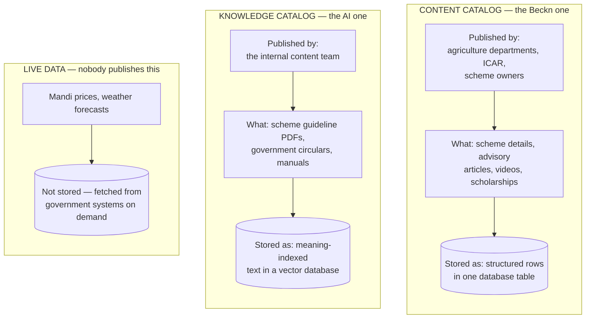
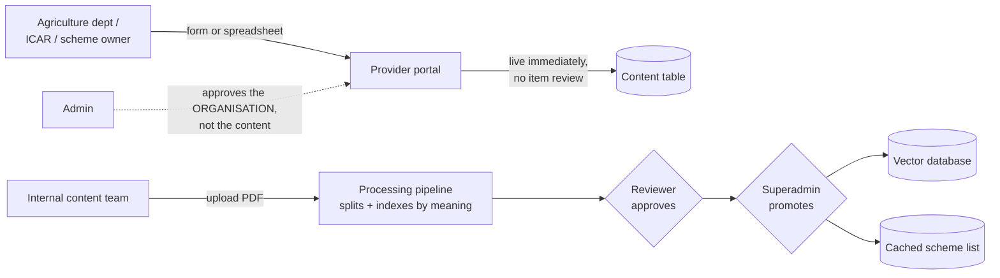
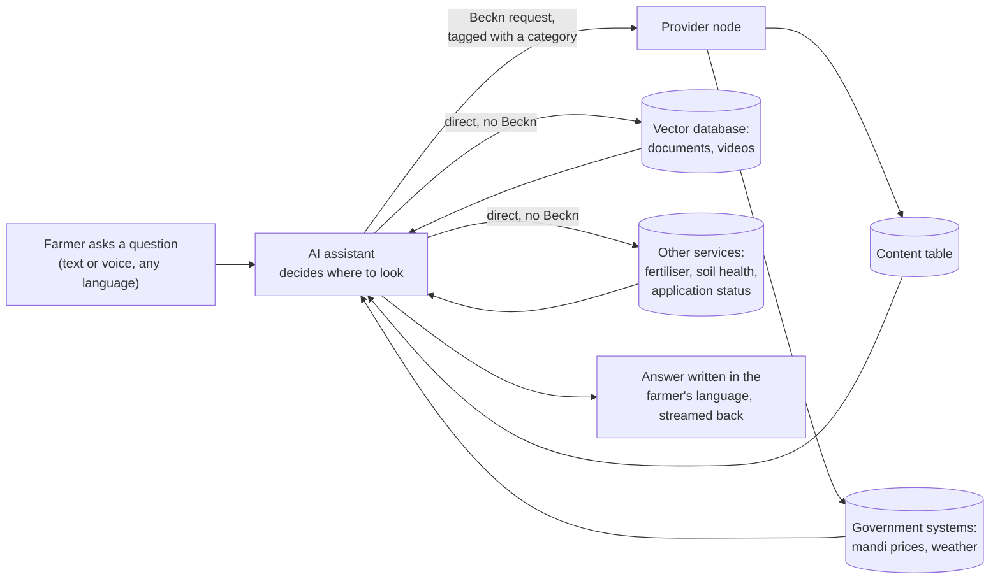

# OpenAgriNet — How publish and discover work

A plain-language explanation of how the platform works today, written as the baseline for moving onto the current Beckn protocol.

---

## 1. The three products

All three are the same thing wearing different clothes: an **AI assistant that answers farmers' questions** in their own language, by voice or text. They are built from one common codebase and then customised.

| | **BharatVistaar** | **MahaVistaar** | **Amul** |
|---|---|---|---|
| Who uses it | Farmers nationally, via central and state agriculture departments | Farmers in Maharashtra, under the state's POCRA programme | Dairy farmers in the Amul network |
| How they reach it | Website and Android/iOS app | Website and iOS app | Mostly by **phone call**, in Gujarati |
| What it answers | Schemes, crop advice, mandi prices, weather, insurance, fertiliser guidance | Same, focused on Maharashtra schemes | Dairy and farming guidance |
| Connected to the Beckn network | **Yes** — it has its own provider node | Yes, but through a shared node run elsewhere | **No** — not on the network at all |

**The short version:** BharatVistaar is the full implementation. MahaVistaar is a state variant. Amul is a voice-first deployment that skips the network entirely.

---

## 2. Start here: there are two catalogs, not one

This is the single thing that makes everything else confusing if you miss it. When someone says "the catalog," they could mean either of two unrelated systems.

They have **different publishers, different approval rules, different storage, and completely different search mechanics**. A request to "add a new scheme to the catalog" means two different jobs depending on which one is meant.

---

## 3. Publish — what goes in, and how

### The content catalog

**Who publishes:** external organisations — state agriculture departments, ICAR, scheme-owning bodies. They register for an account and are approved as an organisation.

**What they publish:**
- Scheme listings — name, who's eligible, what the benefit is, how to apply
- Advisory content — crop guidance, farming practice articles
- Videos
- Scholarship listings

**How they publish it:** they log in and either fill in a form for a single item, or upload a spreadsheet to load hundreds at once. The spreadsheet has a fixed set of columns they must match.

**Who approves it:** *nobody, at the item level.* An admin approves the **organisation** once. From that moment, anything that organisation uploads goes live immediately — there is no review queue, no second pair of eyes on individual content.

**Where it lands:** a single table in a standard database. Notably, there are **no separate tables for providers, catalogs, or items**. When a search comes in, the Beckn-shaped response is assembled on the fly from those flat rows.

### The knowledge catalog

**Who publishes:** the internal team, not external organisations.

**What they publish:** long-form government documents — scheme guideline PDFs, circulars, operational manuals. The things too dense for a farmer to read, that the assistant needs to be able to quote from.

**How it works:** the document goes through an automated pipeline that splits it into small passages and converts each passage into a numeric representation of its *meaning*. This is what lets the assistant find "the bit about eligibility" without anyone tagging it.

**Who approves it:** **two humans**, in sequence. A reviewer signs off after the document is processed, and then a superadmin promotes it to production. This is genuinely reviewed content, unlike the content catalog.

**Where it lands:** a vector database for the passages, plus a summary list of available schemes that is cached separately. That cache is what lets a newly-added scheme become searchable **without redeploying the assistant**.

### Live data

Nobody publishes mandi prices or weather. Those are fetched in real time from government systems when a farmer asks. There is no catalog entry to maintain.

---

## 4. Discover — how a search actually works

### The farmer never searches

This is the key point. There is no search box and no browsing. The farmer **asks a question in plain language** — typed or spoken, in their own language. Everything after that is the assistant's job.

The assistant reads the question, works out what's being asked, and picks where to look. It has roughly seventeen different sources it can reach for.

### Three different ways it looks things up

**1. Structured lookup — for schemes and published content**
The assistant sends a request across the Beckn network describing what it wants. The provider node reads the *category* of that request — "insurance", "mandi price", "ICAR scheme", "weather" — and routes it to the matching handler, which queries the database and returns matching rows dressed up in Beckn's catalog format.

**2. Meaning-based search — for documents and videos**
The assistant converts the farmer's question into the same kind of numeric meaning-representation used when the documents were indexed, then finds the passages that sit closest to it. This is why a farmer can ask "will I get money if my crop fails" and get back the right paragraph from an insurance scheme document that never uses those words.

This search **does not go through Beckn at all.** The assistant queries the vector database directly.

**3. Live call — for prices and weather**
The assistant calls the government system directly and reports what comes back.

### What comes back

The assistant takes whatever the source returned, writes an answer in the farmer's language, and streams it back sentence by sentence so the farmer sees it appear as it's written rather than waiting for the whole thing.

---

## 5. Who publishes what, who discovers what

| | **Publishes** | **Discovers** |
|---|---|---|
| Agriculture departments, ICAR, scheme owners | Scheme details, advisory articles, videos, scholarships | nothing |
| Internal content team | Scheme guideline documents and circulars | nothing |
| Government systems (mandi, weather, insurance) | nothing — they expose live data | nothing |
| **The AI assistant** | nothing | **everything** — it is the only thing that searches |
| Farmers | nothing | nothing directly — they ask the assistant |

**In Beckn terms:** the assistant is the buyer-side app (BAP). The provider node is the seller-side platform (BPP). The departments are the providers. Farmers are the end users, one step removed — they never touch the network themselves.

---

## 6. A worked example

**A farmer asks: "What's the tomato price in Pune today?"**

1. The question arrives — possibly spoken in Marathi, transcribed to text.
2. The assistant identifies this as a price question and picks the mandi tool.
3. It builds a Beckn request tagged as a price enquiry and sends it to the provider node.
4. The node sees the price category and routes it to the mandi handler.
5. That handler calls the government mandi system live, and merges the result with reference data it holds about markets and commodities.
6. It returns the prices formatted as a Beckn catalog — **immediately, in the same reply**.
7. The assistant turns the numbers into a sentence in Marathi and streams it back.
8. Separately and in the background, a record of the interaction goes to the analytics system.

The whole thing is one round trip. Step 6 is where today's system differs most from real Beckn — see below.

---

## 7. Where this differs from the current Beckn protocol

The reason for this document. Restated plainly:

1. **Answers come back immediately.** Real Beckn expects the provider to say "got it" and send results separately a moment later, so many providers can answer the same question at their own pace. Today it's a single question-and-answer, like any ordinary web request. This is the biggest change, and it affects the assistant too — it would need to start *receiving* results rather than just waiting for them.

2. **Requests aren't signed.** Beckn expects each participant to cryptographically sign its messages so the other side can verify who sent them. None of that happens in the application. It may be handled by the network component the system runs behind, but that has not been confirmed — worth checking before assuming it exists.

3. **There's no directory of participants.** Real Beckn has a registry you consult to find out who's on the network. Here, the assistant talks to exactly one provider address, fixed in configuration. It cannot discover anyone else.

4. **Everything appears under one provider name.** All knowledge results come back attributed to a single provider, regardless of who actually published them. A real network needs each department to appear as itself.

5. **The catalog isn't really a catalog.** There's no stored notion of providers, catalogs, or items — just flat content rows reshaped into Beckn's format at the moment of answering. A proper implementation needs the real structure.

6. **Nobody checks individual content.** Approval is at the organisation level only. If the new network requires per-item trust, that's new work, not a migration.

7. **One search path is silently broken.** The assistant's scheme-document search sends a category label that the provider node doesn't recognise, so it quietly falls through to generic search instead. Verified on both sides. Fix it or remove it — don't carry it forward.

8. **Decide what belongs on the network.** Today the document/video search deliberately bypasses Beckn while structured content goes through it. That split happened by accident rather than design. Choose it consciously this time.

9. **Only one product is actually on the network.** Amul isn't connected at all, and MahaVistaar goes through a shared node that hasn't been examined. Decide whether all three become network participants.

---

## 8. What this document doesn't cover

- **MahaVistaar's network node** — run from a shared repository that was not examined. Don't assume it behaves like BharatVistaar's.
- **The underlying network component** — the off-the-shelf Beckn software the provider node runs behind was never inspected. Claims that signing and registry lookup "happen there" are assumptions.
- **The general knowledge search service** — an external hybrid-search service holding the bulk of advisory content, treated here as a black box.

---

*Traced August 2026 against the running codebase. Where something was inferred rather than confirmed, it says so.*
