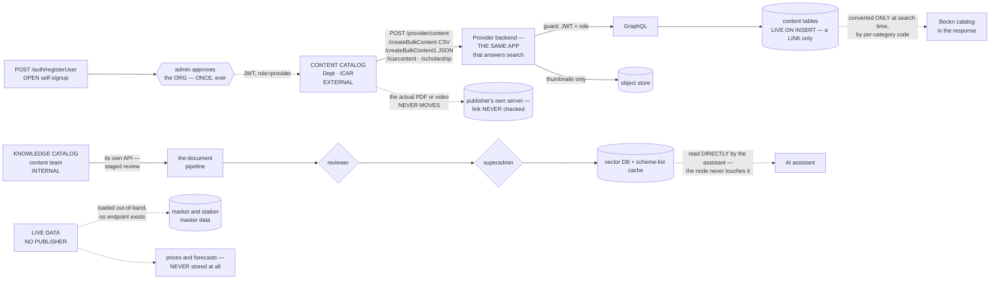
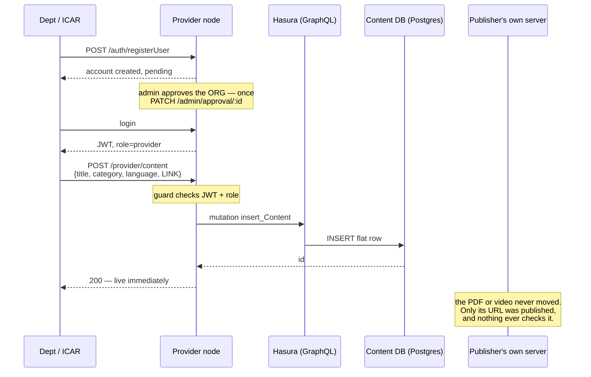
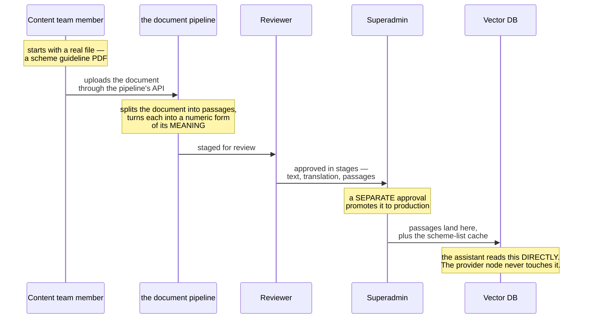
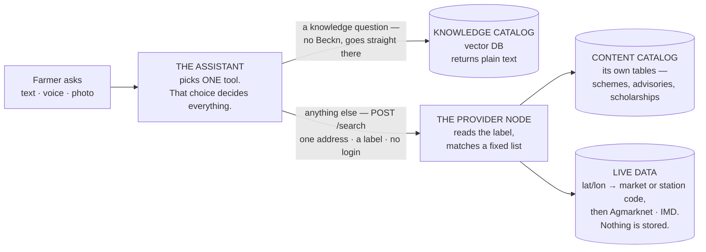
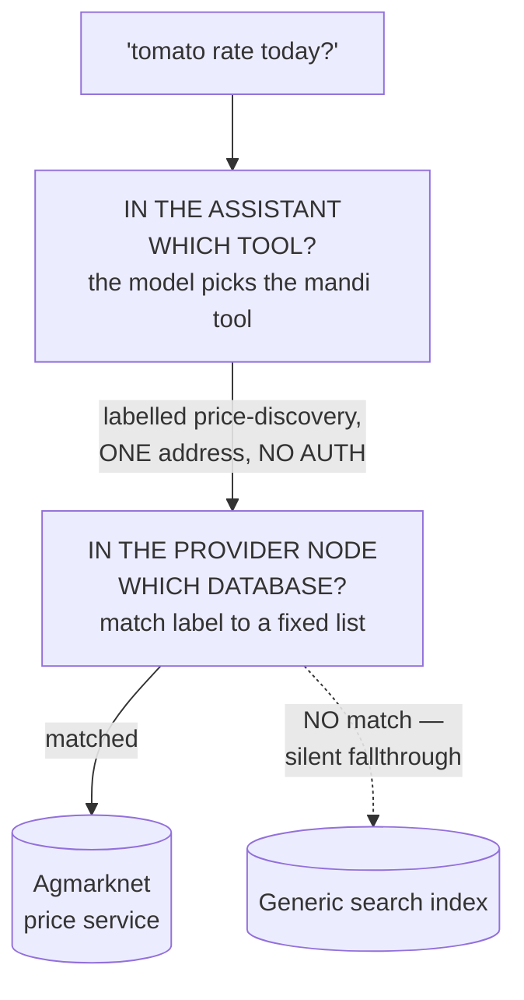
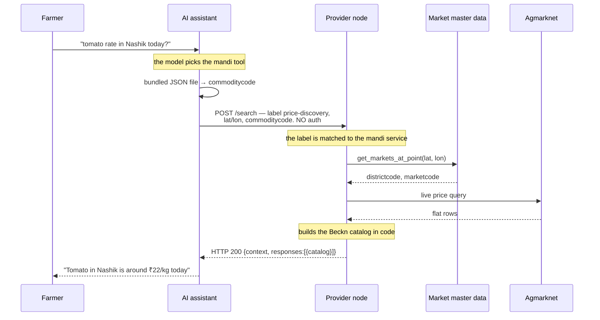
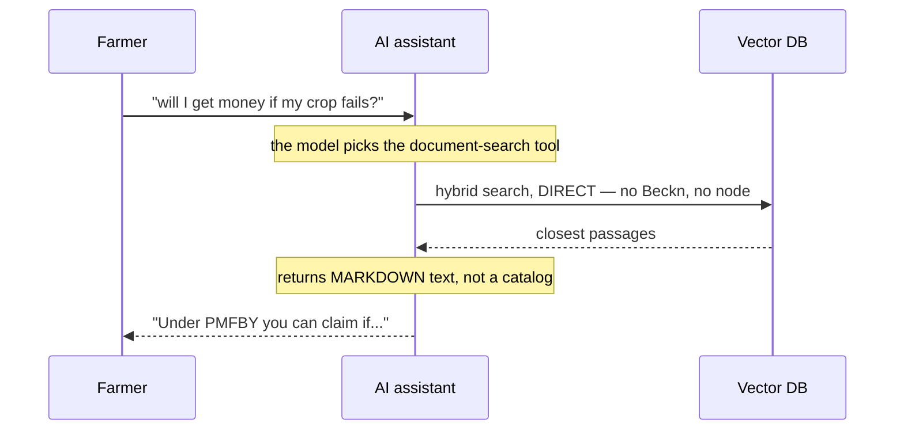
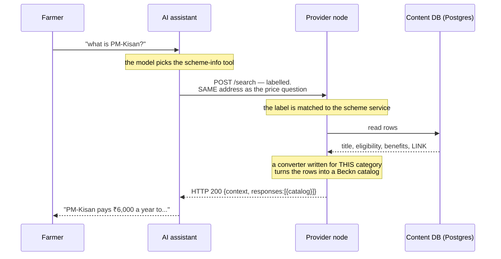
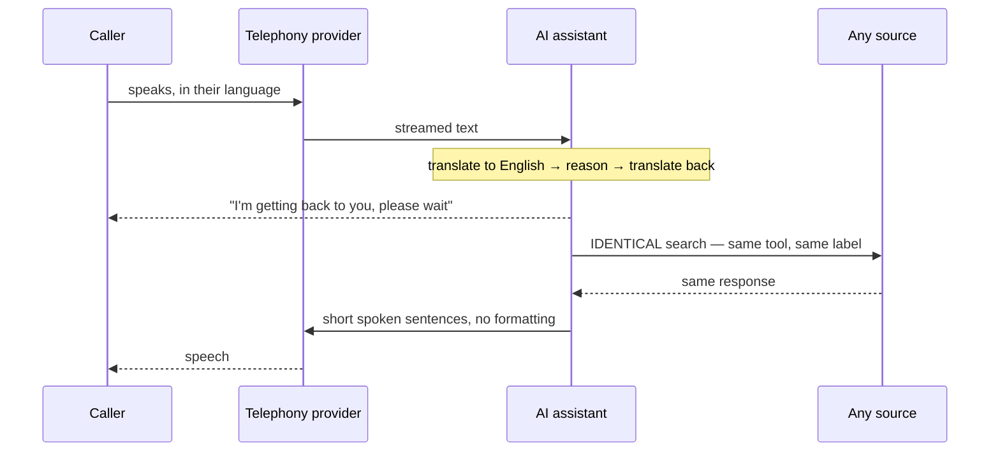
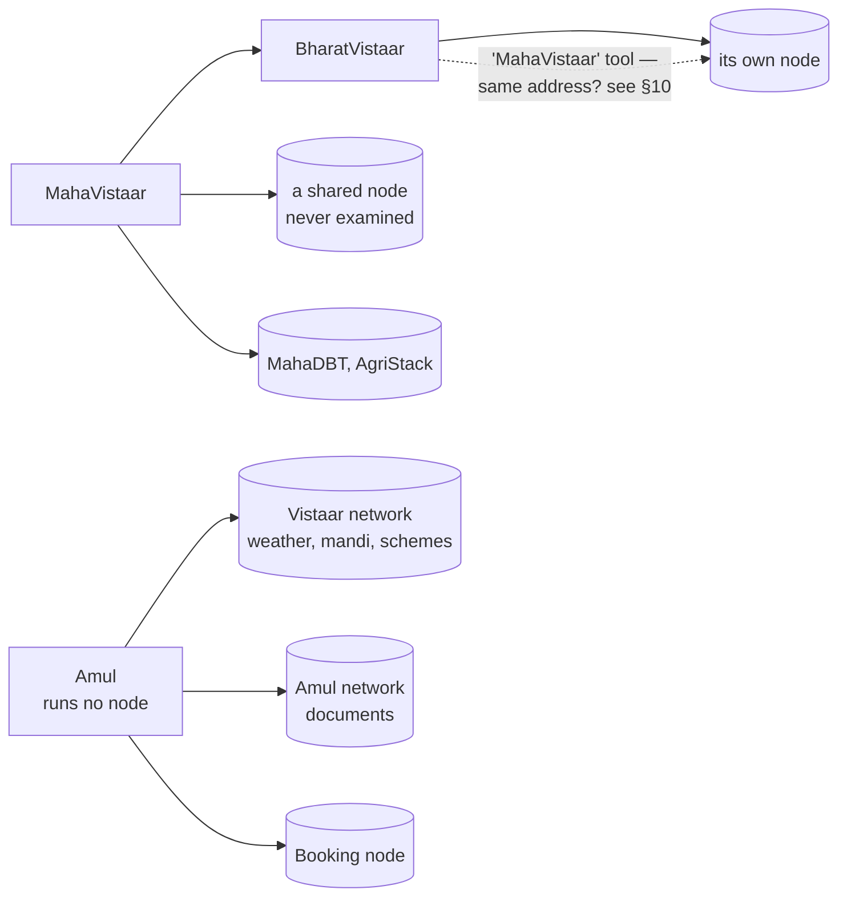

# OpenAgriNet — How publish and discover work

A plain-language explanation of how the platform works today, written as the baseline for moving onto the current Beckn protocol.

**Publish** is §3 and **discover** is §4 — both explained in points, with diagrams and worked examples. Sections 1–2 set up who's involved and where answers come from; §6 lists where today's system departs from Beckn; §9 covers the transactional flows, which are neither publish nor discover but are a third of what the system does. **§10 lists what was not verified** — read it before relying on anything here.

---

## 1. The three products

All three are the same thing wearing different clothes: an **AI assistant that answers farmers' questions** in their own language, by voice or text. They are built from one common codebase and then customised.

| | **BharatVistaar** | **MahaVistaar** | **Amul** |
|---|---|---|---|
| Who uses it | Farmers nationally, via central and state agriculture departments | Farmers in Maharashtra, under the state's POCRA programme | Dairy farmers in the Amul network |
| How they reach it | Website and Android/iOS app | Website and iOS app | Mostly by **phone call**, in Gujarati |
| Tools the assistant has | **31** | **25** | **9** |
| Runs its own provider node | **Yes** | No — uses a shared node run elsewhere | No |
| Uses the Beckn network | Yes | Yes | **Yes** — as a client of others |

**What each one actually does.** They are less alike than "same codebase, different clothes" suggests:

| Capability | BharatVistaar | MahaVistaar | Amul |
|---|---|---|---|
| Scheme information | ✅ | ✅ POCRA, MahaDBT | ✅ union schemes only |
| Advisory documents / video search | ✅ | ✅ | ✅ |
| Weather | ✅ | ✅ | via Vistaar¹ |
| Mandi prices | ✅ | ✅ | via Vistaar¹ |
| Crop insurance (PMFBY) | ✅ | — | — |
| Pest / disease | ✅ search + image diagnosis | ✅ pest detection | — |
| Fertiliser, seed availability, soil health | ✅ | — | — |
| Application status checks | ✅ PM-Kisan, PMFBY, SHC, SMAM | — | — |
| Grievance filing | ✅ PM-Kisan, PMFBY | — | — |
| Farmer registry / land records | — | ✅ AgriStack | ✅ farmer + animal records |
| Local staff contacts | — | ✅ | — |
| **Milk collection records** | — | — | ✅ |
| **Animal health, vet callback** | — | — | ✅ |
| **Loan eligibility** | — | — | ✅ |
| Remembers the farmer between sessions | — | ✅ profile + memory | — |

¹ Feature-flagged. With the network flag off, Amul has no weather or mandi capability at all.

**The short version:** BharatVistaar is the broadest and the only one running its own node. MahaVistaar is a state variant that adds Maharashtra systems and is the only one that remembers a farmer across sessions. **Amul is not a cut-down Vistaar** — it is a dairy operations assistant, and most of what it does (milk collection, animal health, loans) exists nowhere else.

**They also call each other.** MahaVistaar can query BharatVistaar, BharatVistaar has a tool for querying MahaVistaar (see §10), and Amul gets weather, mandi prices and scheme information from the Vistaar network rather than building its own. So "is X on the network" has two answers: whether it *operates* a node, and whether it *uses* one. Only BharatVistaar does the first; all three do the second.

**No shared databases.** Each product has its own deployment and its own stores. What they share is reached over the network, not read from a common database — Amul gets Vistaar's mandi prices by asking, not by querying Vistaar's tables. (MahaVistaar's stores were never examined, so this is confirmed for BharatVistaar and Amul only.)

---

## 2. Start here: three sources of answers

Every answer a farmer gets comes from one of three places. Two of them are catalogs — someone publishes into them and the content sits there until searched. The third has no catalog behind it at all.

| | **Content catalog** | **Knowledge catalog** | **Live data** |
|---|---|---|---|
| Who publishes | agriculture departments, ICAR, scheme owners | the internal content team | **nobody** |
| What | scheme details, advisory articles, videos, scholarships | scheme guideline PDFs, circulars, manuals | mandi prices, weather forecasts |
| Approval | organisation approved once, content never checked | two humans, in sequence | not applicable |
| Stored | yes — structured rows | yes — meaning-indexed passages | **no** — only reference data |
| Searched by | matching on category and fields | closeness of meaning | fetched fresh per request |

The two catalogs have **different publishers, different approval rules, different storage and completely different search mechanics.** A request to "add a new scheme to the catalog" means two different jobs depending on which one is meant.

**Why live data isn't a catalog:** nothing is published into it and no answer is kept — today's tomato price exists only for the length of one request. What *is* stored is the **market and station master data** behind it: which markets exist and where their boundaries fall, which weather stations exist and where. It is a live proxy with a geospatial lookup in front; the full path is traced in §4.

This matters for the redesign: catalogs can be published and cached, live data cannot — but **the master data in front of it is neither.** Nothing publishes it, no API exposes it, and it has no owner in the publishing model at all.

### And a fourth: the generic index

The three above are the ones this document can trace end to end. There is a fourth, and it is reached two different ways — one deliberate, one not.

- **Deliberately**, as the backend for one named category. A request labelled `knowledge-advisory` is routed to it on purpose. It is the node's document-search service.
- **Accidentally**, as the catch-all. Any request whose label the node doesn't recognise is sent here too, rather than refused (§6, gap 8).

What is known about it:

| | |
|---|---|
| What it holds | documents — searches filter on `type:document`, hybrid vector + keyword |
| Where it lives | a **hardcoded IP address in the node's source**, over plain HTTP — not configuration, not TLS |
| Is it the knowledge catalog? | **No.** Different index, different name, different address. The assistant's own document store is configured separately. |
| Who writes to it | **almost certainly the document pipeline — but nothing proves it.** The pipeline has a real write path, yet its target is set by environment variables, and its shipped defaults point somewhere else entirely. The generic index's name appears exactly once in the whole project: the node's read. |

> Two document stores, not one. The assistant searches its own; the node searches this one. **Which one the pipeline actually fills is a deployment setting, not a decision recorded anywhere in the code.** Reading the running pipeline's configuration would settle it in minutes — see §10.

**A note on scope.** These three cover every answer to a *general* question.**A note on scope.** These three cover every answer to a *general* question. They do not cover questions about a specific farmer — "has my PM-Kisan payment arrived?" — which are answered by a fourth path: a live, OTP-authenticated query against a government system, holding no data of its own. That path is §9.

---

## 3. Publish — what goes in, and how

### The one-line version

**Publishing is a database write.** Nothing is announced, registered, or converted to Beckn. A row goes into a table, and it is live.

### Three ways in, with nothing in common

These are the same three sources introduced in §2, now seen from the publishing side.

| | Who publishes | What lands | Approval | Has an API? |
|---|---|---|---|---|
| **Content catalog** | External depts, ICAR | a flat row + a **link** | org approved once | yes |
| **Knowledge catalog** | Internal content team | document passages, by meaning | **two humans, per document** | **no** |
| **Live data** | *nobody* | nothing | — | — |

---

### How the content catalog gets published

1. **Sign up.** `POST /auth/registerUser` — open self-signup, anyone can start.
2. **Wait for one approval.** An admin approves the **organisation** — `PATCH /admin/approval/:id`. This happens **once, ever**.
3. **Log in.** Get a JWT carrying `role=provider`.
4. **Push content.** Pick whichever route matches what you have in hand (all four write to the same place).
5. **The guard checks** JWT + role. Publishing is the only authenticated half of this system.
6. **The node writes** via GraphQL → `insert_Content` → a flat row in Postgres.
7. **It is live on insert.** No review queue, no second pair of eyes, no item-level check.
8. **The file never moves.** Only its URL was stored — and nothing ever checks that URL.

**The four content routes:**

| Route | You send | Notes |
|---|---|---|
| `POST /provider/content` | one item as JSON | the normal path |
| `POST /provider/createBulkContent` | a **CSV file** | bulk load — the spreadsheet version of the above |
| `POST /provider/createBulkContent1` | a JSON array | same job as the CSV route, different input format |
| `POST /provider/icarcontent` | one item, scheme-shaped | adds scheme fields like eligibility and benefits |

- Two of the four are the same operation in different wrappers — CSV vs JSON array.
- **Scholarships are separate.** `POST /provider/scholarship` has its own 21-field shape and its own table. It is not content.
- **Supporting routes:** `/provider/collection` and `/contentCollection` group items; `/provider/uploadImage` handles thumbnails. Each has edit and delete variants.

**What actually gets stored — a pointer, not the thing:**

| Type | What the node keeps |
|---|---|
| Advisory article | metadata + **link** |
| PDF | metadata + link — **the file stays on the publisher's server** |
| Video | metadata + link |
| Scheme listing | scheme fields + link |

- Only **thumbnails** are genuinely uploaded.
- Everything else is a URL, and **nothing checks those URLs**. Delete the PDF and the node keeps advertising it.

**A catch that undermines all of the above:** what you can publish is not what search can find.

- Scheme search narrows the content table on two columns — one naming the use case, one naming the scheme.
- **No publish route sets either of them.** They appear in no insert and no update anywhere in the node.
- The six columns holding the actual scheme text — intro, benefits, eligibility, support, how to apply, other — are the same: **read at search time, written by nothing.**
- So a row published through the documented API arrives with all of these empty, and the scheme search that was meant to find it never will.
- The rows that *do* answer scheme questions today were loaded some other way, **outside every endpoint in §7.**

> This is the sharpest thing in this document. There are effectively **two publishing stories** for one table — the API described above, and an undocumented path that populates the columns that matter. Only the first has a route, a guard and a shape. Verified in the node's own source; see §6.

**Three facts about format, which matter most for the re-architecture:**

1. **Nobody publishes in Beckn format.** Publishers send flat fields.
2. **Nothing is stored in Beckn format.** The database holds flat rows.
3. **Beckn is built at response time**, in code — and with **separate converters per category**: one for ICAR schemes, one for PM-Kisan, one for foundational-literacy content, with mandi and weather building theirs inline. There is no shared mapper.

> So: **there is no Beckn data model to migrate.** There is flat content plus scattered translation code. You would be building the model, not moving it.

**What a "provider" is, as far as the system knows:**

- A **User** row — login, role, approval state.
- A **Provider** row — **four fields only**: id, link to the user, organisation name, source code.
- No contact detail, no endpoint, no signing key, no domain. Enough to say "this login belongs to ICAR", and nothing a network would need to treat it as a participant.

---

### How the knowledge catalog gets published

1. **Internal team only.** External organisations cannot use this path.
2. **What goes in:** long-form government documents — scheme guideline PDFs, circulars, operational manuals. Too dense for a farmer, but the assistant needs to quote from them.
3. **There is a proper API** — a document pipeline with its own service and review interface, sitting alongside the other BharatVistaar components. Documents are submitted by upload or by reference, singly or in batches, and everything after that is driven through the same API.
4. **The pipeline splits** the document into small passages and converts each into a numeric representation of its *meaning* — this is what lets the assistant find "the bit about eligibility" without anyone tagging it.
5. **Approval happens in stages, not once.** Reading the text, translating it, splitting it into passages and loading it are each approved separately, with the document moving through a ten-stage lifecycle. Work can be retried, reset or re-run per stage rather than restarted.
6. **Production is a second, separate promotion.** A document approved for use still has to be requested for production and then approved by a superadmin — a distinct target with its own configuration.
7. **It lands in a vector database**, plus a separately-cached list of available schemes — that cache is what makes a new scheme searchable **without redeploying the assistant**.

> **This is the most carefully built publish path in the system**, and the only one with staged human review, per-action permissions, rate limiting and an audit trail of who changed what. It is worth contrasting with §3's content API, where a single insert goes straight to live.

> Note the inversion: content from **strangers** goes live on insert; content from **staff** needs two approvals.

---

### Live data — nobody publishes it

- Nobody publishes mandi prices or weather forecasts. **No publish route touches this path.**
- What *is* maintained is the **market and station master data** — which markets exist and where their boundaries fall, which weather stations exist and where.
- It sits in its own database, loaded and maintained **outside every API on this page**. No publisher can touch it; no endpoint exposes it.
- Prices and forecasts themselves are fetched per request and **never stored**.
- It appears in a publish section only to record that **it has no publisher**. How it is used is in §4.

---

### Publish — the high-level architecture

One picture covering all three paths — and the point of it is that **they never meet.** Each ends in a different store, with a different approval model, and the one with the most review is not the one carrying farmer-facing content.



**The architecture in points:**

1. **Publishing and searching happen in the same app.** One program, one container, one database. There is no separate publishing service.
2. **Two of the three have an API, and they are very different in character.** The content catalog takes a single insert straight to live. The knowledge catalog has staged review, per-action permissions and an audit trail. Live data has nothing at all.
3. **Only publishing needs a login.** Every publish route checks a token. Every search route checks nothing.
4. **The approval happens once, to the organisation — not to the content.** After that, everything that account uploads is live the moment it is saved.
5. **Outsiders are checked less than staff.** Content from departments gets no review. Documents from the internal team need two people to sign off.
6. **The system stores a link, not the file.** The PDF or video stays on the publisher's own server. Nobody ever checks whether it still exists.
7. **The three stores never talk to each other.** Content tables, the vector DB, and the map data are completely separate. Nothing joins them.
8. **Beckn does not appear anywhere in publishing.** Not in what is sent, not in what is stored. It is built later, at search time.
9. **The most-asked questions have no publisher at all.** Today's price and tomorrow's rain are fetched live and thrown away — nothing on this diagram covers them.

### Publish — one request, end to end (content catalog)

An agriculture department publishes a new advisory article:



### Publish — the same request for the knowledge catalog

Put side by side with the one above, the contrast is the whole point: **no login, no endpoint, no HTTP at all — and two humans instead of none.**



**The difference in one line each:**

| | Content catalog | Knowledge catalog |
|---|---|---|
| How it is sent | an HTTP request, live on insert | an HTTP request, then staged review |
| Who can do it | any approved outside org | internal team only |
| Checks on the item | **none** — live on insert | **staged approval**, plus a separate promotion to production |
| What lands | a flat row with a link | passages indexed by meaning |
| Who reads it later | the provider node | the assistant, directly |

---

## 4. Discover — how a search works

### The one-line version

**The model picks a tool, and that choice is the entire routing decision.** Every Beckn tool posts to the same single address; only the label written inside the request differs. The node reads that label and matches it against a list compiled into its code.

### Search — the high-level architecture

Everything a farmer can ask goes through this one picture. Text, voice and photos all converge at the same point. What changes after that is only **which of the three sources** the chosen tool goes to — the same content catalog, knowledge catalog and live data described in §2.



Answers come back the same way they went out, in the same HTTP call — the node builds the Beckn wrapper on the way out, and the assistant turns whatever it gets into a sentence in the farmer's language, typed or spoken.

Two details left off the picture to keep it readable, both covered in the points below: the assistant looks up commodity codes in a **file bundled inside it** before calling the node, and a label the node **doesn't recognise** quietly falls through to a generic index.

**The same three sources from §2, seen from the search side:**

| Source | A question like | Beckn? | Where the answer comes from | Comes back as | Stored? |
|---|---|---|---|---|---|
| **Content catalog** | "what is PM-Kisan" | yes | node → its own content tables | Beckn catalog | yes, a row |
| **Knowledge catalog** | "will I get money if my crop fails" | **no** | assistant → vector DB **directly** | **plain text** | yes, passages |
| **Live data** | "tomato rate today", "will it rain" | yes | node → map lookup → **government API** | Beckn catalog | **no, never** |

The assistant cannot tell the first and third apart — both arrive in the same shape.

**The architecture in points:**

1. **The farmer asks a question.** There is no search box and no browsing. Typed, spoken or photographed — it all becomes the same thing before anything is decided.
2. **The model reads the question** and the plain-English descriptions of the tools it has.
3. **The model picks one tool.** This is a judgement, not a rule or a lookup. **That single choice decides everything** — which source, which database, which answer.
4. **The tool never looks at the question.** It already knows where it goes. The question only decided *which tool*.
5. **If the tool is a knowledge-catalog search, it stops here.** The assistant queries the vector database itself and gets back plain text. No Beckn, no node, no routing.
6. **Otherwise the tool sends a request to the node** — always the same one address, with a **label** written inside it. Nothing checks who is calling.
7. **The node does not think.** It reads the label, finds it in a fixed list, and calls that service. It never reads the farmer's question.
8. **A content question reads a database row.** A live question does two extra things: turn the farmer's location into codes (government APIs won't accept a place name), then call the government API fresh.
9. **The Beckn format is built right there, on the way out**, from plain rows — then thrown away. Nothing is stored in it.
10. **Live answers are never saved.** Ask the same question twice and every step runs again.
11. **If the model picks wrong, the wrong database answers and nobody notices.** There is no fallback and no second opinion.
12. **A label the node doesn't recognise doesn't fail either** — it quietly answers from a generic index. This is happening in production today (§6).

### Not everything the assistant can do is a search

BharatVistaar has **31 tools** registered:

| | Count | What they do |
|---|---|---|
| Search and lookup | 18 | schemes, documents, video, pests, weather, mandi prices, commodities, geocoding, seed availability, crop-image analysis, glossary |
| **Transactional** | **13** | check a farmer's application status, file and track grievances — OTP-gated, acting on one named person |

This section covers the first row only. **The transactional half is a different thing entirely** — see §9. The full menu across all three products is in §11.

### Voice changes the ends, not the search

- Speaking is just another way to type.
- **Once speech becomes text, the search is identical** — same tools, same sources, same routing.
- There is **no voice-specific index** and no separate voice search.

Only the ends differ:

| | **Web and app** | **Phone (Amul)** |
|---|---|---|
| Speech → text | the platform does it | the telephone provider does it |
| Steps | three calls: transcribe, then ask, then speak the answer | one continuous streaming call |
| Language handling | detect the spoken language, then transcribe in it | translate to English, reason, translate back |
| Answer format | text on screen, optionally read aloud | speech only — no formatting, short sentences |

**Two things exist only on the phone side:**

- The conversation is held **per call**. If the caller drops and redials, the older in-flight reply is stopped so it can't write stale history.
- When a lookup is slow, the assistant says something brief — *"I'm getting back to you, please wait"* — because silence on a phone line reads as a dropped call.

### How it decides which database

The honest answer is blunt: **the caller names it.** The label the tool writes into the request *is* the database selector.



**The full list the node matches against:**

| Label the caller sends | Where the answer comes from |
|---|---|
| `price-discovery` with item `mandi` | resolves the nearest market, then calls **Agmarknet** for today's prices |
| `Weather-Forecast` | resolves the weather station, then calls the **IMD** station service |
| `Weather-Forecast-Mausamgram` | calls **Mausamgram** by coordinates instead |
| `icar-schemes` | its own content database — no external call |
| `schemes-agri` | the PM-Kisan service |
| `pmfby` | the crop insurance service |
| `knowledge-advisory` | a general-purpose external search index |
| anything else | falls through to that same general-purpose index |

**Five things to note about that list:**

- **Nothing checks who is asking.** No token, no key, no signature on any search route — or on the OTP and grievance routes either. Publishing needs a login; searching does not.
- **Milk and dairy aren't on it.** Amul is a **separate deployment** with its own addresses.
- **An unrecognised label doesn't fail — it silently answers from the generic index.** Not hypothetical: scheme search sends a label the node has no entry for, so scheme questions are answered by generic search today (§6).
- **Adding a data source means editing that list and shipping a release.** There is no way for a new source to announce itself.
- **The matching is inconsistent.** Some labels match on the descriptor's *name*, others on its *code*, with different case rules. Three don't go where their names suggest — `schemes-agri` reaches PM-Kisan, `icar-schemes` reaches the general content database, and the weather tool sends `Weather-Forecast-Mausamgram` alongside an unrelated code. It works by coincidence of convention, not design.

---

### Example 1 — Live data: *"tomato rate in Nashik today?"*



**In points:**

1. The model picks the mandi tool.
2. **The assistant resolves "tomato" → a commodity code itself**, from a JSON file bundled into it. No network call.
3. It posts a labelled request to the one address. No authentication.
4. The node reads the label. **In this repo's source it does not reach the mandi service** — see the request body below.
5. **The node resolves the location** — lat/lon → `districtcode` + `marketcode` by point-in-polygon against master data.
6. The node calls Agmarknet **live**. If nothing comes back, it retries without `marketcode` to widen the search.
7. The node converts the flat rows into a Beckn catalog **at that moment**, and returns it in the same HTTP response.
8. **Nothing is stored.** The next identical question repeats every step.

**What the assistant actually sends.** This is the whole translation from the farmer's sentence to a structured request — nothing else happens in between:

```json
{
  "context": {
    "domain": "schemes:vistaar",
    "action": "search",
    "version": "1.1.0",
    "bap_id": "<from configuration>",
    "bap_uri": "<from configuration>",
    "bpp_id": "<from configuration>",
    "bpp_uri": "<from configuration>",
    "transaction_id": "<fresh uuid>",
    "message_id": "<fresh uuid>",
    "timestamp": "2026-08-12T06:15:00.000Z",
    "ttl": "PT10M",
    "location": { "country": { "code": "IND" }, "city": { "code": "*" } },
    "tags": { "session_id": "...", "question_id": "..." }
  },
  "message": {
    "intent": {
      "category": { "descriptor": { "code": "price-discovery" } },
      "item":     { "descriptor": { "name": "Tomato" } },
      "fulfillment": {
        "end": {
          "location": {
            "descriptor": { "name": "Nashik" },
            "gps": "19.9975,73.7898"
          }
        }
      },
      "tags": [
        { "code": "from_date", "value": "2026-08-11" },
        { "code": "to_date",   "value": "2026-08-12" }
      ]
    }
  }
}
```

Read it against the question and the mapping is one-to-one:

| In the farmer's sentence | Where it lands | Who decided it |
|---|---|---|
| *(nothing — it's the tool choice)* | `category.descriptor.code` = `price-discovery` | **the model, by picking the mandi tool** |
| "tomato" | `item.descriptor.name` | the model |
| "Nashik" | `fulfillment.end.location` — name **and** gps | the model, then the geocoding tool |
| "today" | the `from_date` / `to_date` tags | the tool's own date logic |

- **`category.descriptor.code` is the routing decision, and it is a constant in the tool's source.** It cannot vary with the question. Pick the mandi tool and it is always `price-discovery`.
- **`item.descriptor` carries only a `name`, and no `code` — and that breaks this path.** The node routes a `price-discovery` request to its mandi service **only if `item.descriptor.code` equals `mandi`**. This request has no `code` at all, so it fails that test and falls through to the generic index. No client in any of the three products sets it. See §6, gap 8 — this is the second instance of the same fault, and it sits on one of the most-asked questions there is.
- `city.code` is `"*"` — a wildcard. The city field Beckn would route on is unused; the real location rides in `fulfillment`.
- `bpp_id` and `bpp_uri` are read from configuration and **asserted, never verified** — the sender names its own destination.
- `transaction_id` is fresh every call, so nothing correlates two requests.

**Two lookups, in two different systems — this is the part that gets missed:**

| Resolving | Where | How |
|---|---|---|
| "tomato" → `commoditycode` | **the assistant** | fuzzy match on a bundled JSON file |
| location → `marketcode`, `districtcode`, station id | **the node** | geospatial query on master data |

- The node **never looks up a commodity**. It receives the code and passes it straight through. A wrong match on the assistant side reaches the government API unchallenged.
- The location step exists because the government APIs **won't accept "Nashik" or coordinates** — they demand codes.
- **Weather is the same shape:** resolve the station from coordinates, then call IMD or Mausamgram live. Same address, same node, different label.

---

### Example 2 — Knowledge catalog: *"will I get money if my crop fails?"*



**In points:**

1. The model picks the document-search tool.
2. **The request never leaves the assistant's own network.** No Beckn envelope, no node, no label, no routing decision.
3. The question is converted into the same numeric meaning-representation used when the documents were indexed.
4. The closest passages come back — which is why a question that never uses the word "insurance" finds the right insurance paragraph.
5. **The tool returns markdown text, not a Beckn catalog.** There is no `on_search` structure anywhere on this path.
6. **The node is never involved.** The vector database is the only thing consulted.

**What the assistant actually sends — and this is the point of showing it:**

```json
{
  "q": "will I get money if my crop fails?",
  "limit": 10,
  "filter_string": "type:document",
  "search_method": "hybrid",
  "hybrid_parameters": {
    "retrievalMethod": "disjunction",
    "rankingMethod": "rrf",
    "alpha": 0.5,
    "rrfK": 60
  }
}
```

That is the entire request. Put it beside Example 1 and the contrast is the whole story:

| | Live data / content catalog | Knowledge catalog |
|---|---|---|
| Envelope | ~40 lines of Beckn `context` | none |
| The question itself | **discarded** — only a code and a name survive | **sent verbatim**, as `q` |
| What routes it | a category label the tool hardcodes | nothing — one index, one query |
| Sent to | the provider node | the search engine directly |

**The farmer's actual words only survive on this path.** On the Beckn paths the sentence is thrown away at the assistant and replaced with a label plus a couple of parameters; the node never sees what was asked. Here the sentence *is* the request.

> This path proves the point: **most of what a farmer asks is answered without Beckn being involved.**

---

### Example 3 — Content catalog: *"what is PM-Kisan?"*



**In points:**

1. The model picks the scheme-info tool.
2. The tool posts a labelled Beckn request — same address as mandi, different label.
3. The node matches the label and hands off to the scheme service.
4. **The service reads its own database** through GraphQL. No external call.
5. Flat rows come back — title, description, eligibility, benefits, and a **link**.
6. A **category-specific converter** turns those rows into a Beckn catalog. There is no shared mapper — ICAR schemes, PM-Kisan and literacy content each have their own.
7. The catalog returns in the same HTTP response. The assistant summarises it for the farmer.

**What the assistant actually sends.** Same envelope as the mandi request — only the `intent` differs, and it is smaller:

```json
{
  "context": { "…identical in shape to Example 1…": "" },
  "message": {
    "intent": {
      "category": { "descriptor": { "code": "schemes-agri" } },
      "item":     { "descriptor": { "name": "PM-Kisan" } }
    }
  }
}
```

- **Two fields carry the entire query**: one label naming the database, one name naming the scheme.
- No location, no dates, no free text. The farmer's sentence is gone by this point.
- Change `schemes-agri` to `price-discovery` and the identical request becomes a mandi lookup. **The label is the whole routing decision** — which is what "the caller names the database" means in practice.

> **The address is not literally `/search`.** The node exposes `mobility/search` and `dsep/search`; there is no bare `/search` route. The configured endpoint carries the prefix, and every tool appends `/search` to it. Worth knowing before anyone tries to call it from the URL in the docs.

**The catch:** the *scheme-document* tool — the one for "what are the eligibility rules" rather than "what is this scheme" — sends `category.descriptor.code` = `scheme-agri-qdrant`, and the node's list has **no entry for it**. It falls through to the generic index (§6, gap 8). Verified on both sides: the constant in the tool, and its absence from the node's chain.

---

### Example 4 — The same question, on a phone call



**In points:**

1. The telephone provider turns speech into text — one continuous streaming call, not three separate ones.
2. **From here the search is byte-for-byte identical.** Same tools, same labels, same sources, same routing.
3. There is **no voice index** and no voice-specific search path.
4. The conversation is held **per call**. Redial and the older in-flight reply is cancelled so it can't write stale history.
5. If the lookup is slow, the assistant fills the silence — on a phone line, silence reads as a dropped call.
6. The answer comes back as **short spoken sentences with no formatting** — no bullets, no headings, no links.

---

### Why none of this counts as discovery

Everything above is content lookup. **No step in it ever asks who is on the network** — the tool doesn't choose a destination, and the node only matches a string against a list compiled into it. The request does carry a provider id and URL in its header, but the sender asserts those and nothing verifies them.

Because there is no gateway to fan a search out to several providers, **a search can only ever reach the one address in configuration.** The full comparison against what Beckn expects is §6.

### What comes back to the farmer

1. The tool receives whatever its source returned — a Beckn catalog, or markdown.
2. It flattens that into plain text for the model.
3. The model writes the answer **in the farmer's language**.
4. It streams back sentence by sentence rather than making them wait for the whole reply.
5. On a phone call, the same text is spoken instead — short sentences, no formatting.

---

## 5. Who publishes what, who discovers what

| | **Publishes** | **Discovers** |
|---|---|---|
| Agriculture departments, ICAR, scheme owners | Scheme details, advisory articles, videos, scholarships | nothing |
| Internal content team | Scheme guideline documents and circulars | nothing |
| Government systems (Agmarknet, IMD, Mausamgram, insurance, PM-Kisan, SHC) | nothing — they answer live, on request | nothing |
| **The AI assistant** | nothing | **everything** — it is the only thing that searches, and the only thing that transacts |
| **The other two products** | nothing | each other's catalogs, over Beckn |
| Farmers | nothing | nothing directly — they ask the assistant |

**In Beckn terms:** the assistant is the buyer-side app (BAP). The provider node is the seller-side platform (BPP). The departments are the providers. Farmers are the end users, one step removed — they never touch the network themselves.

**One clarification worth making,** because the words collide: the **provider node** is software — one deployment, run by the platform team, that answers searches. The **providers** are the organisations that publish into it. Many providers, one node. A department doesn't run anything; it just has a login.

---

## 6. Where this differs from the current Beckn protocol

The reason for this document. Restated plainly:

1. **Answers come back immediately.** Real Beckn expects the provider to say "got it" and send results separately a moment later, so many providers can answer the same question at their own pace. Today it's a single question-and-answer, like any ordinary web request. This is the biggest change, and it affects the assistant too — it would need to start *receiving* results rather than just waiting for them.

2. **Requests aren't signed — and there is no layer that would sign them.** Beckn expects each participant to cryptographically sign its messages so the other side can verify who sent them. It was natural to assume an off-the-shelf Beckn component sat behind the node doing this. **It does not.** The container the node runs in is built from the node's own source, its dependency list contains no Beckn or signing library, and the deployment runs a single service. Signing is absent, not delegated.

3. **Nothing authenticates a search either.** Not just unsigned — unguarded. Every search and transaction route on the node accepts any caller, including the OTP and grievance routes. Publishing requires a login; reading and transacting do not. Whatever replaces this has to close both gaps, and this one is the more urgent of the two.

4. **There's no directory of participants.** Real Beckn has a registry you consult to find out who's on the network. Here, the assistant talks to exactly one provider address, fixed in configuration. It cannot discover anyone else.

   Worth being precise about what that costs, because it is the opposite of what "no registry" usually suggests. It does **not** mean anyone can join — joining means an admin approving an organisation by hand. It means nobody can be **found**. A second provider node could go live tomorrow and no assistant would ever reach it; someone would have to edit a configuration value and ship a release. Open to read, closed to join, impossible to discover.

5. **Everything appears under one provider name.** All knowledge results come back attributed to a single provider, regardless of who actually published them. A real network needs each department to appear as itself.

6. **The catalog isn't really a catalog.** There is no stored notion of catalogs or items — just flat content rows reshaped into Beckn's format at the moment of answering. A provider record does exist, but it carries only an organisation name and a source code: no endpoint, no key, no domain. Enough for an account, not enough for a network participant.

7. **Nobody checks individual content.** Approval is at the organisation level only. If the new network requires per-item trust, that's new work, not a migration.

8. **Two search paths are silently broken, and the mechanism is the same.** Verified on both sides — the constant in the client, and the routing chain in the node.

   - **Scheme documents.** The tool sends the category `scheme-agri-qdrant`. That string appears nowhere in the node — no branch, no mention. It falls through to generic search.
   - **Mandi prices.** The tool sends the category `price-discovery`, which the node *does* recognise — but the node only reaches its mandi service if `item.descriptor.code` is also `mandi`, and **no client in any of the three products sets that field.** So this falls through too, on one of the most-asked questions in the system.

   Neither fails loudly. Both return plausible text from the wrong source, and nothing in the response says so. Fix or remove — don't carry either forward. *(Read from this repository's source; the running deployment was not inspected — see §10.)*

9. **The publish API cannot write the fields that search filters on.** Verified in code. Scheme search narrows the content table on two columns, `usecase` and `scheme_id` — and **no publish route sets either one**. Neither appears in any insert or update. The same is true of the six columns holding the actual scheme text. So anything published through the documented API arrives with those columns empty and is invisible to the search that was meant to find it. The rows that *do* answer scheme questions were loaded some other way, outside every endpoint in §7. Two separate publishing stories, and only one of them has an API.

10. **The node's document index is hardcoded, and which pipeline fills it is unrecorded.** It backs the `knowledge-advisory` category *and* catches everything unrecognised. Its address is an **IP literal in the node's source, over plain HTTP** — not configuration, not TLS. It is a second document store, separate from the one the assistant searches. A document pipeline exists and can write to a store like it, but **its target is chosen by environment variable and its shipped defaults point elsewhere**, so the connection is inferred, not documented. Three questions for the redesign: who owns it, is it the same content as the assistant's store, and should an unroutable request be answered at all rather than refused?

11. **Decide what belongs on the network.** Today the document/video search deliberately bypasses Beckn while structured content goes through it. That split happened by accident rather than design. Choose it consciously this time.

12. **Nobody publishes in Beckn format, and no content is actually held.** Publishers send flat fields in four shapes; the node converts at query time. Files are never uploaded — only links to the publisher's server, which nothing validates, so dead links are advertised indefinitely. Two questions: should publishers produce Beckn structure directly, and should the network hold content or keep pointing elsewhere?

13. **Only one product operates a node, but all three use the network.** BharatVistaar runs the only node examined here; MahaVistaar uses a shared node nobody has looked at; Amul runs none yet is a client of three. The products also query each other. The cross-traffic is real — it just has no registry, no signing and no discovery underneath it. That makes the redesign more urgent, not less.

14. **Two unrelated routing schemes, and the riskier one is the weaker.** Search routes on a category label; transactions route on a provider id in the order. Neither knows about the other, and both fall through to a default handler rather than rejecting what they don't recognise. The transactional flows carry identity and have real consequences — a grievance filed, a payment status disclosed — yet run on the same unsigned, unverified transport. An OTP proves the farmer; nothing proves the machines. See §9.

### The picture across the three products

A hand-wired mesh, not a network — this is gap 13 above, drawn:



- **Every arrow is a deployment setting**, not a discovered route.
- The traffic is genuinely cross-organisational — Amul farmers really do get Vistaar's mandi prices.
- But **no participant can name, find or verify any other.** Amul is the clearest case: it runs no node at all, yet is a client of three.

---

## 7. Appendix — the actual APIs

For engineers. The rest of the document deliberately avoids these.

**Publishing into the content catalog** (provider node)

| Endpoint | Purpose |
|---|---|
| `POST /auth/registerUser`, `POST /auth/login` | organisation registers, then gets a token |
| `PATCH /admin/approval/:id` | admin approves the **organisation** — the only approval that exists |
| `POST /provider/content` | publish one item |
| `POST /provider/createBulkContent` | spreadsheet upload, 30-column layout — but see the warning below |
| `POST /provider/icarcontent` | scheme-shaped items |
| `POST /provider/collection`, `/contentCollection` | group items |
| `POST /provider/scholarship`, `/uploadImage` | scholarships, media |

**Publishing into the knowledge catalog** (ingestion pipeline)

| Endpoint | Purpose |
|---|---|
| `POST /documents/{id}/approve-ingestion` | reviewer sign-off |
| `POST /documents/{id}/approve-prod` | superadmin promotes to production |

**Discovery** (provider node) — `POST /mobility/search` is the one that matters. `select`, `init`, `confirm`, `rating`, `status` exist under the same prefix. A legacy `/dsep/*` set still runs alongside it. Routing is decided by `message.intent.category.descriptor.name` / `.code`:

| Category value | Goes to |
|---|---|
| `knowledge-advisory` | general search service |
| `Weather-Forecast` | IMD station lookup |
| `Weather-Forecast-Mausamgram` | Mausamgram by coordinates |
| `schemes-agri` | PM-Kisan handler |
| `icar-schemes` | content database via GraphQL |
| `price-discovery` + item code `mandi` | Agmarknet |
| `pmfby` (or any code starting `pmfby`) | crop insurance service |
| *unmatched* | general search service |

> Three traps here. `schemes-agri` and `icar-schemes` do **not** go where their names suggest. The assistant sends `scheme-agri-qdrant`, which matches nothing — it lands in the unmatched row. And the first three rows are matched on `.name` (case-sensitive) while the rest are matched on `.code` — so a caller sending the right value in the wrong field silently misses.

**The full route list** (provider node)

| Route | Notes |
|---|---|
| `POST /mobility/search` | the one that matters — routed by category, above |
| `POST /mobility/init` | routed by `order.provider.id`, **not** by category — see §9 |
| `POST /mobility/status` | application status |
| `POST /mobility/select`, `/confirm`, `/rating` | |
| `POST /dsep/{search,select,init,confirm,rating}` | legacy set, still running |
| `POST /vistaar-proxy` | CORS proxy for a browser test app |
| `POST /submit-feedback/:id` | |

**Outbound calls the provider node makes**

| Call | Notes |
|---|---|
| `GET {MANDI_BASE_URL}/v1/fetch-agmarknet-vistaar` | 15s timeout, retries with a relaxed query if empty |
| `GET {IMD_WEATHER_API_URL}?id={stationId}` | 30s timeout, 3 attempts, 2s backoff |
| `GET {MAUSAMGRAM_ENDPOINT}/get-daily?lat=&lon=` | Basic auth, same retry policy |

Market and station reference data comes from a separate database the node connects to directly, not from these APIs.

**Assistant-facing** — `GET /api/chat/` streams the answer as server-sent events. Supporting routes: `POST /api/token` (plus `/api-key` and `/play-integrity`), `POST /api/transcribe/`, `POST /api/tts/`, `POST /api/telemetry/{events,feedback,error}`.

**Configuration trap:** the variable named `BAP_ENDPOINT` holds the URL the assistant **sends to**, not its own. The assistant is the BAP; this is its destination. Every Beckn tool in BharatVistaar uses this one setting — including the tool named for cross-network calls to MahaVistaar. What it actually points at was not verified; see §10.

---

## 8. Examples

### Publishing one item

`POST /provider/content`, with the organisation's token. The owning organisation is taken from the token, not the body.

```json
{
  "content_id": "ICAR-WHEAT-2026-014",
  "title": "Wheat sowing advisory for late rabi",
  "description": "Recommended varieties and sowing window for delayed rabi planting.",
  "contentType": "Article",
  "category": "Crop Advisory",
  "themes": "Rabi, Wheat, Sowing",
  "domain": "Agriculture",
  "language": "hi",
  "url": "https://example.gov.in/advisories/wheat-late-rabi.pdf",
  "urlType": "external",
  "mimeType": "application/pdf",
  "publisher": "ICAR",
  "sourceOrganisation": "ICAR-IIWBR",
  "author": "Dr. A. Sharma",
  "image": "https://example.gov.in/img/wheat.png",
  "collection": false
}
```

It goes live on insertion. No review step follows.

Note the two things this example makes concrete: the shape is **flat, not Beckn**, and `url` is **a pointer, not an upload** — the PDF stays on the publisher's server.

**Don't confuse this with the scheme PDFs the assistant quotes from.** Those go through the knowledge catalog: real uploads, reviewed stage by stage, indexed by meaning, never touching Beckn. Same word "scheme", two unrelated pipelines.

### Publishing in bulk

`POST /provider/createBulkContent` with a CSV. The header row must contain these 30 columns:

```
content id, Name, Description, Icon, Crop, Branch, Publisher, Collection,
URL_Type, URL, Mime_Type, Language, Content Type, Category, Themes,
Min age, Max age, Author, Domain, Curricular Goals, Competencies,
Learning Outomes, District, State, Expiry Date, File Type,
Month Or Season, Publish Date, Region, Target Users
```

> ⚠️ **Three things to know before relying on this.**
> 1. **The header check does not run.** The code computes whether the headers are valid and then ignores the result — the import proceeds unconditionally. A malformed file will be accepted and produce rows full of nulls.
> 2. **Only 18 of the 30 columns are stored.** Crop, Category, Themes, Min age, Max age, Author, Domain, Curricular Goals, Competencies, Learning Outcomes, District, URL_Type and Mime_Type are read from the file and then dropped. Publishers filling them in are wasting effort.
> 3. **`Learning Outomes` is misspelled** in the expected header, so a correctly spelled file mismatches — which currently doesn't matter only because of point 1.
>
> The vocabulary is also inherited from an education platform — "Curricular Goals", "Competencies", "Learning Outcomes", "Min age"/"Max age" have no agricultural meaning. Worth dropping in the redesign.

### A search request

`POST /mobility/search`. **The verified request body is in §4, Example 1** — read it there rather than duplicating it here.

Two things about it are worth restating, because an idealised version of this example used to appear here and got both wrong:

- The real mandi request sends `item.descriptor` with a **`name` only, no `code`** — and the node's `price-discovery` branch requires `item.descriptor.code === "mandi"`. It is not a well-formed request for the node it is sent to (§6, gap 8).
- It also carries `fulfillment.end.location` (name + gps) and `from_date` / `to_date` tags, which a minimal example omits — and those are what the node's geospatial step actually consumes.

**`category.descriptor` is the routing key** — it alone decides which internal service handles the request. `item.descriptor` carries the actual question.

### The response

Comes back **in the same HTTP reply** — there is no separate callback:

```json
{
  "context": { "action": "on_search", "transaction_id": "2f7c1e40-...", "...": "..." },
  "responses": [{
    "context": { "...": "..." },
    "message": {
      "catalog": {
        "providers": [{
          "descriptor": { "name": "Agri Acad" },
          "items": [{
            "descriptor": { "name": "Tomato — Pune (Khadki)", "short_desc": "Agmarknet mandi prices" },
            "tags": [{ "descriptor": { "code": "modal_price" }, "value": "2450" }]
          }]
        }]
      }
    }
  }]
}
```

Note the **`responses` array** wrapping the catalog. That is not Beckn — a real `on_search` has `message.catalog` at the top level, one callback per provider. Here every result is nested one level deeper inside a non-standard array, because one synchronous reply has to stand in for what would otherwise be several separate callbacks. Any client written against the spec will not parse this.

Note two things. The action says `on_search`, but this is a plain response body, not a callback to `bap_uri` — the shape is Beckn, the mechanics are not. And the provider name is a fixed label, not the organisation that actually published the data.

---

## 9. The other half — transactions, not search

Everything above is about *finding* things. But **13 of the assistant's 31 tools don't search at all.** They act on behalf of one identified farmer, and the document would be misleading without them.

**What they do**

| Group | Tools | What happens |
|---|---|---|
| Application status | PM-Kisan, PMFBY, Soil Health Card, SMAM | "has my payment come through?" — checks a real application against a government system |
| Grievances | PM-Kisan (3), PMFBY (4) | files a complaint, then tracks it |

**Walked through — a farmer asks "has my PM-Kisan payment come?"**

1. The model picks the PM-Kisan status tool.
2. The tool sends **`/init`** with the farmer's registration number — this triggers an **OTP to their registered mobile**.
3. The assistant asks the farmer to read out the OTP.
4. The farmer replies. The model now calls a **second** tool, passing that OTP.
5. That tool sends **`/status`** — the government system returns the real record.
6. The assistant reads it back in the farmer's own language.

This is why these tools come in pairs — `initiate_…` and `check_…_with_otp`. **The conversation has to survive between steps 2 and 4**, which search never has to do.

Grievances are the same shape, one step longer: OTP → verify → **file the complaint** → later, check where it got to. Filing uses `/init` again; tracking uses `/status`.

**How they differ from search — this is the important part:**

| | Search | These |
|---|---|---|
| Who it's about | nobody — a general question | **one named farmer** |
| Identity | none needed | **OTP to the registered mobile** |
| Turns | one | **several** — send OTP, then verify, then act |
| Effect | reads | **writes** — a grievance is filed and stays filed |
| Beckn action | `/search` | **`/init`, `/status`, `/confirm`** |

**How they're routed.** Not by category. The `/init` route reads **`order.provider.id`** and the first item's id instead:

| What the order says | Handler |
|---|---|
| provider `pmfby-agri` + item `pmfby` | crop insurance |
| provider `shc-discovery` | soil health card |
| any other order | **PM-Kisan** |
| no order at all | generic |

So the system has **two unrelated routing schemes** — search routes on a category label, transactions route on a provider id — and neither knows about the other. Note the third row: an order that matches nothing specific is handed to PM-Kisan rather than rejected. Same failure mode as the search `default:`, different key.

**Why this matters for the re-architecture.** These flows are the ones with real consequences — money, identity, a filed complaint — and they run on the same unsigned, unverified, single-address transport as everything else. An OTP proves the farmer's phone; **nothing proves the two machines to each other.** For search that's a quality problem. Here it isn't.

Also worth noting: Beckn's `/init` and `/confirm` were designed for placing orders in a marketplace. They're being used here to check government application status and file grievances. It works, but the vocabulary doesn't fit what's actually happening, and that mismatch is worth resolving deliberately rather than inheriting.

---

## 10. What this document doesn't cover

- **MahaVistaar's network node** — run from a shared repository that was not examined. Don't assume it behaves like BharatVistaar's.
- **~~The underlying network component~~** — this was an assumption, and it was **checked and found false**. There is no separate Beckn layer behind the provider node: the container is built from the node's own source, its dependencies include no Beckn or signing library, and the deployment runs one service. Nothing is delegated to a layer that doesn't exist. *(Note: the image is named `beckn-onix-network-provider`, which is what made the assumption plausible.)*
- **The general knowledge search service** — an external hybrid-search service holding the bulk of advisory content, treated here as a black box.

**Three specific things worth resolving — observed in code, not confirmed:**

- **Does the "MahaVistaar" cross-network call actually leave BharatVistaar?** That tool sends the *same* category label to the *same* configured address as an ordinary local scheme lookup. Nothing in the request marks it as destined for Maharashtra. If that address is BharatVistaar's own node, the call is answered locally and the cross-network hop never happens; if it's a gateway, it works as intended. **The deciding fact is one configuration value, not code** — check what it's set to. Worth doing: the tool's name asserts something the request doesn't.

- **The running deployment was never inspected.** Everything here is read from source in this repository. Where the doc says a request falls through — mandi and scheme documents, §6 gap 8 — that is what this code does. A deployed node built from a different branch could behave differently. Checking one real mandi response against a live endpoint would settle it in minutes, and it is the single highest-value verification left.
- **Where do the seed-availability and crop-registry searches go?** Both post to that same address, but neither sends a category label the node's list recognises — one identifies itself by provider id instead. On the node examined here they would fall through to generic search. They may target a newer deployment; that wasn't established.

- **Which node answers any of it.** Every claim about routing in this document describes the one provider node that was read. Whether the configured address actually points at *that* node was never confirmed.

---

## 11. Appendix — every tool, by product

A **tool** is a Python function the assistant's language model is allowed to call. Each one is registered with a name, a plain-English description, and typed arguments. The model reads the farmer's question, picks the function whose description fits, and fills in the arguments. It never sees a database — only this menu. This table *is* the menu.

Two columns carry the meaning. **Group** says what kind of job the tool does; **Route** says whether it goes through Beckn.

| Product | Tools |
|---|---|
| BharatVistaar | 31 |
| MahaVistaar | 25 |
| Amul | 9 (6 always on, 3 only when the network flag is set) |

**The six groups:**

| Group | What it means |
|---|---|
| **Look up** | Fetch a fact about the world — a price, a forecast, a scheme's rules. Same answer for any farmer who asks. |
| **Search meaning** | Find the relevant passage or video by what the question *means*, not the words it uses. |
| **My status** | Answer a question about *this* farmer's own record. Needs identity, so OTP-gated. |
| **Grievance** | File a complaint and track the ticket. Also OTP-gated. |
| **Act** | Change something in the real world — book a visit, send an SMS. |
| **Plumbing** | Not an answer to anything. Feeds the other tools usable inputs, or remembers the farmer. |

The first two are read-only and anonymous. The middle two need to know who's asking. **Act** is the only group with consequences that can't be undone by asking again.

### BharatVistaar — 31

Every tool marked *Beckn* posts to the same single configured address; only the label inside the body differs.

| Group | Tool | What it does | Route |
|---|---|---|---|
| Look up | `get_scheme_info` | Details of a government agricultural scheme | Beckn |
| Look up | `weather_forecast` | Forecast for a location | Beckn → live IMD/Mausamgram |
| Look up | `get_mandi_prices` | Market prices for a commodity near a location | Beckn → live Agmarknet |
| Look up | `gfr_get_crop_registries` | Crop registry for lat/lon | Beckn |
| Look up | `gfr_get_recommendations` | Fertiliser recommendation for those crops | Beckn |
| Look up | `get_sathi_crop_groups` | Official SATHI crop groups | Beckn |
| Look up | `list_sathi_crops_in_group` | Crops within a SATHI group | Beckn |
| Look up | `search_sathi_seed_availability` | Certified seed dealers with stock nearby | Beckn |
| Look up | `call_maha_vistaar_network` | Fetch MahaVistaar scheme info (see §10) | Beckn |
| Search meaning | `search_schemes` | Semantic search over scheme guideline PDFs | Beckn → vector store |
| Search meaning | `search_documents` | Semantic search over advisory documents | **Direct — vector store** |
| Search meaning | `search_video` | Semantic search over videos | **Direct — vector store** |
| Search meaning | `search_pests_diseases` | Semantic search over crop pests and diseases | **Direct — vector store** |
| Search meaning | `analyze_crop_image` | Identify pest/disease from a photo | **Direct — NPSS** |
| My status | `initiate_pm_kisan_status_check` | Send OTP for PM-Kisan status | Beckn `/init` |
| My status | `check_pm_kisan_status_with_otp` | Verify OTP, return installment status | Beckn `/status` |
| My status | `initiate_pmfby_status_check` | Send OTP for crop-insurance status | Beckn `/init` |
| My status | `check_pmfby_status_with_otp` | Verify OTP, return policy status | Beckn `/status` |
| My status | `check_shc_status` | Soil health card status | Beckn `/init` |
| My status | `check_smam_scheme_status` | SMAM application / beneficiary status | Beckn `/search` |
| Grievance | `pmkisan_grievance_send_otp` | Send OTP to file a PM-Kisan grievance | Beckn `/init` |
| Grievance | `pmkisan_submit_grievance` | File the grievance after OTP | Beckn `/init` |
| Grievance | `pmkisan_grievance_status` | Status of a filed grievance | Beckn `/status` |
| Grievance | `initiate_pmfby_grievance_otp` | Send OTP for a crop-insurance grievance | Beckn `/init` |
| Grievance | `check_pmfby_grievance_otp` | Verify that OTP | Beckn `/status` |
| Grievance | `pmfby_submit_grievance` | File the grievance | Beckn `/init` |
| Grievance | `pmfby_grievance_status` | Status of the support ticket | Beckn `/status` |
| Plumbing | `forward_geocode` | Place name → coordinates | **Direct — geocoder** |
| Plumbing | `reverse_geocode` | Coordinates → place name | **Direct — geocoder** |
| Plumbing | `search_terms` | Match a glossary term across languages | **In-process — bundled file** |
| Plumbing | `search_commodity` | Match a commodity name across languages | **In-process — bundled file** |

**9 look up · 5 search meaning · 6 my status · 7 grievance · 4 plumbing.** The thirteen in *My status* and *Grievance* are the transactional ones — see §9. BharatVistaar has no *Act* tools; it never books or sends anything.

### MahaVistaar — 25

Unlike BharatVistaar, MahaVistaar names a **different destination per target** inside the request (POCRA, MahaDBT, Bharat Vistaar), and the Bharat Vistaar path uses its own separate URL.

| Group | Tool | What it does | Route |
|---|---|---|---|
| Look up | `weather_forecast` | Forecast for a location | Beckn |
| Look up | `weather_historical` | Past weather for a location | Beckn |
| Look up | `mandi_prices` | Market prices for a location | Beckn |
| Look up | `agri_services` | Nearby KVK, custom hiring centres, soil labs, warehouses | Beckn |
| Look up | `contact_agricultural_staff` | Contact details for local agriculture staff | Beckn |
| Look up | `fetch_agristack_data` | Farmer profile and GPS from Agristack | Beckn |
| Look up | `get_scheme_info` | Details of a government agricultural scheme | Beckn |
| Look up | `get_scheme_codes` | Prioritised scheme list — state first, then central | Local list |
| Search meaning | `search_documents` | Semantic search over advisory documents | **Direct — vector store** |
| Search meaning | `search_videos` | Semantic search over videos | **Direct — vector store** |
| Search meaning | `analyze_pest_disease_image` | Identify pest/disease from an uploaded photo | **Direct — pest service** |
| My status | `get_scheme_status` | Farmer's MahaDBT application status | Beckn → MahaDBT |
| My status | `get_pocra_dbt_status` | Farmer's POCRA DBT application status | Beckn → POCRA |
| My status | `pmkisan_installment_init` | Send OTP for PM-Kisan installment status | **Cross-network → BharatVistaar** |
| My status | `pmkisan_installment_status` | Verify OTP, fetch installment details | **Cross-network → BharatVistaar** |
| My status | `smam_application_status` | SMAM status by application number | **Cross-network → BharatVistaar** |
| Plumbing | `forward_geocode` | Place name → coordinates | **Direct — geocoder** |
| Plumbing | `reverse_geocode` | Coordinates → place name | **Direct — geocoder** |
| Plumbing | `search_terms` | Match a glossary term across languages | **In-process — bundled file** |
| Plumbing | `recall_farmer_memory` | Recall what the farmer said in past chats | Memory store |
| Plumbing | `save_farmer_memory` | Save durable farmer context | Memory store |
| Plumbing | `edit_farmer_memory` | Correct a saved memory | Memory store |
| Plumbing | `delete_farmer_memory` | Delete a saved memory | Memory store |
| Plumbing | `update_farmer_profile` | Save stable farm facts (crops, land, irrigation) | Profile store |
| Plumbing | `remove_farmer_profile_value` | Remove a retracted fact | Profile store |

**8 look up · 3 search meaning · 5 my status · 9 plumbing.** MahaVistaar has **no grievance tools and no *Act* tools** — a farmer can check a status here but cannot file a complaint or book anything. Its plumbing group is the largest of the three products because it is the only one that remembers farmers between chats.

`reasoning_tool` and `planning_tool` also exist in the codebase but are not registered on the agent.

### Amul — 9

Amul is a **separate deployment** with its own APIs. Its three network tools are the only Beckn traffic, and they are hidden from the model entirely unless the network flag is on — so with the flag off the model sees just six.

| Group | Tool | What it does | Route |
|---|---|---|---|
| Look up | `get_farmer_milk_collection_details` | Milk collection records and deductions for a date range | Direct — Amul API |
| Look up | `get_union_scheme_data` | The farmer's milk-union welfare schemes | Direct — Amul API |
| Look up | `get_vistaar_weather` | Forecast for the Amul region | Beckn → BharatVistaar |
| Look up | `get_vistaar_mandi_prices` | Live mandi prices near the Amul region | Beckn → BharatVistaar |
| Look up | `get_vistaar_scheme_info` | Central government scheme information | Beckn → BharatVistaar |
| Search meaning | `search_documents` | Semantic search over veterinary and agri documents | **Direct — vector store** |
| Act | `create_ai_call` | Book an artificial-insemination visit | Direct — Amul API |
| Act | `create_health_call` | Book a veterinary health visit, return ticket number | Direct — Amul API |
| Act | `check_loan_eligibility` | Micro-loan eligibility; sends approval SMS on confirmation | Direct — Amul API |

**5 look up · 1 search meaning · 3 act.** Amul is the **only product with *Act* tools** — the only one where the assistant dispatches a person or sends money-related SMS. It has no OTP-gated status or grievance tools; the farmer is already identified by the phone they called from.

**One thing this table can't show.** With the network flag on, three of the *direct* tools silently change route — vet-document search, AI-call booking, and union schemes each re-route through Beckn instead of the Amul API. Same tool name, same description, different backend. The model has no idea either way.

### What the grouping makes visible

| Group | BharatVistaar | MahaVistaar | Amul |
|---|---|---|---|
| Look up | 9 | 8 | 5 |
| Search meaning | 5 | 3 | 1 |
| My status | 6 | 5 | — |
| Grievance | 7 | — | — |
| Act | — | — | 3 |
| Plumbing | 4 | 9 | — |

- **The three products are not the same shape.** BharatVistaar is the only one that can file a grievance. Amul is the only one that can book a person or send an SMS. MahaVistaar is the only one that remembers a farmer between conversations. A farmer's options depend entirely on which product they reached.
- **Most tools never touch Beckn.** Everything meaning-based queries its store directly. Beckn covers structured lookups, live proxying, and transactions.
- **Every tool's route is fixed at build time.** No tool decides where to go; it was hardwired when it was written. That is why tool choice is the whole of discovery (§4).

---

*Traced August 2026 against the running codebase. Where something was inferred rather than confirmed, it says so.*
