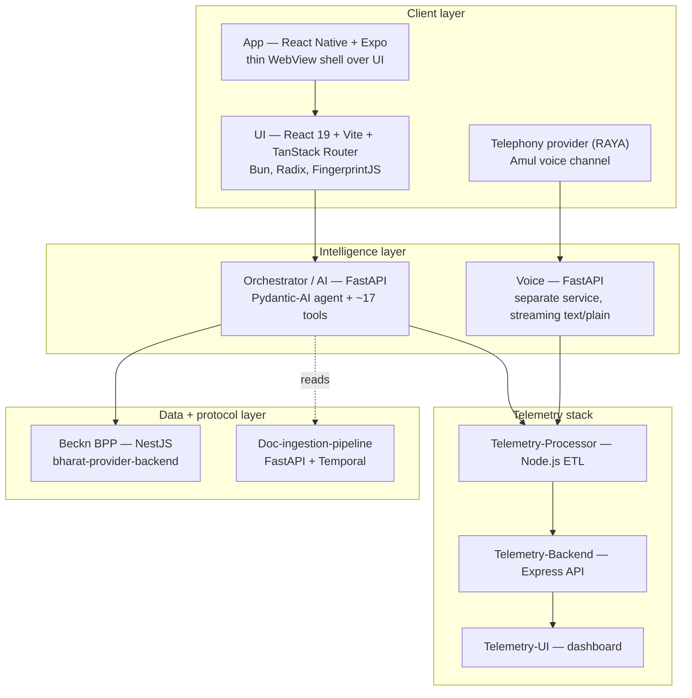
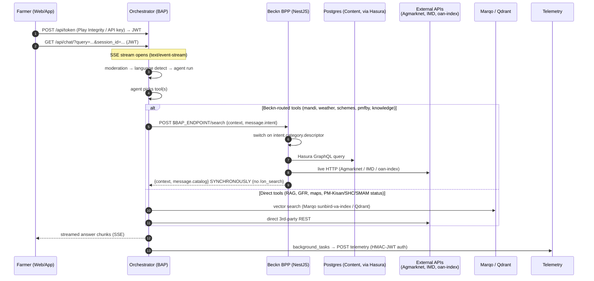
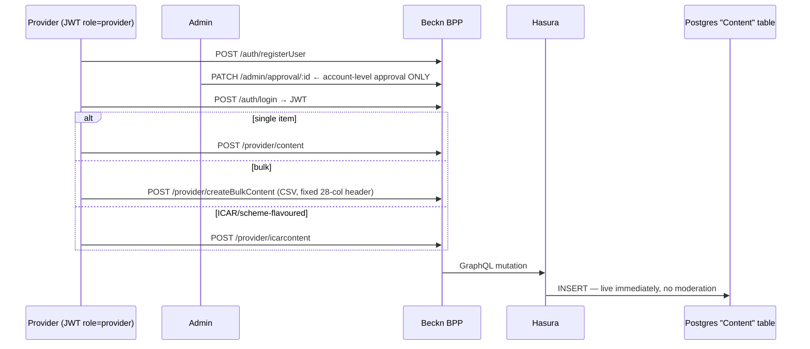
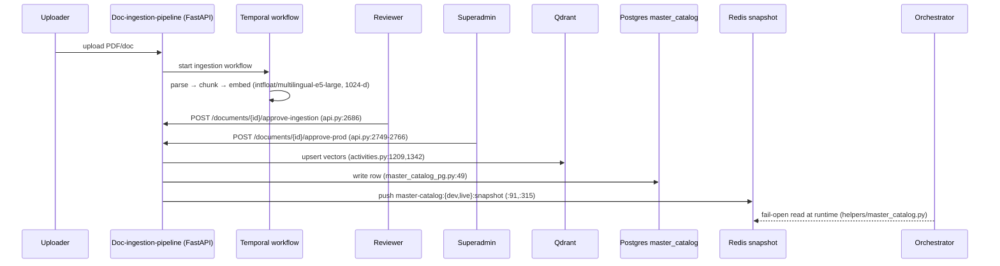
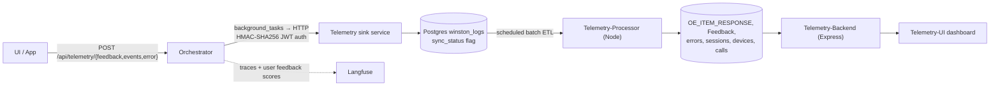

# OpenAgriNet — How the system works today

Traced 2026-08-11 against the cloned repos. Purpose: a complete, accurate picture of the **current** system as the baseline for re-architecting onto the latest Beckn protocol.

**Confidence levels used below**
- ✅ **Verified** — read in code, file:line cited.
- ⚠️ **Inferred** — deduced from config/naming, not confirmed by reading the component itself.
- ❌ **Not traced** — repo not read.

---

## 1. What the three things are

| | **BharatVistaar** | **MahaVistaar** | **Amul** |
|---|---|---|---|
| Who it serves | Central/state govt farmers | Maharashtra govt (POCRA) farmers | Amul dairy farmers |
| Channel | Web + Android/iOS app | Web + iOS app | Web + voice (phone) |
| Orchestrator repo | `bharat-oan-api` | `mh-oan-api` (self-named `sunbird-va-api`) | `amul-oan-api` |
| Beckn node | ✅ own repo `bharat-provider-backend` | ❌ shared org-wide repo — **not traced** | **none** |
| Doc-ingestion (RAG) pipeline | ✅ yes (Temporal) | none | none |
| Voice | ✅ | ✅ | ✅ (primary channel, Gujarati) |
| Telemetry stack | ✅ (all three have identical UI/Processor/Backend) | ✅ | ✅ |

All three Orchestrators are **forks of the same Sunbird Virtual Assistant FastAPI base** — identical `agents/ app/ helpers/ main.py` layout. They diverge only in tools, prompts, and which backends they call.

---

## 2. Module map (what each repo actually is)

---

## 3. Roles in Beckn terms

| Beckn role | What plays it here | Verified? |
|---|---|---|
| **BAP** (searches) | The **Orchestrator**. Builds the Beckn envelope, POSTs to `$BAP_ENDPOINT/search`. | ✅ `agents/tools/search.py:318-337` |
| **BPP** (answers) | The **NestJS Beckn backend**, running as/behind Docker image `beckn-onix-network-provider:latest_v1.0.1`. | ✅ `Beckn/docker-compose.yml` |
| **Provider** (publishes) | A JWT account with role `provider` — a govt dept, ICAR, etc. | ✅ `provider.controller.ts` |
| **Gateway / Registry** | **No code anywhere in these repos.** | ⚠️ presumed inside external beckn-onix |

> **Naming trap:** the env var is called `BAP_ENDPOINT`, but it points at the **BPP's** search URL. The Orchestrator *is* the BAP; `BAP_ENDPOINT` is where the BAP sends to.

---

## 4. The main flow — a farmer asks a question

**The single most important deviation:** step "B-->>O" is a **plain synchronous HTTP response**. There is no `/on_search` route and no outbound callback to `bap_uri` anywhere in the codebase. Every Beckn action (`search`, `select`, `init`, `confirm`, `rating`, `status`) is collapsed into one request/response RPC. ✅ verified — `Beckn/src/app.controller.ts` has no `on_*` route.

---

## 5. Publish — how catalogs get filled

There are **two completely separate catalogs**. Conflating them is the most common mistake.

### 5a. Beckn content catalog (self-service, no per-item review)

| Endpoint | Purpose | Where |
|---|---|---|
| `POST /provider/content` | insert one row | `provider.controller.ts:20` → `hasura.service.ts:348-437` |
| `POST /provider/createBulkContent` | CSV upload, row-by-row insert | `provider.controller.ts:146` → `provider.service.ts:80-127` |
| `POST /provider/icarcontent` | scheme-shaped rows (`scheme_id`, `scheme_intro`, `scheme_benefits`…) | `provider.controller.ts:234` → `hasura.service.ts:1793-1813` |
| `POST /provider/collection`, `/contentCollection`, `/scholarship`, `/uploadImage` | grouping, scholarship items, media | `provider.controller.ts:69,118,197,175` |

- **Storage:** ONE Postgres table, `Content`, reachable only through Hasura GraphQL (`hasura.service.ts:1212-1234`).
- **No `Item` / `Provider` / `Catalog` tables exist.** The Beckn `Item`/`Provider`/`Descriptor` JSON is synthesised at query time in `utils/generator.ts`.
- **Review:** none per item. `admin.controller.ts` approves *accounts*, not content. Once approved, everything the account posts is live.

### 5b. RAG scheme/document catalog (human-reviewed, Temporal-orchestrated)

The Redis snapshot lets **new schemes appear without redeploying the Orchestrator** — it extends an otherwise hardcoded 13-scheme list in `helpers/scheme_qdrant_search.py`. If Redis is unreachable, the read fails *open* (falls back to the hardcoded list).

---

## 6. Discover — how search actually resolves

`POST /mobility/search` (and the older `/dsep/search`) branch on the intent category. ✅ verified against `app.controller.ts:68-133`:

| `category.descriptor.name` / `.code` | Handler | Backing store |
|---|---|---|
| `knowledge-advisory` | `searchForIntentQuery` (`app.service.ts:378-469`) | external **oan-index**, hybrid vector search |
| `Weather-Forecast` | `weatherforecastSearch` (`weatherforecast.service.ts:11-206`) | Postgres + live **IMD** API |
| `Weather-Forecast-Mausamgram` | `masuamGramaWeatherForecastSearch` (`:208-266`) | Postgres + Mausamgram |
| `schemes-agri` | **`handlePmKisanSearch`** (`app.service.ts:1949+`) | Postgres / external PM-Kisan |
| `icar-schemes` | **`handleSearch`** (`app.service.ts:277-376`) | Postgres `Content` via Hasura |
| `price-discovery` + item code `mandi` | `mandiSearch` (`mandi.service.ts:209-321`) | Postgres + live **Agmarknet** |
| `pmfby` (or any code starting `pmfby`) | `handlePmfbySearch` | Postgres / external PMFBY |
| **anything else** | falls through to `searchForIntentQuery` | oan-index |

Non-Beckn discovery also exists and **bypasses the protocol entirely**: `search_documents` (Marqo `sunbird-va-index`), `search_video` (Qdrant `video_data_collection`), `search_pests_diseases`, plus direct-REST tools (GFR, maps/geocode, SHC/SMAM/PM-Kisan status, PMFBY grievance, NPSS, Sathi seed).

### ⚠️ Confirmed routing gap
`agents/tools/search.py` sends `category = SCHEME_AGRI_QDRANT_CATEGORY` (code `scheme-agri-qdrant`, `search.py:312,373,398`). **No case matches it** in the switch above — so it hits `default:` and is answered by the generic oan-index handler, not a Qdrant scheme search. Verified on both sides. Fix or delete this path before porting it forward.

---

## 7. Telemetry flow

- Ingest is **write-behind**: `background_tasks.add_task(send_telemetry, ...)` — never blocks the chat stream (`app/routers/telemetry.py`).
- The processor polls `winston_logs WHERE sync_status = 0`, fans rows into typed tables, sets `sync_status = 1` (`Telemetry-Processor/index.js:167-190`). Event processors are **DB-configurable**, not hardcoded.
- Telemetry-Backend exposes ~15 route groups including `GET /beckn-ext/stats` — the only place Beckn traffic is observable.
- Langfuse runs in parallel for LLM tracing; chat feedback is also written back as a Langfuse score, guarded by a `qid` → `session_id` turn map.

---

## 8. Auth

| Path | Mechanism |
|---|---|
| `POST /api/token` | issues app JWT (`token.py:408`) |
| `POST /api/token/play-integrity` | Google Play Integrity attestation — per-client service account, nonce replay-check in Redis, freshness window (`token.py:528, 234-397`) |
| `POST /api/token/api-key` | static key for server-to-server (`token.py:501`) |
| Every `/api/*` route | `Depends(get_current_user)` — JWT carries `mobile` + `channel` |
| Beckn `/provider/*`, `/admin/*` | separate NestJS JWT (`/auth/login`), role-gated |
| Beckn network layer | ❌ **no Ed25519 signing, no `Authorization`/`X-Gateway-Authorization` handling** |

`channel` in the JWT is how one Orchestrator deployment tells tenants apart (defaults to `"BharatVistaar"`).

---

## 9. Who owns what data

| Data | Store | Written by | Read by |
|---|---|---|---|
| Content / scheme items | Postgres `Content` (Hasura only) | Provider REST APIs | Beckn `/search` handlers |
| Mandi + weather master data | Postgres (separate DB) | ops / sync jobs | `mandiSearch`, `weatherforecastSearch` |
| Scheme documents (vectors) | Qdrant | Doc-ingestion-pipeline on prod-promote | `scheme_qdrant_search.py` — *currently unreachable, see §6* |
| Master scheme list | Postgres `master_catalog` + Redis snapshot | Doc-ingestion-pipeline | `helpers/master_catalog.py` (fail-open) |
| General knowledge | Marqo `sunbird-va-index` | Orchestrator ingestion | `search_documents` — bypasses Beckn |
| Videos | Qdrant `video_data_collection` | ingestion | `search_video` — bypasses Beckn |
| Chat history | Redis (per `session_id`) | Orchestrator / Voice | same |
| Raw telemetry | Postgres `winston_logs` | Orchestrator (async) | Telemetry-Processor |
| Typed analytics | Postgres typed tables | Telemetry-Processor | Telemetry-Backend → UI |

---

## 10. Gaps vs. the current Beckn protocol — the re-architecture punch list

1. **No async callbacks.** No `/on_search`, `/on_select`, `/on_init`, `/on_confirm`. Real Beckn needs the BPP to ACK immediately and POST results to the BAP's `bap_uri`. This changes the Orchestrator too — it must expose callback routes and correlate by `transaction_id`/`message_id`, which today it never does.
2. **No signing.** No Ed25519, no `Authorization` / `X-Gateway-Authorization` header handling in application code. Only `types/schema.ts` (a copied OpenAPI file) mentions `Subscriber` — spec artifact, not working code. ⚠️ Presumed handled by the external beckn-onix container; **unconfirmed** — verify before assuming it exists at all.
3. **No Registry or Gateway client.** Subscriber lookup and network fan-out are absent. The system today talks to exactly one hardcoded BPP URL (`BAP_ENDPOINT`).
4. **Single hardcoded provider per category** (e.g. all knowledge-advisory results come back under one provider, "Agri Acad"). A real network needs genuine multi-provider fan-out and per-provider catalogs.
5. **No `Item`/`Provider`/`Catalog` persistence.** Beckn shapes are generated on the fly from one flat `Content` table. A protocol-conformant catalog needs a real domain model, not `generator.ts`.
6. **No per-item moderation** — only account-level approval. A public network's trust model likely requires item-level review; that's net-new work.
7. **Dead routing path**: `scheme-agri-qdrant` silently degrades to the generic handler (§6). Decide: wire it, or drop it.
8. **Two catalogs, one Orchestrator.** Decide explicitly whether the RAG catalog (Qdrant/Marqo docs) enters the Beckn catalog too, or stays a non-Beckn side channel. Today it's the latter by accident, not by design.
9. **Legacy `dsep/*` routes** still live alongside `mobility/*` — the domain naming is inherited from unrelated Beckn domains (mobility, DSEP/education) and doesn't describe agriculture. Fix the domain taxonomy in the redesign.
10. **Tenant asymmetry.** Amul has no Beckn node at all; MahaVistaar's lives in an untraced shared repo. A unified Beckn layer needs a decision on whether all three tenants become network participants or only BharatVistaar does.

---

## 11. Known blind spots in this document

- ❌ **MahaVistaar's Beckn node** — separate shared org repo, never cloned or read. Do not assume it mirrors BharatVistaar.
- ⚠️ **beckn-onix itself** — never read. Everything about signing/registry being "handled there" is inference from the Docker image name.
- ⚠️ **oan-index** — external hybrid-search service, treated as a black box; it holds the bulk of knowledge-advisory content.
- ⚠️ **Voice services** — routes confirmed (`/api/voice`, OpenAI-compatible `/v1`), but the internal tool/agent path was not traced end-to-end.
