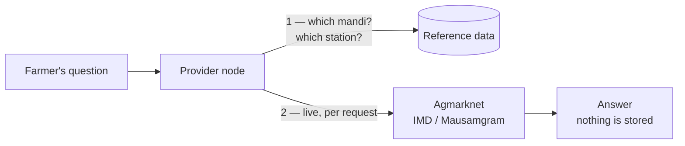
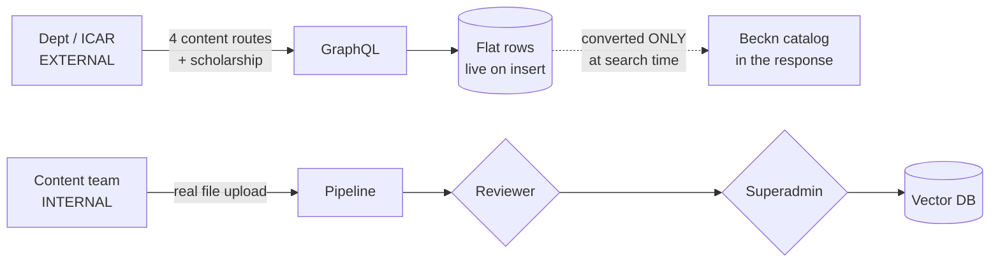
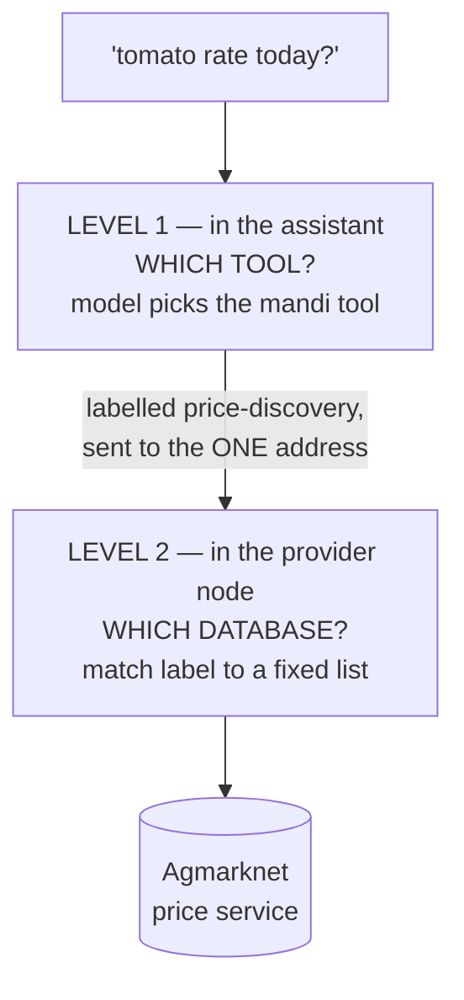
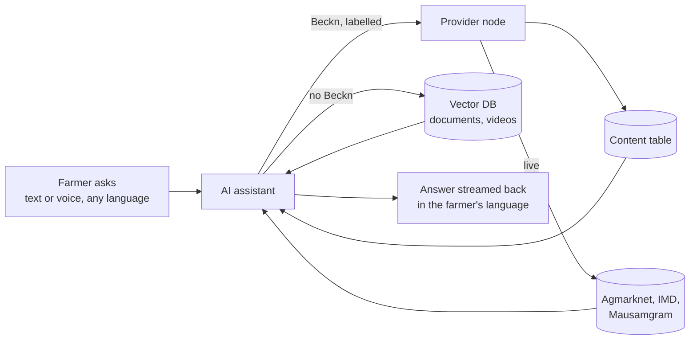

# OpenAgriNet — How publish and discover work

A plain-language explanation of how the platform works today, written as the baseline for moving onto the current Beckn protocol.

**Publish** is §3, **discover** is §4. Sections 1–2 set up who's involved and where answers come from; §7 lists where today's system departs from Beckn; §10 covers the transactional flows, which are neither publish nor discover but are a third of what the system does. **§11 lists what was not verified** — read it before relying on anything here.

---

## 1. The three products

All three are the same thing wearing different clothes: an **AI assistant that answers farmers' questions** in their own language, by voice or text. They are built from one common codebase and then customised.

| | **BharatVistaar** | **MahaVistaar** | **Amul** |
|---|---|---|---|
| Who uses it | Farmers nationally, via central and state agriculture departments | Farmers in Maharashtra, under the state's POCRA programme | Dairy farmers in the Amul network |
| How they reach it | Website and Android/iOS app | Website and iOS app | Mostly by **phone call**, in Gujarati |
| Tools the assistant has | **31** | **25** | **9** |
| Runs its own provider node | **Yes** | No — uses a shared node run elsewhere | No |
| Uses the Beckn network | Yes | Yes | **Yes** — as a client of others |

**What each one actually does.** They are less alike than "same codebase, different clothes" suggests:

| Capability | BharatVistaar | MahaVistaar | Amul |
|---|---|---|---|
| Scheme information | ✅ | ✅ POCRA, MahaDBT | ✅ union schemes only |
| Advisory documents / video search | ✅ | ✅ | ✅ |
| Weather | ✅ | ✅ | via Vistaar¹ |
| Mandi prices | ✅ | ✅ | via Vistaar¹ |
| Crop insurance (PMFBY) | ✅ | — | — |
| Pest / disease | ✅ search + image diagnosis | ✅ pest detection | — |
| Fertiliser, seed availability, soil health | ✅ | — | — |
| Application status checks | ✅ PM-Kisan, PMFBY, SHC, SMAM | — | — |
| Grievance filing | ✅ PM-Kisan, PMFBY | — | — |
| Farmer registry / land records | — | ✅ AgriStack | ✅ farmer + animal records |
| Local staff contacts | — | ✅ | — |
| **Milk collection records** | — | — | ✅ |
| **Animal health, vet callback** | — | — | ✅ |
| **Loan eligibility** | — | — | ✅ |
| Remembers the farmer between sessions | — | ✅ profile + memory | — |

¹ Feature-flagged. With the network flag off, Amul has no weather or mandi capability at all.

**The short version:** BharatVistaar is the broadest and the only one running its own node. MahaVistaar is a state variant that adds Maharashtra systems and is the only one that remembers a farmer across sessions. **Amul is not a cut-down Vistaar** — it is a dairy operations assistant, and most of what it does (milk collection, animal health, loans) exists nowhere else.

**They also call each other.** MahaVistaar can query BharatVistaar, BharatVistaar has a tool for querying MahaVistaar (see §11), and Amul gets weather, mandi prices and scheme information from the Vistaar network rather than building its own. So "is X on the network" has two answers: whether it *operates* a node, and whether it *uses* one. Only BharatVistaar does the first; all three do the second.

**No shared databases.** Each product has its own deployment and its own stores. What they share is reached over the network, not read from a common database — Amul gets Vistaar's mandi prices by asking, not by querying Vistaar's tables. (MahaVistaar's stores were never examined, so this is confirmed for BharatVistaar and Amul only.)

---

## 2. Start here: three sources of answers

Every answer a farmer gets comes from one of three places. Two of them are catalogs — someone publishes into them and the content sits there until searched. The third has no catalog behind it at all.

| | **Content catalog** | **Knowledge catalog** | **Live data** |
|---|---|---|---|
| Who publishes | agriculture departments, ICAR, scheme owners | the internal content team | **nobody** |
| What | scheme details, advisory articles, videos, scholarships | scheme guideline PDFs, circulars, manuals | mandi prices, weather forecasts |
| Approval | organisation approved once, content never checked | two humans, in sequence | not applicable |
| Stored | yes — structured rows | yes — meaning-indexed passages | **no** — only reference data |
| Searched by | matching on category and fields | closeness of meaning | fetched fresh per request |

The two catalogs have **different publishers, different approval rules, different storage and completely different search mechanics.** A request to "add a new scheme to the catalog" means two different jobs depending on which one is meant.

**Why live data isn't a catalog:** nothing is published into it and no answer is kept — today's tomato price exists only for the length of one request. What *is* stored is the lookup table behind it: which markets exist, which weather stations exist, which commodity names are valid. So it's a live proxy with a reference table in front.



This matters for the redesign: catalogs can be published and cached, live data cannot.

**A note on scope.** These three cover every answer to a *general* question. They do not cover questions about a specific farmer — "has my PM-Kisan payment arrived?" — which are answered by a fourth path: a live, OTP-authenticated query against a government system, holding no data of its own. That path is §10.

---

## 3. Publish — what goes in, and how

### The content catalog

**Who publishes.** External organisations — state agriculture departments, ICAR, scheme-owning bodies. They register, an admin approves the account, and they get a login.

**The four ways to publish content.** All four write to the same place. They differ only in what you hand over:

| Route | You send | Notes |
|---|---|---|
| `POST /provider/content` | one item as JSON | the normal path |
| `POST /provider/createBulkContent` | a **CSV file** | bulk load — the spreadsheet version of the above |
| `POST /provider/createBulkContent1` | a JSON array | same job as the CSV route, different input format |
| `POST /provider/icarcontent` | one item, scheme-shaped | adds scheme fields like eligibility and benefits |

Two of those four are the same operation with different wrappers. There is no reason a publisher needs to know which to pick beyond "do I have a file or not."

**Scholarships are separate.** `POST /provider/scholarship` has its own 23-field shape — amount, deadline, eligibility, selection criteria, contact — and its own table. It is not content.

**Supporting routes:** `POST /provider/collection` and `/contentCollection` group items together; `POST /provider/uploadImage` uploads a thumbnail. Edit and delete variants exist for each.

**What actually gets published.** Not the content itself — a *pointer* to it:

| Type | What the node receives | What the node keeps |
|---|---|---|
| Advisory article | title, description, category, language, **link** | metadata + link |
| PDF | same | metadata + link — **the file stays on the publisher's server** |
| Video | same | metadata + link |
| Scheme listing | scheme fields + link | fields + link |

Only thumbnails are genuinely uploaded. Everything else is a URL, and **nothing checks those URLs.** If a department deletes a PDF, the node keeps advertising it and the farmer gets a dead link.

**Nobody publishes in Beckn format.** Publishers send flat fields. Nothing they touch resembles Beckn structure.

**Nothing is stored in Beckn format either.** The database holds flat rows.

**Beckn exists only in the response.** When a search arrives, the node converts flat rows into a Beckn catalog on the spot. And it does this with **separate converters per category** — one for ICAR schemes, one for PM-Kisan, another for foundational-literacy content, with the mandi and weather services building their catalogs inline themselves. There is no shared mapper.

> This is the single most important fact for the re-architecture: **there is no Beckn data model to migrate.** There is flat content plus scattered translation code. You would be building the model, not moving it.

**Who approves it.** *Nobody, at the item level.* An admin approves the **organisation** once. After that, everything it publishes goes live on insertion. No review queue, no second pair of eyes.

**Where it lands.** A content table in a standard database, reached only through a GraphQL layer. In practice there are several content-ish tables — a main one, a second one with nearly the same purpose, and one for foundational-literacy material — plus a separate scholarship table.

**Who the publisher is, as far as the system knows.** A **User** row holds the login, role and approval state. A **Provider** row holds the organisation — and only four fields: an id, a link to the user, the organisation name, and a source code. Content links back by user, so every row knows who published it.

That is the whole notion of a provider. No contact detail, no endpoint, no signing key, no domain — enough to say "this login belongs to ICAR" and nothing a network would need to treat it as a participant.

### The knowledge catalog

**Who publishes:** the internal team, not external organisations.

**What they publish:** long-form government documents — scheme guideline PDFs, circulars, operational manuals. The things too dense for a farmer to read, that the assistant needs to be able to quote from.

**How it works:** the document goes through an automated pipeline that splits it into small passages and converts each passage into a numeric representation of its *meaning*. This is what lets the assistant find "the bit about eligibility" without anyone tagging it.

**Who approves it:** **two humans**, in sequence. A reviewer signs off after the document is processed, and then a superadmin promotes it to production. This is genuinely reviewed content, unlike the content catalog.

**Where it lands:** a vector database for the passages, plus a summary list of available schemes that is cached separately. That cache is what lets a newly-added scheme become searchable **without redeploying the assistant**.

### The whole publish picture



**Three things to read off this:**

1. **The two paths have opposite trust models.** The content strangers publish is checked less than the content staff publish.
2. **Beckn appears only at search time**, in code. Never a publish format, never a storage format.
3. **Only the internal path uploads real files.** Everything external is a link to somebody else's server.

### Live data — nothing to publish

Nobody publishes mandi prices or weather forecasts. What *is* maintained is the reference data behind them — the list of markets, weather stations and commodities used to work out which mandi or station a farmer's location maps to. That list is loaded and kept in a database. The prices and forecasts themselves are fetched per request and never stored.

---

## 4. Discover — how a search actually works

### The farmer never searches

This is the key point. There is no search box and no browsing. The farmer **asks a question in plain language** — typed or spoken, in their own language. Everything after that is the assistant's job.

The assistant reads the question, works out what's being asked, and picks where to look. It has **31 tools** registered — and not all of them are searches:

| | Count | What they do |
|---|---|---|
| Search and lookup | 18 | schemes, documents, video, pests, weather, mandi prices, commodities, geocoding, seed availability, crop-image analysis, glossary |
| **Transactional** | **13** | check a farmer's application status, file and track grievances — OTP-gated, acting on one named person |

Everything in this section describes the first row. **The transactional half is a different thing entirely** and is covered in §10 — it is easy to miss, and it is not search.

### Voice questions take the same path

Speaking is just another way to type. Once speech becomes text, **the search is identical** — same tools, same sources, same routing. There is no voice-specific index and no separate voice search.

Only the ends differ:

| | **Web and app** | **Phone (Amul)** |
|---|---|---|
| Speech → text | the platform does it | the telephone provider does it |
| Steps | three calls: transcribe, then ask, then speak the answer | one continuous streaming call |
| Language handling | detect the spoken language, then transcribe in it | translate to English, reason, translate back |
| Answer format | text on screen, optionally read aloud | speech only — no formatting, short sentences |

Two things exist only on the phone side. The conversation is held per call, and if the caller drops and redials, the older in-flight reply is stopped so it can't write stale history. And when a lookup is slow, the assistant says something brief — "I'm getting back to you, please wait" — because silence on a phone line reads as a dropped call.

### Three different ways it looks things up

**1. Structured lookup — schemes and published content.** A Beckn search to the provider node, which queries its database and returns rows in Beckn catalog format.

**2. Meaning-based search — documents and videos.** The assistant turns the question into the same numeric meaning-representation used when the documents were indexed, then finds the closest passages. This is why "will I get money if my crop fails" finds the right paragraph in an insurance document that never uses those words. **This bypasses Beckn entirely** — the assistant queries the vector database directly.

**3. Live proxy — prices and weather.** The assistant sends an ordinary Beckn search, exactly as it would for a scheme; the *node* makes the outbound government call. The assistant can't tell this apart from a stored-catalog answer — both come back in the same shape.

**Which of the three is used is decided by one thing: which tool the model picks.** There is no classifier, no lookup, no rule. The model reads the question, reads the tool descriptions, and chooses — and each tool is hardwired to exactly one destination:

| Farmer asks | Model picks | Answered by |
|---|---|---|
| "will I get money if my crop fails" | document search | **vector database, direct — no Beckn** |
| "tomato rate today" | mandi | Beckn node → **live Agmarknet call** |
| "what is PM-Kisan" | scheme info | Beckn node → **content database** |

The tool never inspects the question; it already knows where it goes. So **tool choice is the whole of discovery.** If the model picks wrong, the wrong database answers and nothing downstream notices — there is no fallback and no second opinion.

### How the search knows which database to hit

Routing happens at **two levels**, in two different systems. Neither is a network lookup.



**Level 1 — which tool? Decided by the language model.**
The assistant holds a set of tools, each described in plain English. The model reads the farmer's question, judges which tool fits, and calls it. This is a model judgement, not a lookup.

**Level 1 does not choose a destination.** This is worth stating plainly, because the obvious assumption is wrong: in BharatVistaar **every Beckn tool posts to the same single configured address.** Weather, mandi, schemes, seed availability, the cross-network tool — one address for all of them. Choosing the mandi tool does not send the request anywhere different; it only changes the label written into it.

**Level 2 — which database? Decided by that label.**
The provider node reads the category label, matches it against a fixed internal list, and hands the request to the matching service. The decision was already made by the caller before the request left.

So of the two levels, **Level 2 does effectively all the routing.** The node performs no judgement of its own — it does not read the question or weigh which source is best. It obeys the label. The answer to "how does it know which database?" is blunt: **the caller names it.** The category label *is* the database selector.

| Label the caller sends | Where the answer comes from |
|---|---|
| `price-discovery` with item `mandi` | resolves the nearest market, then calls **Agmarknet** for today's prices |
| `Weather-Forecast` | resolves the weather station, then calls the **IMD** station service |
| `Weather-Forecast-Mausamgram` | calls **Mausamgram** by coordinates instead |
| `icar-schemes` | its own content database — no external call |
| `schemes-agri` | the PM-Kisan service |
| `pmfby` | the crop insurance service |
| `knowledge-advisory` | a general-purpose external search index |
| anything else | falls through to that same general-purpose index |

Milk and dairy aren't on this list at all — Amul is a **separate deployment** with its own addresses.

Two things follow, both of which matter for the redesign:

- **An unrecognised label doesn't fail — it silently answers from the generic index.** Not hypothetical: scheme search sends a label the node has no entry for, so scheme questions are answered by generic search today. See §7.
- **Adding a data source means editing that list and shipping a release.** There is no way for a new source to announce itself.

**One inconsistency to note.** The node matches some labels on the descriptor's *name* and others on its *code*, and the two are checked with different case rules. Three labels also do not go where their names suggest: `schemes-agri` reaches the PM-Kisan handler, `icar-schemes` reaches the general content database, and the weather tool sends the name `Weather-Forecast-Mausamgram` alongside an unrelated code. Matching works today by coincidence of convention, not by design.

### Why neither level counts as discovery

There is **no registry**. Nothing ever looks up who is on the network.

Level 1 doesn't discover anything — as above, it doesn't even choose a destination. Level 2 matches a string against a list compiled into the node. The request does carry a provider id and URL in its header, but those are *asserted* by the sender and nothing verifies them.

| Beckn expects | Today |
|---|---|
| a registry to find participants | one address in configuration |
| a gateway that broadcasts one search to many providers | every search goes to that one address |
| signatures checked against registered keys | no verification |
| participants joining and leaving | redeploy with a new setting |

Because there is no gateway fan-out, **a search can only ever reach one provider.** The network cannot grow beyond what someone wired in by hand.

**Across the three products** the picture is a hand-wired mesh, not a network:


Every arrow is a deployment setting. The traffic is genuinely cross-organisational — Amul farmers really do get Vistaar's mandi prices — but no participant can name, find or verify any other. Amul is the clearest case: it operates no node at all, yet is a client of three.

### What comes back

The assistant takes whatever the source returned, writes the answer in the farmer's language, and streams it back sentence by sentence rather than making them wait for the whole thing.

**The whole of discover, in one picture:**



Note the two shapes of arrow into the assistant: **structured content and live data go through Beckn; document search does not.**

---

## 5. Who publishes what, who discovers what

| | **Publishes** | **Discovers** |
|---|---|---|
| Agriculture departments, ICAR, scheme owners | Scheme details, advisory articles, videos, scholarships | nothing |
| Internal content team | Scheme guideline documents and circulars | nothing |
| Government systems (Agmarknet, IMD, Mausamgram, insurance, PM-Kisan, SHC) | nothing — they answer live, on request | nothing |
| **The AI assistant** | nothing | **everything** — it is the only thing that searches, and the only thing that transacts |
| **The other two products** | nothing | each other's catalogs, over Beckn |
| Farmers | nothing | nothing directly — they ask the assistant |

**In Beckn terms:** the assistant is the buyer-side app (BAP). The provider node is the seller-side platform (BPP). The departments are the providers. Farmers are the end users, one step removed — they never touch the network themselves.

**One clarification worth making,** because the words collide: the **provider node** is software — one deployment, run by the platform team, that answers searches. The **providers** are the organisations that publish into it. Many providers, one node. A department doesn't run anything; it just has a login.

---

## 6. A worked example

**A farmer asks: "What's the tomato price in Pune today?"**

1. The question arrives — possibly spoken in Marathi, transcribed to text.
2. The assistant identifies this as a price question and picks the mandi tool.
3. It builds a Beckn request tagged as a price enquiry and sends it to the provider node.
4. The node sees the price category and routes it to the mandi handler.
5. The mandi service first resolves which market the farmer's location maps to, using reference data it holds locally, then calls Agmarknet live for that market's current prices.
6. It returns the prices formatted as a Beckn catalog — **immediately, in the same reply**.
7. The assistant turns the numbers into a sentence in Marathi and streams it back.
8. Separately and in the background, a record of the interaction goes to the analytics system.

The whole thing is one round trip. Step 6 is where today's system differs most from real Beckn — see below.

---

## 7. Where this differs from the current Beckn protocol

The reason for this document. Restated plainly:

1. **Answers come back immediately.** Real Beckn expects the provider to say "got it" and send results separately a moment later, so many providers can answer the same question at their own pace. Today it's a single question-and-answer, like any ordinary web request. This is the biggest change, and it affects the assistant too — it would need to start *receiving* results rather than just waiting for them.

2. **Requests aren't signed.** Beckn expects each participant to cryptographically sign its messages so the other side can verify who sent them. None of that happens in the application. It may be handled by the network component the system runs behind, but that has not been confirmed — worth checking before assuming it exists.

3. **There's no directory of participants.** Real Beckn has a registry you consult to find out who's on the network. Here, the assistant talks to exactly one provider address, fixed in configuration. It cannot discover anyone else.

4. **Everything appears under one provider name.** All knowledge results come back attributed to a single provider, regardless of who actually published them. A real network needs each department to appear as itself.

5. **The catalog isn't really a catalog.** There is no stored notion of catalogs or items — just flat content rows reshaped into Beckn's format at the moment of answering. A provider record does exist, but it carries only an organisation name and a source code: no endpoint, no key, no domain. Enough for an account, not enough for a network participant.

6. **Nobody checks individual content.** Approval is at the organisation level only. If the new network requires per-item trust, that's new work, not a migration.

7. **One search path is silently broken.** The assistant's scheme-document search sends a category label that the provider node doesn't recognise, so it quietly falls through to generic search instead. Verified on both sides. Fix it or remove it — don't carry it forward.

8. **Decide what belongs on the network.** Today the document/video search deliberately bypasses Beckn while structured content goes through it. That split happened by accident rather than design. Choose it consciously this time.

9. **Nobody publishes in Beckn format, and no content is actually held.** Publishers send flat fields in four shapes; the node converts at query time. Files are never uploaded — only links to the publisher's server, which nothing validates, so dead links are advertised indefinitely. Two questions: should publishers produce Beckn structure directly, and should the network hold content or keep pointing elsewhere?

10. **Only one product operates a node, but all three use the network.** BharatVistaar runs the only node examined here; MahaVistaar uses a shared node nobody has looked at; Amul runs none yet is a client of three. The products also query each other. The cross-traffic is real — it just has no registry, no signing and no discovery underneath it. That makes the redesign more urgent, not less.

11. **Two unrelated routing schemes, and the riskier one is the weaker.** Search routes on a category label; transactions route on a provider id in the order. Neither knows about the other, and both fall through to a default handler rather than rejecting what they don't recognise. The transactional flows carry identity and have real consequences — a grievance filed, a payment status disclosed — yet run on the same unsigned, unverified transport. An OTP proves the farmer; nothing proves the machines. See §10.

---

## 8. Appendix — the actual APIs

For engineers. The rest of the document deliberately avoids these.

**Publishing into the content catalog** (provider node)

| Endpoint | Purpose |
|---|---|
| `POST /auth/registerUser`, `POST /auth/login` | organisation registers, then gets a token |
| `PATCH /admin/approval/:id` | admin approves the **organisation** — the only approval that exists |
| `POST /provider/content` | publish one item |
| `POST /provider/createBulkContent` | spreadsheet upload, 30-column layout — but see the warning below |
| `POST /provider/icarcontent` | scheme-shaped items |
| `POST /provider/collection`, `/contentCollection` | group items |
| `POST /provider/scholarship`, `/uploadImage` | scholarships, media |

**Publishing into the knowledge catalog** (ingestion pipeline)

| Endpoint | Purpose |
|---|---|
| `POST /documents/{id}/approve-ingestion` | reviewer sign-off |
| `POST /documents/{id}/approve-prod` | superadmin promotes to production |

**Discovery** (provider node) — `POST /mobility/search` is the one that matters. `select`, `init`, `confirm`, `rating`, `status` exist under the same prefix. A legacy `/dsep/*` set still runs alongside it. Routing is decided by `message.intent.category.descriptor.name` / `.code`:

| Category value | Goes to |
|---|---|
| `knowledge-advisory` | general search service |
| `Weather-Forecast` | IMD station lookup |
| `Weather-Forecast-Mausamgram` | Mausamgram by coordinates |
| `schemes-agri` | PM-Kisan handler |
| `icar-schemes` | content database via GraphQL |
| `price-discovery` + item code `mandi` | Agmarknet |
| `pmfby` (or any code starting `pmfby`) | crop insurance service |
| *unmatched* | general search service |

> Three traps here. `schemes-agri` and `icar-schemes` do **not** go where their names suggest. The assistant sends `scheme-agri-qdrant`, which matches nothing — it lands in the unmatched row. And the first three rows are matched on `.name` (case-sensitive) while the rest are matched on `.code` — so a caller sending the right value in the wrong field silently misses.

**The full route list** (provider node)

| Route | Notes |
|---|---|
| `POST /mobility/search` | the one that matters — routed by category, above |
| `POST /mobility/init` | routed by `order.provider.id`, **not** by category — see §10 |
| `POST /mobility/status` | application status |
| `POST /mobility/select`, `/confirm`, `/rating` | |
| `POST /dsep/{search,select,init,confirm,rating}` | legacy set, still running |
| `POST /vistaar-proxy` | CORS proxy for a browser test app |
| `POST /submit-feedback/:id` | |

**Outbound calls the provider node makes**

| Call | Notes |
|---|---|
| `GET {MANDI_BASE_URL}/v1/fetch-agmarknet-vistaar` | 15s timeout, retries with a relaxed query if empty |
| `GET {IMD_WEATHER_API_URL}?id={stationId}` | 30s timeout, 3 attempts, 2s backoff |
| `GET {MAUSAMGRAM_ENDPOINT}/get-daily?lat=&lon=` | Basic auth, same retry policy |

Market and station reference data comes from a separate database the node connects to directly, not from these APIs.

**Assistant-facing** — `GET /api/chat/` streams the answer as server-sent events. Supporting routes: `POST /api/token` (plus `/api-key` and `/play-integrity`), `POST /api/transcribe/`, `POST /api/tts/`, `POST /api/telemetry/{events,feedback,error}`.

**Configuration trap:** the variable named `BAP_ENDPOINT` holds the URL the assistant **sends to**, not its own. The assistant is the BAP; this is its destination. Every Beckn tool in BharatVistaar uses this one setting — including the tool named for cross-network calls to MahaVistaar. What it actually points at was not verified; see §11.

---

## 9. Examples

### Publishing one item

`POST /provider/content`, with the organisation's token. The owning organisation is taken from the token, not the body.

```json
{
  "content_id": "ICAR-WHEAT-2026-014",
  "title": "Wheat sowing advisory for late rabi",
  "description": "Recommended varieties and sowing window for delayed rabi planting.",
  "contentType": "Article",
  "category": "Crop Advisory",
  "themes": "Rabi, Wheat, Sowing",
  "domain": "Agriculture",
  "language": "hi",
  "url": "https://example.gov.in/advisories/wheat-late-rabi.pdf",
  "urlType": "external",
  "mimeType": "application/pdf",
  "publisher": "ICAR",
  "sourceOrganisation": "ICAR-IIWBR",
  "author": "Dr. A. Sharma",
  "image": "https://example.gov.in/img/wheat.png",
  "collection": false
}
```

It goes live on insertion. No review step follows.

Note the two things this example makes concrete: the shape is **flat, not Beckn**, and `url` is **a pointer, not an upload** — the PDF stays on the publisher's server.

**Don't confuse this with the scheme PDFs the assistant quotes from.** Those go through the knowledge catalog: real uploads, reviewed by two people, indexed by meaning, never touching Beckn. Same word "scheme", two unrelated pipelines.

### Publishing in bulk

`POST /provider/createBulkContent` with a CSV. The header row must contain these 30 columns:

```
content id, Name, Description, Icon, Crop, Branch, Publisher, Collection,
URL_Type, URL, Mime_Type, Language, Content Type, Category, Themes,
Min age, Max age, Author, Domain, Curricular Goals, Competencies,
Learning Outomes, District, State, Expiry Date, File Type,
Month Or Season, Publish Date, Region, Target Users
```

> ⚠️ **Three things to know before relying on this.**
> 1. **The header check does not run.** The code computes whether the headers are valid and then ignores the result — the import proceeds unconditionally. A malformed file will be accepted and produce rows full of nulls.
> 2. **Only 18 of the 30 columns are stored.** Crop, Category, Themes, Min age, Max age, Author, Domain, Curricular Goals, Competencies, Learning Outcomes, District, URL_Type and Mime_Type are read from the file and then dropped. Publishers filling them in are wasting effort.
> 3. **`Learning Outomes` is misspelled** in the expected header, so a correctly spelled file mismatches — which currently doesn't matter only because of point 1.
>
> The vocabulary is also inherited from an education platform — "Curricular Goals", "Competencies", "Learning Outcomes", "Min age"/"Max age" have no agricultural meaning. Worth dropping in the redesign.

### A search request

`POST /mobility/search`. This is the mandi example from §6:

```json
{
  "context": {
    "domain": "schemes:vistaar",
    "action": "search",
    "version": "1.1.0",
    "bap_id": "vistaar-assistant",
    "bap_uri": "https://assistant.example.in",
    "bpp_id": "vistaar-provider",
    "bpp_uri": "https://provider.example.in",
    "transaction_id": "2f7c1e40-...",
    "message_id": "9b3d55a1-...",
    "timestamp": "2026-08-11T09:14:22.517Z",
    "ttl": "PT10M",
    "location": { "country": { "code": "IND" }, "city": { "code": "*" } },
    "tags": { "session_id": "sess-8821", "question_id": "q-4417" }
  },
  "message": {
    "intent": {
      "category": { "descriptor": { "code": "price-discovery", "name": "price-discovery" } },
      "item": { "descriptor": { "code": "mandi", "name": "tomato" } }
    }
  }
}
```

**`category.descriptor` is the routing key** — it alone decides which internal service handles the request. `item.descriptor` carries the actual question.

### The response

Comes back **in the same HTTP reply** — there is no separate callback:

```json
{
  "context": { "action": "on_search", "transaction_id": "2f7c1e40-...", "...": "..." },
  "message": {
    "catalog": {
      "providers": [{
        "descriptor": { "name": "Agri Acad" },
        "items": [{
          "descriptor": { "name": "Tomato — Pune (Khadki)", "short_desc": "Agmarknet mandi prices" },
          "tags": [{ "descriptor": { "code": "modal_price" }, "value": "2450" }]
        }]
      }]
    }
  }
}
```

Note two things. The action says `on_search`, but this is a plain response body, not a callback to `bap_uri` — the shape is Beckn, the mechanics are not. And the provider name is a fixed label, not the organisation that actually published the data.

---

## 10. The other half — transactions, not search

Everything above is about *finding* things. But **13 of the assistant's 31 tools don't search at all.** They act on behalf of one identified farmer, and the document would be misleading without them.

**What they do**

| Group | Tools | What happens |
|---|---|---|
| Application status | PM-Kisan, PMFBY, Soil Health Card, SMAM | "has my payment come through?" — checks a real application against a government system |
| Grievances | PM-Kisan (3), PMFBY (4) | files a complaint, then tracks it |

**How they differ from search — this is the important part:**

| | Search | These |
|---|---|---|
| Who it's about | nobody — a general question | **one named farmer** |
| Identity | none needed | **OTP to the registered mobile** |
| Turns | one | **several** — send OTP, then verify, then act |
| Effect | reads | **writes** — a grievance is filed and stays filed |
| Beckn action | `/search` | **`/init`, `/status`, `/confirm`** |

**How they're routed.** Not by category. The `/init` route reads **`order.provider.id`** and the first item's id instead:

| What the order says | Handler |
|---|---|
| provider `pmfby-agri` + item `pmfby` | crop insurance |
| provider `shc-discovery` | soil health card |
| any other order | **PM-Kisan** |
| no order at all | generic |

So the system has **two unrelated routing schemes** — search routes on a category label, transactions route on a provider id — and neither knows about the other. Note the third row: an order that matches nothing specific is handed to PM-Kisan rather than rejected. Same failure mode as the search `default:`, different key.

**Why this matters for the re-architecture.** These flows are the ones with real consequences — money, identity, a filed complaint — and they run on the same unsigned, unverified, single-address transport as everything else. An OTP proves the farmer's phone; **nothing proves the two machines to each other.** For search that's a quality problem. Here it isn't.

Also worth noting: Beckn's `/init` and `/confirm` were designed for placing orders in a marketplace. They're being used here to check government application status and file grievances. It works, but the vocabulary doesn't fit what's actually happening, and that mismatch is worth resolving deliberately rather than inheriting.

---

## 11. What this document doesn't cover

- **MahaVistaar's network node** — run from a shared repository that was not examined. Don't assume it behaves like BharatVistaar's.
- **The underlying network component** — the off-the-shelf Beckn software the provider node runs behind was never inspected. Claims that signing and registry lookup "happen there" are assumptions.
- **The general knowledge search service** — an external hybrid-search service holding the bulk of advisory content, treated here as a black box.

**Three specific things worth resolving — observed in code, not confirmed:**

- **Does the "MahaVistaar" cross-network call actually leave BharatVistaar?** That tool sends the *same* category label to the *same* configured address as an ordinary local scheme lookup. Nothing in the request marks it as destined for Maharashtra. If that address is BharatVistaar's own node, the call is answered locally and the cross-network hop never happens; if it's a gateway, it works as intended. **The deciding fact is one configuration value, not code** — check what it's set to. Worth doing: the tool's name asserts something the request doesn't.

- **Where do the seed-availability and crop-registry searches go?** Both post to that same address, but neither sends a category label the node's list recognises — one identifies itself by provider id instead. On the node examined here they would fall through to generic search. They may target a newer deployment; that wasn't established.

- **Which node answers any of it.** Every claim about routing in this document describes the one provider node that was read. Whether the configured address actually points at *that* node was never confirmed.

---

*Traced August 2026 against the running codebase. Where something was inferred rather than confirmed, it says so.*
