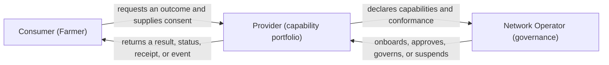
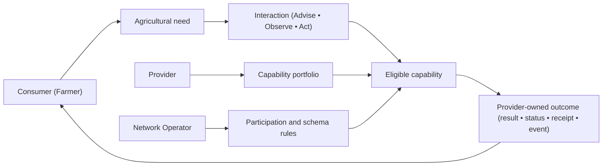
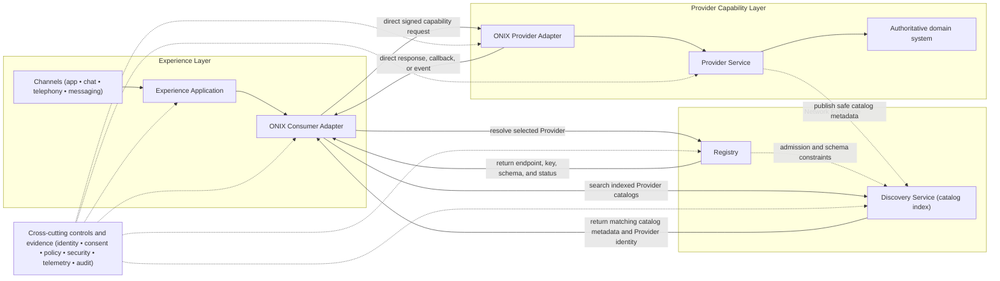
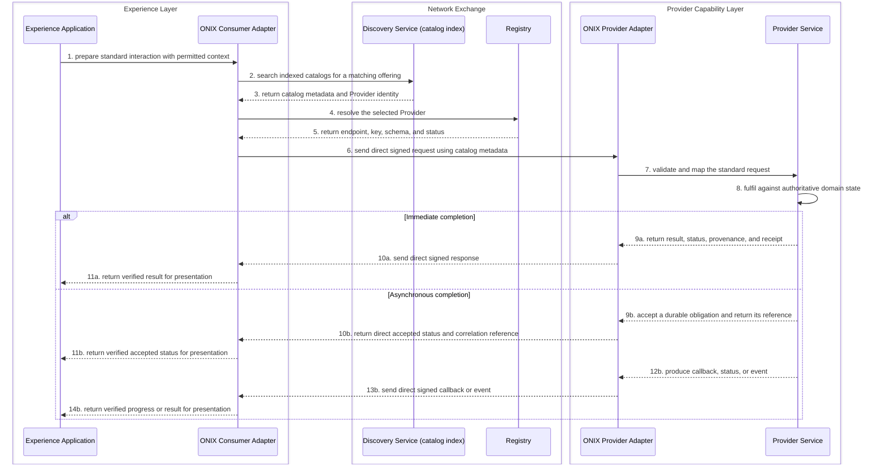

# OpenAgriNet high-level architecture

Status: Proposed for review

This document is a visual summary of the proposed OpenAgriNet architecture. It explains the shape of the system in five views. The normative [OpenAgriNet architecture](PROPOSED_ARCHITECTURE.md) remains the source for requirements, boundaries, information authority, and pending decisions.

## Actors

The ecosystem has three accountable roles: Consumer, Provider, and Network Operator.

| Actor | Primary responsibility |
|---|---|
| Consumer | Expresses an agricultural need and receives a trustworthy outcome through a supported channel |
| Provider | Exposes one or more capabilities and remains accountable for their domain results and workflows |
| Network Operator | Defines participation rules and governs which Providers and capabilities may operate on the network |

One organisation may perform more than one role. Its responsibilities, permissions, state, and evidence remain separate for each role.

## Key design problems

The architecture must address the problems that arise when diverse agricultural capabilities operate through one governed network.

| Design problem | Why it matters at OAN level |
|---|---|
| Many channels, languages, and personas | A Provider should not implement separate domain logic for chat, telephony, web, messaging, or each language |
| Diverse Providers and native systems | Knowledge, weather, mandi, livestock, scheme, credit, and action Providers expose different data and workflows |
| Governance without centralizing domain authority | The network must establish trust and discovery without becoming the source of Provider content or relaying every business interaction |
| Different outcome and completion semantics | Advice, observation, and state-changing actions may complete immediately, by callback, by polling, or through a later event |
| End-to-end accountability with minimum disclosure | Operators must diagnose failures across organisational boundaries without copying unnecessary Consumer or Provider data |

## Architecture principles

The principles translate the design problems into stable rules for the architecture.

| Principle | Architectural consequence |
|---|---|
| Start with the outcome | Advise, Observe, and Act describe the Consumer-to-Provider contract independently of channel, trigger, representation, and completion pattern |
| Providers expose capability portfolios | A Provider may declare multiple independently governed capabilities; a new capability does not create a new top-level architecture component |
| Authority follows responsibility | Experience owns session and presentation state; the Registry governs participation and invocation details; Discovery owns the searchable catalog index and search evidence; the ONIX edges own protocol delivery evidence; the Provider owns its catalog, domain workflow, and results |
| Govern through declarations | One logical Registry records accepted participants, capabilities, schemas, endpoints, keys, and participation decisions; Discovery indexes safe catalog metadata published by admitted Providers |
| Discover through catalogs, invoke the Provider directly | The network-operated Discovery Service returns matching catalog metadata and Provider identity; the Registry resolves current invocation details; the Experience-side and Provider-side ONIX adapters exchange the business message without a central relay |
| Extend at the accountable boundary | Channels and personas extend Experience; discovery extends Network Exchange; domain AI and native-system mapping extend the Provider; every extension preserves policy, evidence, and privacy obligations |

Every component treats both its callers and dependencies as stakeholders. Health means that the promised outcome is working, not merely that a process is running.

## Domain architecture

The domain view describes the concepts that participate in an agricultural interaction without assigning them to software components.

| Domain concept | Meaning |
|---|---|
| Agricultural need | The outcome the Consumer is trying to achieve |
| Interaction | The semantic contract: Advise, Observe, or Act |
| Capability portfolio | The set of named outcomes a Provider declares it can fulfil |
| Participation and schema rules | The conditions under which a capability is eligible for use on the network |
| Provider-owned outcome | The authoritative result, workflow status, receipt, or event returned by the Provider |

Trigger, completion pattern, channel, and representation are independent of the interaction type. Provider publishing, onboarding, and governance are lifecycle interactions, not Consumer-facing Advise, Observe, or Act interactions.

## System architecture

The system view maps the domain concepts to three ownership layers. Network Exchange supplies governance and discovery; the two ONIX edges carry the business interaction directly.

The Registry and Discovery Service are part of Network Exchange, not additional layers. Discovery is an index of Provider-published catalogs: it returns metadata that helps the Experience side select an offering and formulate the Provider query. It does not own the Provider's knowledge, return endpoints or keys, or relay the business request. The Registry resolves the selected Provider's current endpoint, key, schema, and participation status.

“Direct” means ONIX-to-ONIX after catalog discovery and Registry resolution. It does not mean the Experience Application calls a Provider-native API or bypasses protocol, trust, policy, or audit controls.

### Representative runtime interaction

The sequence begins after the Experience Application has captured the Consumer's need through a supported channel.

Discovery and Registry are not in the business-message path after resolution. A Provider publishes safe catalog metadata to Discovery; its authoritative knowledge and domain data remain with the Provider. Provider onboarding and Network Operator governance address the Registry.

### Open items carried by this view

- The authority for Consumer identity, durable profile, consent, preferences, and subscriptions remains to be resolved.
- The exact catalog publication, Discovery search-result, and Registry resolution contracts remain to be specified.
- Direct callback addressing, replay protection, correlation, retry, and delivery evidence remain contract work for the two ONIX edges.
- Exact capability declarations, interaction envelopes, schemas, errors, and conformance tests belong to the derived specifications.
- Physical deployment, service allocation, scale targets, and service levels remain later decisions.
