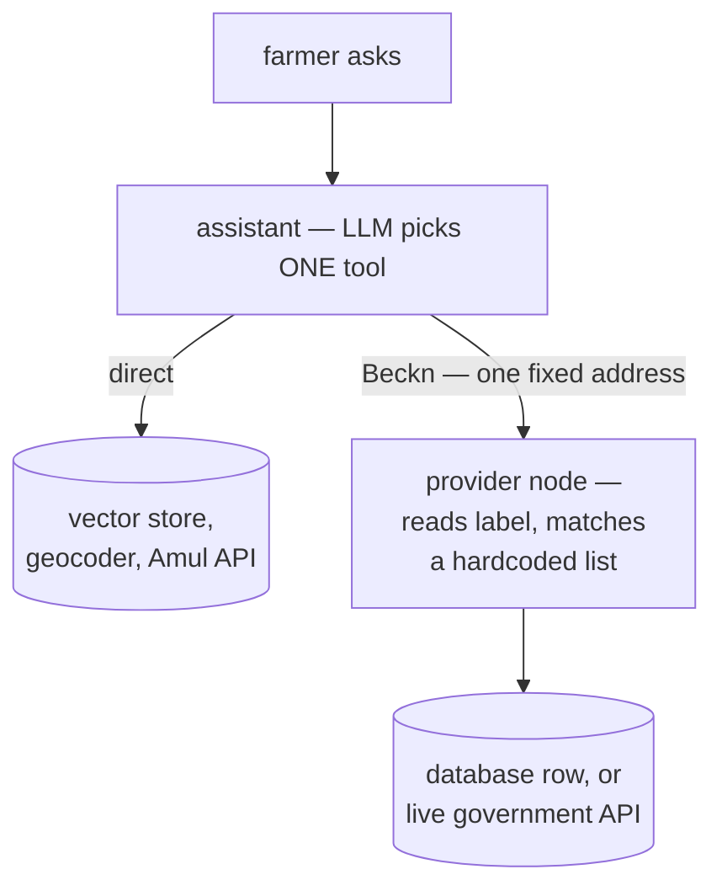

# OpenAgriNet in ten minutes

The short version. For the full trace — every tool, every route, every gap — see [ARCHITECTURE.md](ARCHITECTURE.md).

---

## 1. What it is

Three separate AI assistants for farmers, plus a shared provider node that speaks a Beckn-shaped protocol.

| | BharatVistaar | MahaVistaar | Amul |
|---|---|---|---|
| Who it serves | National | Maharashtra | Dairy co-operative, Gujarat |
| Tools | 31 | 25 | 9 |
| Only it can do | File grievances | Remember a farmer between chats | Book a visit, check a loan, read milk records |

These are **three separate deployments**, not one network. They occasionally call each other, but a farmer's options depend entirely on which product they reached.

---

## 2. The two halves

**Publish** — content and scheme data get loaded into databases.
**Discover** — a farmer asks something, and one of those databases answers.

The fact that surprises everyone: **nothing is stored in Beckn format.** The rows are ordinary database rows. The Beckn shape is constructed at the moment a response is built, and thrown away after. So "publishing to the network" doesn't happen — publishing is a database write.

---

## 3. How a question gets answered



Two levels of routing, and it's worth being precise about what each one does:

**Level 1 — the model picks a tool.** It reads the question, reads the plain-English tool descriptions, and chooses. This decides everything about what the farmer gets.

But it does **not** decide where the request goes. In BharatVistaar every Beckn tool posts to the same single configured URL. Picking the weather tool instead of the mandi tool changes only the *label written inside the request*.

**Level 2 — the node reads that label.** It matches the label against an if-else chain compiled into the deployed code, and hands off to the matching service.

So the honest answer to "how does search know which database to call?" is: **it doesn't work it out. The caller already named it.**

---

## 4. Where the answers actually come from

Three different paths, and which one is used depends only on which tool the model picked.

| Farmer asks | Tool | Answered by |
|---|---|---|
| "will I get money if my crop fails" | document search | vector store — **Beckn not involved** |
| "tomato rate today" | mandi | node → **live Agmarknet call** |
| "what is PM-Kisan" | scheme info | node → **content database** |

Most tools never touch Beckn at all. Everything meaning-based queries its store directly. Beckn covers structured lookups, live proxying, and transactions.

---

## 5. What the tools actually do

A **tool** is a Python function the model is allowed to call. The model can only reason and talk — anything that touches a database, a government API, or a phone happens because a tool did it. The tools are its hands.

All 65 across the three products fall into six groups:

| Group | What it means | Needs identity? |
|---|---|---|
| **Look up** | Fetch a fact — a price, a forecast, a scheme's rules | no |
| **Search meaning** | Find the right passage by what the question *means* | no |
| **My status** | Answer about *this* farmer's own record | yes — OTP |
| **Grievance** | File a complaint, track the ticket | yes — OTP |
| **Act** | Change something real — book a visit, send an SMS | yes |
| **Plumbing** | Feeds other tools usable inputs, or remembers the farmer | — |

*Act* is the only group whose effects can't be undone by asking again.

---

## 6. Transactions work differently than you'd expect

Roughly fifteen tools don't look anything up — they change something.

**Each tool is one step, not a flow.** Checking a PM-Kisan payment is two separate tools: send the OTP, then verify it and fetch the status. Filing a grievance is four.

**The sequencing is not in the code.** Nothing enforces that step 2 runs after step 1. The ordering lives in the tool descriptions as English sentences aimed at the model — *"only after OTP verification."* That sentence is the state machine.

**No state is stored.** Step 2 rebuilds the same transaction id from scratch:

```
uuid5(session_id + registration_number)
```

Same session, same number, same id — that's what tells the backend the two calls are one conversation. It also means the farmer has to repeat their registration number, because nothing remembered it.

And transactions route on a **completely different key** (`order.provider.id`) than searches do (`category.descriptor`). Two unrelated routing schemes inside one node.

---

## 7. How this differs from real Beckn

| Beckn expects | What exists here |
|---|---|
| A **registry** — who is on the network | none |
| A **gateway** — multicast the search to them | none |
| **`/on_search`** — providers reply asynchronously | none; it's one blocking HTTP call |
| **Signing** | not observed |

The **message format** is Beckn. The **network** is not. It's a client and a server that were built together and hardcoded to match.

This is why "discovery" is a confusing word here. Discovering *content* works fine. Discovering *participants* — the thing Beckn means by the term — doesn't exist.

---

## 8. The three real problems

**1. Adding a data source means editing code and shipping a release.** There is no way for a new source to announce itself. This is the single biggest constraint on growth.

**2. An unrecognised label doesn't fail — it silently answers from the generic index.** Not hypothetical: scheme search sends a label the node has no entry for, so scheme questions are answered by generic search today.

**3. Cross-product calls may never leave the building.** MahaVistaar's "cross-network" tool sends the *same* label to the *same* address as an ordinary local lookup. Whether it reaches Maharashtra depends on one configuration value, not on code. **Unverified — worth checking first.**

---

*Traced August 2026 against the running codebase. Where something was inferred rather than confirmed, it says so.*
