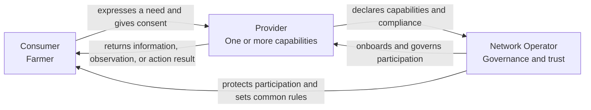
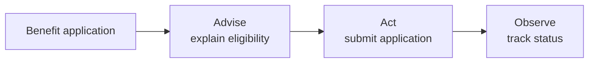
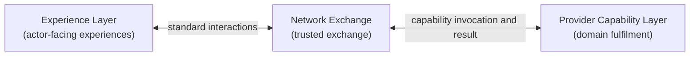
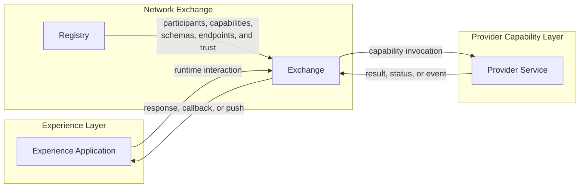
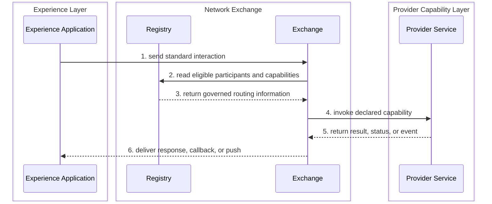
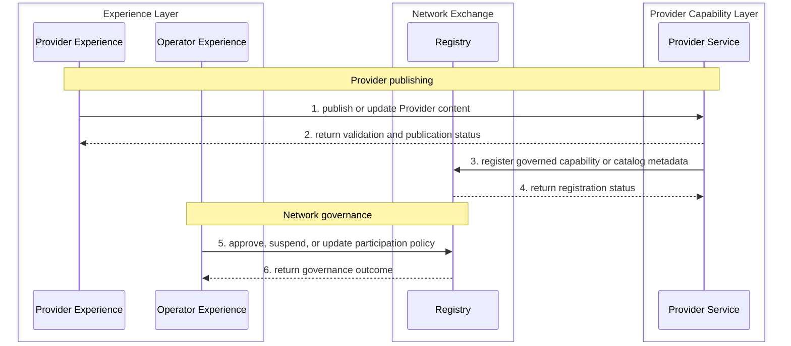

# OpenAgriNet architecture

Status: Accepted foundation, 2026-08-12

## The idea

OpenAgriNet is an ecosystem in which a Consumer seeks an agricultural outcome, a Provider supplies a capability that can satisfy it, and a Network Operator establishes the rules under which they participate. These are the three actor roles used to derive the architecture.

The architecture will not use a network-of-networks model as its starting point. Knowledge, livestock, mandi, weather, schemes, and similar domains are Provider capabilities, not separate actor types. Consumer-to-Provider outcomes use three composable interaction types: Advise, Observe, and Act. The trigger, completion pattern, channel, and representation are independent of the interaction type. Experience Layer, Network Exchange, and Provider Capability Layer separate actor experience, trusted exchange, and domain fulfilment. Provider publishing and Network Operator governance remain separate lifecycle interactions.

## Who does what

### Consumer

The Consumer is the farmer who seeks information, an observation, or an action from the ecosystem.

**Does:** Expresses a need, supplies the context and consent needed to fulfil it, and receives the result.

**Never does:** Manages provider registration, network governance, schemas, or ecosystem policy.

**Assumes:** The ecosystem protects the farmer's identity and context, makes available capabilities understandable, and returns results with enough provenance and status to be trusted.

### Provider

The Provider supplies one or more agricultural capabilities. A knowledge organisation, livestock service, mandi service, weather service, scheme service, or grievance service is a Provider with a different declared capability.

**Does:** Declares its capabilities, accepts compatible requests, supplies information or performs actions, and remains accountable for its results.

**Never does:** Sets rules for the whole ecosystem or gains access to a Consumer beyond the context and consent required for an interaction.

**Assumes:** The Network Operator publishes stable participation rules, schemas, and trust requirements, and the ecosystem can route eligible Consumer needs to the Provider's declared capabilities.

### Network Operator

The Network Operator governs participation in OpenAgriNet. It defines the common rules, schemas, trust requirements, and onboarding processes for Consumers and Providers.

**Does:** Establishes governance, approves or suspends participation, manages common schemas and policies, and provides the shared mechanisms needed for trusted interaction.

**Never does:** Becomes the source of provider information, performs a Provider's domain service, or owns a Consumer's agricultural decision.

**Assumes:** Consumers and Providers comply with the rules for their role, and governance decisions can be enforced and audited through shared platform mechanisms.

## Actor relationships

The roles describe responsibility, not organisation boundaries. One organisation may play more than one role, but it must act under the contract and permissions of one role in each interaction.

## Interaction model

An interaction type describes the outcome a Consumer expects from a Provider. It does not prescribe who initiates the interaction, how long it takes, or whether the Consumer uses a phone, web application, mobile application, or messaging channel.

### Domain interaction types

| Type    | Does                                                               | Never does                                  | Examples                                                                          |
| ------- | ------------------------------------------------------------------ | ------------------------------------------- | --------------------------------------------------------------------------------- |
| Advise  | Explains, guides, or recommends                                    | Changes an external or Consumer-owned state | Scheme information, crop advisory, livestock guidance, frequently asked questions |
| Observe | Retrieves or derives current, external, or Consumer-specific state | Changes the state it observes               | Weather, mandi price, milk records, application status, pest diagnosis            |
| Act     | Creates, updates, submits, books, transacts, or escalates          | Treats acceptance as proof of completion    | Apply for a benefit, book a service, raise a grievance, update a crop profile     |

A use case may compose more than one type. The architecture must preserve the boundary between the steps even when the Consumer experiences them as one conversation.

For example, a benefit application may Advise on eligibility, Act to submit the application, and Observe its status. A pest flow may Observe a crop image and then Advise on treatment. A market flow may Observe prices before the Consumer chooses to Act.

### Trigger modes

| Trigger | Starts when | Example |
|---|---|---|
| Request-driven | A Consumer asks or submits something | A farmer asks for today's weather |
| Event-driven | A Provider or platform event occurs | A severe-weather condition is detected |
| Scheduled | A configured time or calendar condition occurs | An irrigation reminder becomes due |

### Completion patterns

| Pattern | How the result arrives | Example |
|---|---|---|
| Immediate response | The result returns in the same exchange | Scheme information in web chat |
| Stream | The result arrives progressively in an open session | Voice during a phone call |
| Callback | The result is sent later to an agreed endpoint or session | Eligibility processing completes after the web request |
| Poll | The Consumer asks for the result using an interaction identifier | Application status tracking |
| Push | The result is sent without an open Consumer request | Weather alert or repayment reminder |

A notification is not a domain interaction type. It combines an event-driven or scheduled trigger, a push completion pattern, and a permitted channel.

### Channels and representations

| Channel            | Typical representations                    |
| ------------------ | ------------------------------------------ |
| Phone call         | Voice                                      |
| Web chat           | Text, cards, links, or audio               |
| Mobile application | Text, voice, cards, or device notification |
| Messaging          | Short text, links, or interactive messages |

The same Advise, Observe, or Act contract may be exposed through several channels. Channel adapters translate input and output representations but do not redefine the domain outcome.

### Supporting lifecycle interactions

Provider publishing, participant onboarding, governance, and platform operations support the domain interactions but are not Consumer-to-Provider interaction types. They will be specified as separate flows because they have different actors, authority, and operational obligations.

## Layered architecture

The three layers are logical ownership boundaries, not mandatory deployment units. Each layer owns one transformation and state of one kind.

### Experience Layer

The Experience Layer serves Consumer, Provider, and Network Operator experiences. Examples include farmer channels, a Provider publishing workbench, and a Network Operator governance console.

**Does:** Converts actor intent and information into standard interactions, presents results, and owns channel or user-interface session state.

**Never does:** Selects an unregistered Provider, bypasses the Network Exchange for a runtime network interaction, or executes Provider domain logic.

**Assumes:** Network and Provider functions expose stable contracts that do not depend on a particular channel or user interface.

### Network Exchange

The Network Exchange is operated by the Network Operator. The Registry is its control plane and records governed participants, capabilities, schemas, endpoints, keys, and participation status.

**Does:** Validates, discovers, routes, correlates, and delivers standard interactions and Provider events under network policy.

**Never does:** Interprets raw conversations, produces a Provider result, translates arbitrary Provider-native data, or owns authoritative Provider state.

**Assumes:** Experiences send valid standard interactions and Providers implement the capabilities and schemas they declare.

### Provider Capability Layer

The Provider Capability Layer fulfils declared Advise, Observe, and Act capabilities against authoritative Provider systems. A Knowledge Provider implements both publishing and retrieval here. Publishing reaches the Network Exchange only to register governed capability and catalog metadata; Provider documents, approved content, and retrieval projections remain inside the Provider boundary.

**Does:** Implements the standard capability contract, applies domain rules, owns domain workflow, and returns accountable results, status, events, provenance, and receipts.

**Never does:** Defines network governance, selects other Providers, or owns actor-facing channel presentation.

**Assumes:** The Network Exchange routes only eligible interactions and supplies the identity, context, and consent required by the declared capability.

A Provider may operate this layer itself or use a managed implementation. Physical hosting does not move domain responsibility or authoritative state into the Network Exchange.

| Layer | State it owns |
|---|---|
| Experience Layer | User-interface, channel, and conversation state |
| Network Exchange | Routing, delivery, and correlation state |
| Provider Capability Layer | Domain workflow and authoritative domain state |

## Logical components

The layers contain four logical component types. A component is a responsibility boundary, not necessarily a separately deployed service.

| Component | Does | Never does | Assumes |
|---|---|---|---|
| Experience Application | Captures an actor's intent and presents progress or results | Implements network routing or Provider domain logic | The responsible Network Exchange, Registry, and Provider Service expose stable contracts |
| Registry | Governs participants, capabilities, schemas, endpoints, keys, and participation status | Routes runtime interactions or stores Provider domain content | The Network Operator applies explicit onboarding and governance policy |
| Exchange | Validates, discovers, routes, correlates, and delivers network interactions | Produces Provider results or owns authoritative Provider state | The Registry is authoritative for participation and each Provider implements its declared contracts |
| Provider Service | Fulfils a declared domain capability and owns its domain workflow and state | Defines ecosystem-wide governance or actor-facing presentation | The Exchange supplies the identity, context, consent, and policy evidence required by the capability |

A Provider Service is a component type. A Knowledge Service, Weather Service, Mandi Service, Livestock Service, Scheme Service, Booking Service, or Credit Service is a concrete Provider Service.

Every component treats the components it calls and the components that call it as stakeholders. Its contract must state the outcome it provides, the inputs and services it requires, observable failure states, compatibility rules, operational evidence, and its never-does boundary. Process liveness alone does not establish component health when the stakeholder outcome is failing.

### Extension boundaries

The architecture keeps extensions with the component whose responsibility they change. It does not promote every extension to a top-level component.

| Extension or concern | Owning component or boundary |
|---|---|
| Discovery, routing, callback correlation, retry, and event delivery | Exchange |
| Document ingestion, approval, retrieval, and Provider-system connectors | Provider Service |
| Translation, voice, persona, channel, and conversation memory | Experience Application, unless they alter an authoritative Provider result |
| Participant, capability, schema, endpoint, and key records | Registry |
| Identity, consent, policy evidence, telemetry, and audit | Contracts observed by every affected component |

## Role composition and deployment

Actor roles define accountability. Components define logical responsibility. An organisation may operate components for more than one role without merging those responsibilities.

| Organisation | Components it may operate |
|---|---|
| Network Operator | Registry, Exchange, Operator Experience Applications, and first-party Provider Services |
| External Provider | Provider Services and Provider Experience Applications |
| Application or channel partner | Experience Applications |

For example, the Network Operator may operate the Registry and Exchange under the Network Operator role, and a Knowledge Service under the Provider role. The Knowledge Service remains in the Provider Capability Layer. It registers under the same participation and capability contracts as an external Provider Service.

Co-location may optimize calls, but it must preserve contracts, policy checks, state ownership, provenance, audit, and replaceability. Moving a Provider Service into the Network Operator's deployment does not move its content, retrieval indexes, domain decisions, or accountability into the Exchange.

## Runtime and lifecycle paths

Runtime network interactions use the Exchange. The Registry supplies the governed information that the Exchange needs to discover and route an eligible Provider Service.

Lifecycle interactions address the component that owns the lifecycle. Provider content does not pass through the Exchange merely because the Network Operator also hosts the Provider Service.

An Experience Application therefore does not bypass the Exchange for a runtime network interaction. A Provider publishing experience may address its Provider Service directly, and an Operator governance experience may address the Registry directly.

## Use-case validation

The current use-case inventory fits the component model without adding a fifth top-level component. Each new use case must identify its Experience Application, authoritative Provider Service, Registry records, runtime or lifecycle path, state owner, trigger, completion pattern, and required extensions before the architecture accepts it.

| Use-case family | Component path |
|---|---|
| Advisory, schemes, frequently asked questions, and recommendations | Experience Application to Exchange to Knowledge or advisory Provider Service |
| Weather, mandi prices, milk records, benefits, and application status | Experience Application to Exchange to the relevant Provider Service |
| Booking, applications, grievances, profile updates, and escalation | Experience Application to Exchange to the action-owning Provider Service |
| Alerts, reminders, and farm-calendar notifications | Provider Service to Exchange to Experience Application |
| Knowledge ingestion and repository management | Provider Experience Application to Knowledge Service |
| Knowledge or content synchronization | Provider Service publishing flow, with governed capability or catalog metadata in the Registry |
| Provider, capability, and schema onboarding | Provider or Operator Experience Application to Registry |
| Voice, multilingual, telephony, local terminology, and language switching | Experience Application extensions; the Provider result remains authoritative |
| Personalization, conversation memory, and crop profiles | Experience Application owns conversation context; a Provider Service owns durable farmer or crop profile state and the resulting domain decision |
| Feedback capture and analytics | Experience Application to Exchange to feedback-owning Provider Service; Operator Experience Application reads the resulting analytics |
| Operational dashboards and API health | Operator Experience Application reading operational evidence from the Registry, Exchange, and Provider Services |

Operational dashboards, health monitoring, and feedback analytics require each component to expose consistent operational evidence. This is a cross-component supportability contract, not a fifth top-level business component. If network-wide aggregation later requires independent ownership or scaling, the architecture may separate it without changing the four component types.

## Architecture review checkpoint

The architecture is ready for agreement on its foundation. Reviewers are being asked to confirm the following approach before the document proceeds into detailed models and specifications.

| Area | Foundation proposed for agreement |
|---|---|
| Ecosystem | Consumer, Provider, and Network Operator are the three actor roles |
| Interactions | Advise, Observe, and Act are composable domain interaction types; trigger, completion, channel, and representation remain independent |
| Ownership | Experience Layer, Network Exchange, and Provider Capability Layer are the three logical ownership layers |
| Components | Experience Application, Registry, Exchange, and Provider Service are the four logical component types; Registry belongs inside Network Exchange |
| Role composition | One organisation may play more than one role, but each interaction preserves its role contract, state ownership, policy, provenance, and audit boundaries |
| Flow separation | Runtime network interactions use the Exchange; publishing, onboarding, and governance address the component that owns their lifecycle |
| Extensibility | Discovery, ingestion, channels, language, persona, and adapters extend an owning component rather than becoming top-level components by default |
| Validation | Every architectural addition must map to the use-case inventory and identify its actors, components, state owner, interaction path, and operational evidence |

Agreement at this checkpoint accepts these responsibility boundaries as the basis for further work. It does not yet approve field-level information models, API payloads, protocol bindings, security profiles, deployment technologies, or service-level objectives.

### Pending architecture work

The remaining architecture work will be completed in the following order. Later work may refine an accepted boundary only when a use case, quality requirement, or interface proves that the current boundary does not hold.

| Order | Work item | Completion evidence |
|---|---|---|
| 1 | Requirements and design forces | Prioritized functional, trust, extensibility, operational, and architecture constraints, traced to the use cases |
| 2 | Information model and authority | Core concepts, relationships, identifiers, lifecycle, authoritative owner, projections, privacy boundaries, and extension rules |
| 3 | Representative end-to-end flows | Success and failure diagrams for immediate response, composite interaction, callback, notification, onboarding, knowledge publishing and retrieval, governance, and reconciliation |
| 4 | Component deep-dives | Purpose, does, never does, assumptions, owned state, provided and required contracts, extension points, failure evidence, and supporting use cases for every component |
| 5 | Interface and contract architecture | Interface map covering caller, provider, outcome, authority, synchronous or asynchronous behavior, failure, versioning, and contract owner |
| 6 | Shared trust and control boundaries | Identity, consent, authorization, policy evidence, schema compatibility, status, errors, idempotency, provenance, receipts, and audit |
| 7 | Extensibility and conformance | Verifiable procedures for adding a Provider, capability, schema, channel, language, persona, or adapter without changing unrelated components |
| 8 | Operability and supportability | Component health, operational evidence, dashboards, diagnosis, administration, reconciliation, and network-wide traceability |
| 9 | Deployment and allocation views | Network Operator core, first-party Provider Service, external Provider, managed Provider Service, scaling, and isolation boundaries |
| 10 | Architecture validation | Requirement-to-component mapping and row-level use-case traceability with unresolved pressure points recorded as open items |

### Derived specifications

The architecture will derive a set of normative specifications. The architecture owns the responsibility and authority decisions; each specification owns its precise implementable contract.

| Specification | Defines |
|---|---|
| OpenAgriNet information model | Concepts, relationships, identifiers, lifecycles, authority, validation, privacy, serialization, and domain-profile extensions |
| Interaction contract | Common envelope and Advise, Observe, Act, response, callback, poll, push, status, error, and idempotency contracts |
| Registry | Participant, role, capability, schema, endpoint, key, status, discovery, and governance records and interfaces |
| Provider capability | Capability declaration, invocation, results, events, provenance, receipts, state ownership, and adapter rules |
| Knowledge Provider | Publishing, approval, versioning, retrieval, projections, translation, persona application, deletion, and provenance |
| Identity, consent, trust, and policy | Identity boundaries, consent, credentials, authorization, disclosure, and policy evidence |
| Delivery and events | Callback, notification, subscription, scheduling, retry, delivery guarantee, and reconciliation behavior |
| Operational evidence | Health, metrics, logs, traces, audit events, failure classification, and diagnostic evidence |
| Conformance | Contract validation, compatibility, security, error behavior, Provider admission tests, and activation evidence |

## Locked decisions

- OpenAgriNet has three ecosystem actor roles: Consumer, Provider, and Network Operator.
- The Consumer is the farmer.
- Agricultural domains are capabilities of a Provider, not new actor types.
- The Network Operator governs the ecosystem but does not replace Providers.
- A network-of-networks model is outside this architecture's starting scope.
- Advise, Observe, and Act are the three composable Consumer-to-Provider interaction types.
- Trigger mode, completion pattern, channel, and representation are independent dimensions of an interaction.
- A notification is an event-driven or scheduled push, not a fourth domain interaction type.
- Publishing, onboarding, governance, and operations are supporting lifecycle interactions.
- OpenAgriNet has three logical ownership layers: Experience Layer, Network Exchange, and Provider Capability Layer.
- Experience Layer serves actor-facing experiences for Consumers, Providers, and the Network Operator.
- The Registry is the control plane for the Network Exchange.
- The four logical component types are Experience Application, Registry, Exchange, and Provider Service.
- The Registry is a component within the Network Exchange layer, not a fourth layer.
- Runtime network interactions use the Exchange; Provider publishing and Network Operator governance address the component that owns their lifecycle.
- The Network Operator may operate a first-party Provider Service, but it remains logically and contractually separate from the Registry and Exchange.
- A Provider protocol adapter is internal to the Provider Capability Layer, even when offered as a managed implementation.

## Open items

| Item | Why it matters | Owner and tradeoff |
|---|---|---|
| Define the interaction contracts | The accepted types still need request, result, error, identity, consent, and status contracts | Architecture. One common envelope improves interoperability; type-specific contracts make boundaries clearer |
| Define the Provider capability model | Providers need a consistent way to declare Advise, Observe, and Act capabilities | Architecture and domain owners. A general model improves extensibility; a detailed model improves validation |
| Define the Registry information model and identity boundaries | Registry placement is accepted, but the records and separation between participant trust, Consumer identity, and consent remain open | Architecture and governance. One model simplifies administration; strict identity boundaries reduce data concentration and inappropriate access |
