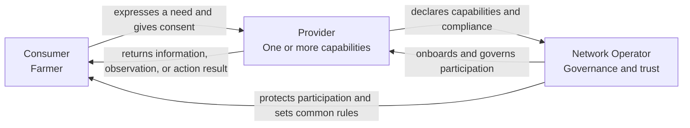
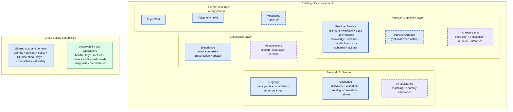
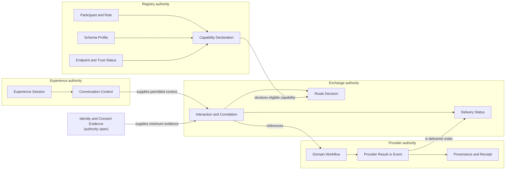
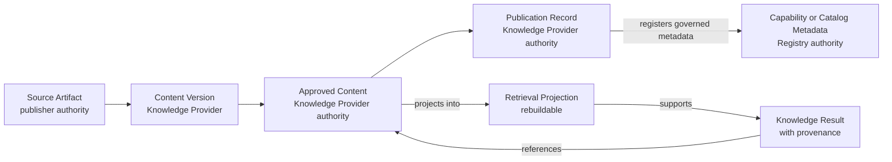
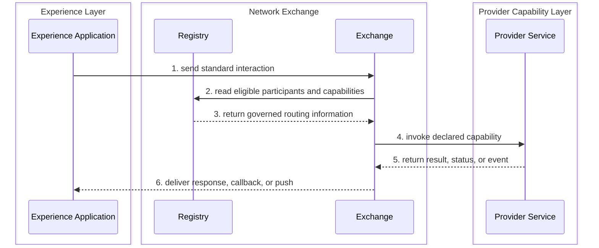
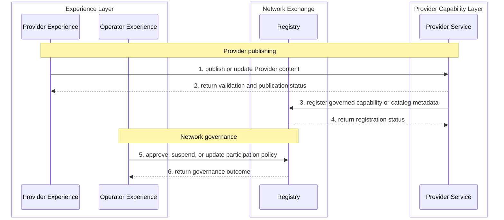

# OpenAgriNet architecture

Status: Proposed to be reviewed with DC

Companion guide: [Understanding OpenAgriNet architecture](UNDERSTANDING_ARCHITECTURE.md)

## The idea

OpenAgriNet is an ecosystem in which a Consumer seeks an agricultural outcome, a Provider supplies a capability that can satisfy it, and a Network Operator establishes the rules under which they participate. These are the three actor roles used to derive the architecture.

The architecture will not use a network-of-networks model as its starting point. Knowledge, livestock, mandi, weather, schemes, and similar domains are Provider capabilities, not separate actor types. Consumer-to-Provider outcomes use three composable interaction types: Advise, Observe, and Act. The trigger, completion pattern, channel, and representation are independent of the interaction type. Experience Layer, Network Exchange, and Provider Capability Layer separate actor experience, trusted exchange, and domain fulfilment. Provider publishing and Network Operator governance remain separate lifecycle interactions.

## Who does what

The **Consumer** is the farmer who seeks information, an observation, or an action from the ecosystem.

The **Provider** supplies one or more agricultural capabilities, such as knowledge, livestock, mandi, weather, schemes, or grievances.

The **Network Operator** governs participation and defines common rules, schemas, trust requirements, and onboarding processes.

| Actor | Does | Never does | Assumes |
|---|---|---|---|
| Consumer | Expresses a need, supplies the context and consent needed to fulfil it, and receives the result | Manages Provider registration, network governance, schemas, or ecosystem policy | The ecosystem protects the farmer's identity and context, makes available capabilities understandable, and returns results with enough provenance and status to be trusted |
| Provider | Declares its capabilities, accepts compatible requests, supplies information or performs actions, and remains accountable for its results | Sets rules for the whole ecosystem or accesses a Consumer beyond the context and consent required for an interaction | The Network Operator publishes stable participation rules, schemas, and trust requirements, and the ecosystem routes eligible Consumer needs to declared capabilities |
| Network Operator | Establishes governance, approves or suspends participation, manages common schemas and policies, and provides the shared mechanisms needed for trusted interaction | Becomes the source of Provider information, performs a Provider's domain service, or owns a Consumer's agricultural decision | Consumers and Providers comply with the rules for their role, and governance decisions can be enforced and audited through shared platform mechanisms |

## Actor relationships

The roles describe responsibility, not organisation boundaries. One organisation may play more than one role, but it must act under the contract and permissions of one role in each interaction.

## What the architecture must support

These are the architecture-significant requirements derived from the current use-case inventory. They define what the architecture must make possible or protect. They do not replace the detailed use cases or prescribe a deployment technology.

Every requirement needs observable validation. A later component, interface, or specification is justified only when it satisfies one or more of these requirements.

### Design tensions

| Force                                        | Tension the architecture must resolve                                                                                                          |
| -------------------------------------------- | ---------------------------------------------------------------------------------------------------------------------------------------------- |
| Ecosystem diversity and a simple core        | Providers and agricultural domains vary, but each variation must not add another top-level architecture component                              |
| Shared governance and Provider authority     | The Network Operator must enforce participation rules without becoming the authority for Provider content, workflow, or results                |
| Role composition and role independence       | One organisation may operate network and Provider functions, while external Providers must be able to participate through the same contracts   |
| Common contracts and domain variation        | Interactions need stable shared semantics while domain information evolves through explicit profiles and extensions                            |
| Channel inclusion and outcome integrity      | Voice, text, web, mobile, and messaging may represent an interaction differently without changing its domain meaning                           |
| Flexible completion and reliable obligation  | Immediate, streaming, callback, poll, and push delivery must remain composable without losing correlation, status, or accountability           |
| Operational visibility and data minimization | Operators need enough evidence to diagnose stakeholder outcomes without copying Consumer identity, consent, or Provider content into telemetry |

### Outcome requirements

| ID     | Requirement                                                                                                                                                       | Validation evidence                                                                                                             |
| ------ | ----------------------------------------------------------------------------------------------------------------------------------------------------------------- | ------------------------------------------------------------------------------------------------------------------------------- |
| OUT-01 | A Consumer must be able to use an eligible Provider capability through any supported Experience Application without the Provider implementing that channel        | Exercise the same advisory through text and voice while keeping the Provider capability contract unchanged                      |
| OUT-02 | A Provider must be able to declare, publish, update, fulfil, and withdraw a capability while remaining authoritative for its domain content, workflow, and result | Publish and retrieve knowledge, then repeat the lifecycle for a non-knowledge Provider capability                               |
| OUT-03 | A Network Operator must be able to onboard, approve, suspend, and audit participants, capabilities, schemas, endpoints, keys, and participation status            | Complete the Provider onboarding lifecycle and prove that suspension prevents new eligible routing                              |
| OUT-04 | A first-party Provider Service operated by the Network Operator must participate through the same role contract as an external Provider Service                   | Replace or complement a first-party Knowledge Service with an external Knowledge Service without changing the Exchange contract |

### Interaction requirements

| ID | Requirement | Validation evidence |
|---|---|---|
| INT-01 | Advise, Observe, and Act must remain independently invocable and composable in one Consumer journey | Exercise benefit discovery, application, and status tracking as Advise, Act, and Observe steps |
| INT-02 | Trigger mode, completion pattern, channel, and representation must vary independently of the domain interaction type | Deliver the same weather observation by request and by scheduled push through different channels |
| INT-03 | Immediate and asynchronous interactions must preserve a stable interaction identity, status, and accountable Provider across response, callback, poll, and push | Trace a long-running application from submission to callback and later status observation |
| INT-04 | Acceptance of a long-running Act must create a durable obligation and must not be reported as completion | Interrupt processing after acceptance and prove that the action resumes, reconciles, or reaches an explicit terminal failure |
| INT-05 | Event-driven and scheduled notifications must respect Consumer permission, preference, and delivery status | Generate an alert, suppress it for a Consumer without permission, and expose its delivery result for a permitted Consumer |

### Participation and governance requirements

| ID | Requirement | Validation evidence |
|---|---|---|
| GOV-01 | One logical Registry must be authoritative for governed participant, role, capability, schema, endpoint, key, and participation-status records | Resolve each governed record for an eligible Provider from the Registry and identify its change history |
| GOV-02 | The Exchange must use current Registry decisions when discovering and routing a Provider | Change a Provider's eligibility and prove that subsequent discovery and routing apply the new decision |
| GOV-03 | Provider admission must be declarative and verifiable without rebuilding the Exchange | Add a conforming Provider through registration, policy approval, and contract validation only |
| GOV-04 | Governance decisions must be attributable, auditable, reversible where policy permits, and enforceable at runtime | Reconstruct an approval and suspension from audit evidence and verify their runtime effect |

### Information and authority requirements

| ID | Requirement | Validation evidence |
|---|---|---|
| INF-01 | Every mutable record must have one accountable authoritative owner; other stores must be declared copies, caches, or rebuildable projections | Map each state read or changed by the representative flows to its authority and reconciliation direction |
| INF-02 | Experience Applications own experience state, the Exchange owns routing and delivery state, and Provider Services own domain workflow and authoritative domain state | Trace a composite interaction and prove that no component writes state owned by another component |
| INF-03 | A Knowledge Service must own source artifacts, approved content, publication state, and retrieval projections; the Registry stores only governed capability or catalog metadata | Publish, update, withdraw, and rebuild a knowledge projection without treating the Exchange or Registry as the content authority |
| INF-04 | Components must disclose only the Consumer identity, context, and consent evidence required for the interaction; the Registry must not accumulate Consumer data for convenience | Inspect Registry records and an interaction trace for unnecessary Consumer data |
| INF-05 | Provider results must carry sufficient provenance, status, and receipt information for a Consumer, Operator, or dependent component to determine their source and authority | Trace an advisory result and a completed action back to the accountable Provider and authoritative evidence |

### Extensibility requirements

| ID     | Requirement                                                                                                                                        | Validation evidence                                                                                               |
| ------ | -------------------------------------------------------------------------------------------------------------------------------------------------- | ----------------------------------------------------------------------------------------------------------------- |
| EXT-01 | A new Provider or capability must be added through declared contracts, registration, policy, and conformance without changing unrelated components | Onboard a new domain Provider without changing the Experience Application or Exchange implementation              |
| EXT-02 | Common schemas must support versioned domain profiles and explicit compatibility rules without forking the shared interaction semantics            | Introduce a backward-compatible domain attribute and reject an incompatible version without an explicit migration |
| EXT-03 | A new channel, language, representation, or persona must extend the Experience Application unless it changes an authoritative Provider result      | Add a new language or channel without changing Provider Service domain logic                                      |
| EXT-04 | Provider-native connectors and transformation adapters must remain replaceable inside the Provider Capability Layer                                | Replace one Provider adapter while keeping the Exchange-facing capability contract unchanged                      |
| EXT-05 | No extension may bypass identity, consent, policy, audit, or conformance obligations                                                               | Run the same policy and conformance checks against a core implementation and an extension                         |

### Operational and supportability requirements

Every component treats the components it calls and the components that call it as stakeholders. Component health therefore measures the promised stakeholder outcome, not process liveness alone.

| ID     | Requirement                                                                                                                                             | Validation evidence                                                                                              |
| ------ | ------------------------------------------------------------------------------------------------------------------------------------------------------- | ---------------------------------------------------------------------------------------------------------------- |
| OPS-01 | Every network interaction must carry a correlation identity across the Experience Application, Exchange, Registry lookup, and Provider Service          | Reconstruct one interaction across all participating components from operational evidence                        |
| OPS-02 | Every component must expose technical health and the health of the stakeholder outcome it promises                                                      | Keep a component process available while making its dependency fail, and verify that outcome health degrades     |
| OPS-03 | A failed interaction must identify the failing boundary, failure category, retryability, current status, and accountable component                      | Inject validation, routing, Provider, callback, and delivery failures and inspect the reported evidence          |
| OPS-04 | The Exchange must expose discovery, routing, correlation, timeout, retry, callback, and delivery evidence                                               | Diagnose an immediate response, a delayed callback, and a failed push from Exchange evidence                     |
| OPS-05 | A Provider Service must expose capability success, domain failure, provenance, authoritative status, and reconciliation evidence                        | Compare a Provider-reported result and status with its authoritative domain system                               |
| OPS-06 | The Registry must expose auditable evidence for onboarding, approval, suspension, capability, schema, endpoint, and key changes                         | Reconstruct a Provider's participation history from Registry evidence                                            |
| OPS-07 | Logs, metrics, traces, dashboards, and audit records must not disclose Consumer data or Provider content beyond authorized operational need             | Inspect operational evidence for prohibited identity, consent, conversation, and content fields                  |
| OPS-08 | Operator Experience Applications must be able to present network and component health using evidence from the Registry, Exchange, and Provider Services | Demonstrate API health, Provider degradation, interaction failures, and delivery failures in an operational view |

### Constraints and non-goals

- Consumer, Provider, and Network Operator are the three ecosystem roles; agricultural domains remain Provider capabilities.
- Experience Layer, Network Exchange, and Provider Capability Layer are logical ownership boundaries, not prescribed deployment units.
- Experience Application, Registry, Exchange, and Provider Service are the four logical component types. Supporting capabilities do not become peer components without an independently justified responsibility boundary.
- The Registry is a component inside Network Exchange. It is not a fourth layer, a Provider-content store, or a general Consumer identity store.
- A network-of-networks model is outside the starting scope. The architecture may revisit federation only when a validated requirement cannot be met by the proposed model.
- The architecture remains implementation-neutral until a later deployment or technology decision is supported by requirements and measurable tradeoffs.

## Interaction model

An interaction type describes the outcome a Consumer expects from a Provider. It does not prescribe who initiates the interaction, how long it takes, or whether the Consumer uses a phone, web application, mobile application, or messaging channel.

### Domain interaction types

| Type    | Does                                                               | Never does                                  | Examples                                                                          |
| ------- | ------------------------------------------------------------------ | ------------------------------------------- | --------------------------------------------------------------------------------- |
| Advise  | Explains, guides, or recommends                                    | Changes an external or Consumer-owned state | Scheme information, crop advisory, livestock guidance, frequently asked questions |
| Observe | Retrieves or derives current, external, or Consumer-specific state | Changes the state it observes               | Weather, mandi price, milk records, application status, pest diagnosis            |
| Act     | Creates, updates, submits, books, transacts, or escalates          | Treats acceptance as proof of completion    | Apply for a benefit, book a service, raise a grievance, update a crop profile     |

A use case may compose more than one type. The architecture must preserve the boundary between the steps even when the Consumer experiences them as one conversation.

For example, a benefit application may Advise on eligibility, Act to submit the application, and Observe its status. A pest flow may Observe a crop image and then Advise on treatment. A market flow may Observe prices before the Consumer chooses to Act.

### Trigger modes

| Trigger | Starts when | Example |
|---|---|---|
| Request-driven | A Consumer asks or submits something | A farmer asks for today's weather |
| Event-driven | A Provider or platform event occurs | A severe-weather condition is detected |
| Scheduled | A configured time or calendar condition occurs | An irrigation reminder becomes due |

### Completion patterns

| Pattern | How the result arrives | Example |
|---|---|---|
| Immediate response | The result returns in the same exchange | Scheme information in web chat |
| Stream | The result arrives progressively in an open session | Voice during a phone call |
| Callback | The result is sent later to an agreed endpoint or session | Eligibility processing completes after the web request |
| Poll | The Consumer asks for the result using an interaction identifier | Application status tracking |
| Push | The result is sent without an open Consumer request | Weather alert or repayment reminder |

A notification is not a domain interaction type. It combines an event-driven or scheduled trigger, a push completion pattern, and a permitted channel.

### Channels and representations

| Channel            | Typical representations                    |
| ------------------ | ------------------------------------------ |
| Phone call         | Voice                                      |
| Web chat           | Text, cards, links, or audio               |
| Mobile application | Text, voice, cards, or device notification |
| Messaging          | Short text, links, or interactive messages |

The same Advise, Observe, or Act contract may be exposed through several channels. Channel adapters translate input and output representations but do not redefine the domain outcome.

### Supporting lifecycle interactions

Provider publishing, participant onboarding, governance, and platform operations support the domain interactions but are not Consumer-to-Provider interaction types. They will be specified as separate flows because they have different actors, authority, and operational obligations.

## Layered architecture

The three layers are logical ownership boundaries, not mandatory deployment units. Each layer owns one transformation and state of one kind.

### Experience Layer

The Experience Layer serves Consumer, Provider, and Network Operator experiences. Examples include farmer channels, a Provider publishing workbench, and a Network Operator governance console.

**Does:** Converts actor intent and information into standard interactions, presents results, and owns channel or user-interface session state.

**Never does:** Selects an unregistered Provider, bypasses the Network Exchange for a runtime network interaction, or executes Provider domain logic.

**Assumes:** Network and Provider functions expose stable contracts that do not depend on a particular channel or user interface.

### Network Exchange

The Network Exchange is operated by the Network Operator. The Registry is its control plane and records governed participants, capabilities, schemas, endpoints, keys, and participation status.

**Does:** Validates, discovers, routes, correlates, and delivers standard interactions and Provider events under network policy.

**Never does:** Interprets raw conversations, produces a Provider result, translates arbitrary Provider-native data, or owns authoritative Provider state.

**Assumes:** Experiences send valid standard interactions and Providers implement the capabilities and schemas they declare.

### Provider Capability Layer

The Provider Capability Layer fulfils declared Advise, Observe, and Act capabilities against authoritative Provider systems. A Knowledge Provider implements both publishing and retrieval here. Publishing reaches the Network Exchange only to register governed capability and catalog metadata; Provider documents, approved content, and retrieval projections remain inside the Provider boundary.

**Does:** Implements the standard capability contract, applies domain rules, owns domain workflow, and returns accountable results, status, events, provenance, and receipts.

**Never does:** Defines network governance, selects other Providers, or owns actor-facing channel presentation.

**Assumes:** The Network Exchange routes only eligible interactions and supplies the identity, context, and consent required by the declared capability.

A Provider may operate this layer itself or use a managed implementation. Physical hosting does not move domain responsibility or authoritative state into the Network Exchange.

| Layer | State it owns |
|---|---|
| Experience Layer | User-interface, channel, and conversation state |
| Network Exchange | Routing, delivery, and correlation state |
| Provider Capability Layer | Domain workflow and authoritative domain state |

## Component architecture

The architecture has four stable building blocks: Experience, Registry, Exchange, and Provider Service. Runtime features, adapters, AI tools, trust controls, and operational tools remain capabilities or extensions of these blocks unless an independently justified boundary requires a separate component.

### Building-block landscape

The invisible Mermaid links (`~~~`) control placement only. They do not represent communication. Blue boxes are deterministic, purple boxes are AI-based, green boxes are operational, and dashed boxes are optional extensions. Conditional capabilities use solid borders because they become mandatory when their declared condition applies.

A Provider that implements the standard contract natively does not need a Provider Adapter. A non-conformant Provider uses an adapter that it operates itself, obtains as a reference implementation, or consumes as a Network Operator-managed implementation. In every option, the adapter remains logically inside the Provider Capability Layer.

Every building block emits evidence about the responsibility it owns. Network operational capabilities collect and correlate that evidence across the ecosystem. Telemetry and audit stores do not become authoritative for Registry governance state or Provider domain state.

### Capability placement

Capabilities with similar technical names remain separate when they change different outcomes or authorities.

| Capability | Placement |
|---|---|
| Speech recognition and synthesis | Experience |
| Language detection and response rendering | Experience |
| Conversation-context enrichment | Experience |
| Channel-input PII minimization and masking | Experience, with protection repeated at every later boundary that handles sensitive data |
| Provider-native to standard protocol mapping | Provider Adapter |
| PDF extraction, OCR, source-content translation, classification, and chunking | Knowledge Provider Service publishing capability |
| Retrieval, reranking, and answer generation | Knowledge Provider Service retrieval capability |
| Domain recommendation, inference, or decision support | Provider Service |
| Capability-matching assistance | Exchange optional extension, advisory only; governed policy remains authoritative |
| Network anomaly detection | Observability and Operations |

### Capability optionality

| Classification | Meaning |
|---|---|
| Core | Required for every conformant implementation of the building block |
| Conditional | Required when a declared use case, channel, format, data class, or completion pattern needs it |
| Optional extension | Adds functionality without changing or weakening the base contract |
| Managed implementation | Another organisation operates it while the logical owner retains responsibility |
| Reference implementation | An example implementation with no privileged architectural status |

A capability receives an independent component boundary only when it has a meaningful independent contract, state, failure mode, deployment lifecycle, security boundary, scaling requirement, or operational owner. Otherwise it remains an internal feature, tool, skill, adapter, or module within its owning building block.

### Building-block responsibilities

The layers contain four logical building blocks. A building block is a responsibility boundary, not necessarily a separately deployed service.

| Building block | Does | Never does | Assumes |
|---|---|---|---|
| Experience | Captures an actor's intent and presents progress or results | Implements network routing or Provider domain logic | The responsible Network Exchange, Registry, and Provider Service expose stable contracts |
| Registry | Governs participants, capabilities, schemas, endpoints, keys, and participation status | Routes runtime interactions or stores Provider domain content | The Network Operator applies explicit onboarding and governance policy |
| Exchange | Validates, discovers, routes, correlates, and delivers network interactions | Produces Provider results or owns authoritative Provider state | The Registry is authoritative for participation and each Provider implements its declared contracts |
| Provider Service | Fulfils a declared domain capability and owns its domain workflow and state | Defines ecosystem-wide governance or actor-facing presentation | The Exchange supplies the identity, context, consent, and policy evidence required by the capability |

A Knowledge Service, Weather Service, Mandi Service, Livestock Service, Scheme Service, Booking Service, or Credit Service is a concrete Provider Service.

Every building block treats its dependencies and consumers as stakeholders. Its contract must state the outcome it provides, the inputs and services it requires, observable failure states, compatibility rules, operational evidence, and its never-does boundary. Process liveness alone does not establish health when the stakeholder outcome is failing.

### Extension boundaries

The architecture keeps extensions with the building block whose responsibility they change. It does not promote every extension to a top-level component.

| Extension or concern | Owning component or boundary |
|---|---|
| Discovery, routing, callback correlation, retry, and event delivery | Exchange |
| Document ingestion, approval, retrieval, and Provider-system connectors | Provider Service |
| Translation, voice, persona, channel, and conversation memory | Experience, unless they alter an authoritative Provider result |
| Participant, capability, schema, endpoint, and key records | Registry |
| Identity, consent, policy evidence, telemetry, and audit | Contracts observed by every affected building block |

## Role composition and deployment

Actor roles define accountability. Components define logical responsibility. An organisation may operate components for more than one role without merging those responsibilities.

| Organisation | Components it may operate |
|---|---|
| Network Operator | Registry, Exchange, Operator Experience Applications, and first-party Provider Services |
| External Provider | Provider Services and Provider Experience Applications |
| Application or channel partner | Experience Applications |

For example, the Network Operator may operate the Registry and Exchange under the Network Operator role, and a Knowledge Service under the Provider role. The Knowledge Service remains in the Provider Capability Layer. It registers under the same participation and capability contracts as an external Provider Service.

Co-location may optimize calls, but it must preserve contracts, policy checks, state ownership, provenance, audit, and replaceability. Moving a Provider Service into the Network Operator's deployment does not move its content, retrieval indexes, domain decisions, or accountability into the Exchange.

## Information model and authority

Status: Proposed for review.

The information model defines the concepts that the building blocks create, read, change, and exchange. It does not define database tables or wire-format fields. Detailed schemas and serialization belong in the derived OpenAgriNet information model specification.

**Every mutable information concept has one accountable authority at a time.** Other stores must identify themselves as caches, projections, delivery copies, indexes, or operational evidence, and must declare how they reconcile with the authority.

### Authority rules

- A building block does not become authoritative merely because it hosts, routes, caches, indexes, or observes information.
- Authority follows the role responsibility: Registry governs participation, Exchange governs network interaction delivery, Experience governs actor-facing session state, and Provider Service governs domain workflow and results.
- Every copy declares its authoritative source, purpose, freshness expectation, retention rule, and reconciliation direction.
- Results, events, receipts, and projections retain stable references to the authoritative record and the participant that produced them.
- Moving a building block between organisations or deployments does not change information authority.

### Core concepts and authority

| Information domain | Core concepts | Accountable authority | Boundary |
|---|---|---|---|
| Participation and governance | Network, Participant, Role Assignment, Credential Reference, Participation Decision, Participation Status | Registry under Network Operator governance | Contains governed participant information, not Consumer identity or Provider domain content |
| Capability and contract | Capability Declaration, supported interaction types, Schema Profile, Endpoint, compatibility and conformance status | Registry for the accepted declaration | A Provider authors its declaration; the Registry is authoritative for what the network has accepted |
| Experience | Experience Session, Channel Session, Conversation Context, Presentation Preference | Experience | Durable domain profiles and outcomes do not become Experience state |
| Consumer trust | Consumer Identity Reference, Authentication Evidence, Consent Grant or Reference, permitted disclosure | Authority remains open; Experience carries the minimum evidence required by the interaction | The Registry must not accumulate Consumer identity or consent data for convenience |
| Interaction and delivery | Interaction, Correlation, Route Decision, Delivery Attempt, Delivery Status, callback or push obligation | Exchange | A copy of a Provider result is delivery state, not authoritative domain state |
| Provider domain | Domain Resource, Domain Workflow, Provider Status, Action, authoritative receipt | Provider Service | The Provider remains accountable when its adapter or service is managed by the Network Operator |
| Result and provenance | Provider Result, Evidence Reference, Provenance Record, Provider Event | Provider Service | Experience and Exchange may retain only the copies required for presentation, delivery, audit, or reconciliation |
| Knowledge | Source Artifact, Content Version, Approved Content, Publication, Retrieval Projection, knowledge provenance | Knowledge Provider Service; the submitting publisher remains authoritative for the source it supplied | Registry contains capability or catalog metadata, not documents, passages, embeddings, or generated answers |
| Operations | Health Observation, Metric, Log Record, Trace, Audit Event, Reconciliation Case | Originating building block is accountable for meaning; operational systems are authoritative for retained evidence | Operational evidence does not replace the underlying governance, interaction, or domain record |

### Concept relationships

This diagram shows information relationships and authority boundaries. It is not a runtime interaction flow.

### Knowledge authority and projections

Knowledge publishing creates an approved, versioned Provider record. Retrieval indexes and embeddings are rebuildable projections of that approved content.

Withdrawing or superseding approved content must invalidate its publication and derived projections. Deleting an index does not delete the approved content, and deleting a Registry record does not by itself delete Provider content.

### Identifiers and correlation

| Identifier | Created or governed by | Purpose and stability |
|---|---|---|
| Participant identity | Registry | Stable identity for a governed participant across capability and endpoint changes |
| Capability identity | Registry | Stable identity for one declared capability; its compatible versions remain traceable |
| Schema profile identity and version | Registry | Identifies the exact common or domain profile used by an interaction |
| Interaction identity | Exchange | Identifies one Advise, Observe, or Act interaction from acceptance to terminal delivery state |
| Correlation identity | Exchange or originating Experience | Relates composite interactions, callbacks, polls, notifications, and operational evidence without merging their states |
| Delivery-attempt identity | Exchange | Distinguishes retries and channel deliveries while preserving the interaction identity |
| Provider workflow reference | Provider Service | Links the network interaction to the authoritative Provider workflow or domain record |
| Result, event, and receipt identity | Provider Service | Provides stable references for provenance, status observation, audit, and reconciliation |
| Content identity and version | Knowledge Provider Service | Preserves identity across edits, translations, approvals, publication, withdrawal, and projection rebuilds |
| Consent reference | Consent authority, to be decided | References the applicable permission without copying unnecessary Consumer identity or consent content |

Identifiers must be globally unambiguous within their declared scope. Reprocessing, retries, projection rebuilds, or representation changes must not silently create a new authoritative identity for the same record.

### Lifecycle ownership

| Lifecycle | Minimum distinctions | Authority |
|---|---|---|
| Participant | Draft, submitted, approved, suspended, withdrawn | Registry |
| Capability declaration | Draft, submitted, accepted, deprecated, withdrawn | Registry |
| Interaction delivery | Received, validated, routed, accepted, delivered, failed, expired | Exchange |
| Provider workflow | Received, accepted, in progress, completed, failed, cancelled | Provider Service |
| Knowledge content | Ingested, validated, approved, published, superseded, withdrawn | Knowledge Provider Service |
| Consent | Granted, restricted, revoked, expired | Consent authority, to be decided |

The exact state machines remain specification work. The architecture requires the distinctions because network delivery, Provider execution, and Consumer presentation must not collapse into one status. In particular, Exchange acceptance does not prove Provider completion.

### Authoritative records and projections

| Copy or projection | Authoritative source | Purpose | Reconciliation direction |
|---|---|---|---|
| Exchange cache of participant and capability records | Registry | Low-latency discovery and routing | Registry to Exchange cache |
| Experience view of interaction status | Exchange for delivery; Provider Service for domain status | Present progress to the actor | Exchange and Provider evidence to Experience |
| Exchange copy of a Provider result | Provider Service | Delivery, retry, audit, and short-lived reconciliation | Provider Service to Exchange copy |
| Knowledge retrieval index or embedding store | Approved Content in Knowledge Provider Service | Search and retrieval | Approved Content to projection; projection is rebuildable |
| Operational dashboard or analytical view | Evidence emitted by each building block | Diagnosis, planning, and support | Origin evidence to operational projection |
| Conformance or compatibility cache | Registry-accepted declaration and evidence | Faster admission and runtime validation | Registry to cache |

No projection may become the only surviving copy of information whose authority lies elsewhere. Reconciliation must move from the authority to the projection unless an explicit, audited authority-transfer process says otherwise.

### Privacy and disclosure boundaries

- Experience collects and retains only the Consumer information required for the channel and interaction.
- Exchange receives only the identity, context, consent, and policy evidence required to validate, route, correlate, and deliver the interaction.
- Provider Service receives only the information required to fulfil the declared capability and meet its accountable retention obligations.
- Registry excludes Consumer conversations, profiles, consent content, Provider documents, Provider results, and domain records.
- Logs, metrics, traces, dashboards, and audit records exclude raw Consumer or Provider content unless a specific authorized operational purpose requires it.
- PII masking at the Experience boundary does not remove the obligation to minimize and protect data in the Exchange, Provider Service, Registry, and operational systems.

### Extension and versioning rules

- The common model contains only concepts and relationships shared across Provider domains.
- A domain profile extends the common model for knowledge, weather, mandi, livestock, schemes, booking, credit, grievances, or another declared capability.
- Every profile has an identity, version, authority, compatibility declaration, and Registry acceptance status.
- An extension may add domain meaning but must not redefine a core concept, change its authority, or bypass identity, consent, policy, provenance, or audit requirements.
- Channel representation, language, persona, and presentation metadata do not become part of the Provider domain model unless the Provider result depends on them.
- Breaking changes require a new incompatible version and an explicit migration or coexistence rule.

### Information-model validation against use cases

| Use-case family | Authoritative information | Required projections or references |
|---|---|---|
| Advisory, schemes, frequently asked questions, and learning | Approved knowledge or advisory result in Provider Service | Retrieval projection, provenance, Experience representation |
| Weather, mandi prices, milk records, benefits, and application status | Domain observation and status in the relevant Provider Service | Exchange delivery state and Experience presentation |
| Booking, applications, grievances, crop profiles, and escalation | Provider workflow, domain state, status, and receipt | Interaction correlation and Consumer-facing progress view |
| Alerts, reminders, and farm calendar | Provider event or schedule authority; Exchange delivery obligation | Consent reference, subscription or preference, delivery attempts |
| Knowledge ingestion and synchronization | Source artifact, approved content, publication, and versions in Knowledge Provider Service | Registry metadata and rebuildable retrieval projections |
| Provider, capability, and schema onboarding | Participant, declaration, schema profile, endpoint, trust, and status in Registry | Exchange cache and conformance evidence |
| Voice, language, telephony, persona, and conversation memory | Experience session and representation state | References to Provider results; no duplication of authoritative domain state |
| Operational dashboards, health, and feedback analytics | Originating operational or feedback record | Network-level operational and analytical projections |

The current use-case families fit these authority boundaries. The unresolved pressure point is Consumer identity, durable profile, consent, preference, and subscription authority. The architecture must resolve that boundary before it defines the corresponding interfaces or schemas.

## Runtime and lifecycle paths

Runtime network interactions use the Exchange. The Registry supplies the governed information that the Exchange needs to discover and route an eligible Provider Service.

Lifecycle interactions address the component that owns the lifecycle. Provider content does not pass through the Exchange merely because the Network Operator also hosts the Provider Service.

An Experience Application therefore does not bypass the Exchange for a runtime network interaction. A Provider publishing experience may address its Provider Service directly, and an Operator governance experience may address the Registry directly.

## Use-case validation

The current use-case inventory fits the component model without adding a fifth top-level component. Each new use case must identify its Experience Application, authoritative Provider Service, Registry records, runtime or lifecycle path, state owner, trigger, completion pattern, and required extensions before the architecture accepts it.

| Use-case family | Component path |
|---|---|
| Advisory, schemes, frequently asked questions, and recommendations | Experience Application to Exchange to Knowledge or advisory Provider Service |
| Weather, mandi prices, milk records, benefits, and application status | Experience Application to Exchange to the relevant Provider Service |
| Booking, applications, grievances, profile updates, and escalation | Experience Application to Exchange to the action-owning Provider Service |
| Alerts, reminders, and farm-calendar notifications | Provider Service to Exchange to Experience Application |
| Knowledge ingestion and repository management | Provider Experience Application to Knowledge Service |
| Knowledge or content synchronization | Provider Service publishing flow, with governed capability or catalog metadata in the Registry |
| Provider, capability, and schema onboarding | Provider or Operator Experience Application to Registry |
| Voice, multilingual, telephony, local terminology, and language switching | Experience Application extensions; the Provider result remains authoritative |
| Personalization, conversation memory, and crop profiles | Experience Application owns conversation context; a Provider Service owns durable farmer or crop profile state and the resulting domain decision |
| Feedback capture and analytics | Experience Application to Exchange to feedback-owning Provider Service; Operator Experience Application reads the resulting analytics |
| Operational dashboards and API health | Operator Experience Application reading operational evidence from the Registry, Exchange, and Provider Services |

Operational dashboards, health monitoring, and feedback analytics require each building block to expose consistent operational evidence. This is a cross-cutting supportability contract, not a fifth top-level business building block. If network-wide aggregation later requires independent ownership or scaling, the architecture may separate its implementation without changing the four building blocks.

## Architecture review checkpoint

Status: Proposed to be reviewed with DC.

This checkpoint asks DC to review the proposed foundation before the architecture proceeds into normative models and specifications.

| Area | Proposal for DC review |
|---|---|
| Ecosystem | Consumer, Provider, and Network Operator are the three actor roles |
| Interactions | Advise, Observe, and Act are composable domain interaction types; trigger, completion, channel, and representation remain independent |
| Ownership | Experience Layer, Network Exchange, and Provider Capability Layer are the three logical ownership layers |
| Building blocks | Experience, Registry, Exchange, and Provider Service are the four logical responsibility boundaries; Registry belongs inside Network Exchange |
| Role composition | One organisation may play more than one role, but each interaction preserves its role contract, state ownership, policy, provenance, and audit boundaries |
| Flow separation | Runtime network interactions use the Exchange; publishing, onboarding, and governance address the component that owns their lifecycle |
| Extensibility | Discovery, ingestion, channels, language, persona, and adapters extend an owning component rather than becoming top-level components by default |
| Validation | Every architectural addition must map to the use-case inventory and identify its actors, building blocks, state authority, interaction path, and operational evidence |

DC agreement at this checkpoint will establish these responsibility boundaries as the basis for further work. It will not approve field-level information models, API payloads, protocol bindings, security profiles, deployment technologies, or service-level objectives.

### Pending architecture work

The remaining architecture work will be completed in the following order. Later work may refine a proposed boundary when a use case, quality requirement, DC review finding, or interface proves that the boundary does not hold.

| Order | Work item | Current status | Completion evidence |
|---|---|---|---|
| 1 | What the architecture must support | Drafted, pending DC review | Prioritized functional, trust, extensibility, operational, and architecture constraints, traced to the use cases |
| 2 | Information model and authority | Proposed for review | Core concepts, relationships, identifiers, lifecycle, authoritative owner, projections, privacy boundaries, and extension rules |
| 3 | Representative end-to-end flows | Partial draft | Success and failure diagrams for immediate response, composite interaction, callback, notification, onboarding, knowledge publishing and retrieval, governance, and reconciliation |
| 4 | Building-block deep-dives | Landscape and responsibility outline drafted | Purpose, does, never does, assumptions, authoritative state, provided and required contracts, extension points, failure evidence, and supporting use cases for every building block |
| 5 | Interface and contract architecture | Pending | Interface map covering caller, provider, outcome, authority, synchronous or asynchronous behavior, failure, versioning, and contract owner |
| 6 | Shared trust and control boundaries | Requirements drafted; allocation pending | Identity, consent, authorization, policy evidence, schema compatibility, status, errors, idempotency, provenance, receipts, and audit |
| 7 | Extensibility and conformance | Principles drafted; procedures pending | Verifiable procedures for adding a Provider, capability, schema, channel, language, persona, or adapter without changing unrelated components |
| 8 | Operability and supportability | Requirements and landscape drafted; detailed design pending | Building-block health, operational evidence, dashboards, diagnosis, administration, reconciliation, and network-wide traceability |
| 9 | Deployment and allocation views | Role composition drafted; allocation views pending | Network Operator core, first-party Provider Service, external Provider, managed Provider Service, scaling, and isolation boundaries |
| 10 | Architecture validation | Use-case-family mapping drafted; row-level traceability pending | Requirement-to-building-block mapping and row-level use-case traceability with unresolved pressure points recorded as open items |

### Derived specifications

The architecture will derive a set of normative specifications. The architecture owns the responsibility and authority decisions; each specification owns its precise implementable contract.

| Specification | Defines |
|---|---|
| OpenAgriNet information model | Concepts, relationships, identifiers, lifecycles, authority, validation, privacy, serialization, and domain-profile extensions |
| Interaction contract | Common envelope and Advise, Observe, Act, response, callback, poll, push, status, error, and idempotency contracts |
| Registry | Participant, role, capability, schema, endpoint, key, status, discovery, and governance records and interfaces |
| Provider capability | Capability declaration, invocation, results, events, provenance, receipts, state ownership, and adapter rules |
| Knowledge Provider | Publishing, approval, versioning, retrieval, projections, translation, persona application, deletion, and provenance |
| Identity, consent, trust, and policy | Identity boundaries, consent, credentials, authorization, disclosure, and policy evidence |
| Delivery and events | Callback, notification, subscription, scheduling, retry, delivery guarantee, and reconciliation behavior |
| Operational evidence | Health, metrics, logs, traces, audit events, failure classification, and diagnostic evidence |
| Conformance | Contract validation, compatibility, security, error behavior, Provider admission tests, and activation evidence |

## Proposed decisions for DC review

The following decisions describe the current architecture proposal. They are not approved or locked until DC reviews them.

- OpenAgriNet has three ecosystem actor roles: Consumer, Provider, and Network Operator.
- The Consumer is the farmer.
- Agricultural domains are capabilities of a Provider, not new actor types.
- The Network Operator governs the ecosystem but does not replace Providers.
- A network-of-networks model is outside this architecture's starting scope.
- Advise, Observe, and Act are the three composable Consumer-to-Provider interaction types.
- Trigger mode, completion pattern, channel, and representation are independent dimensions of an interaction.
- A notification is an event-driven or scheduled push, not a fourth domain interaction type.
- Publishing, onboarding, governance, and operations are supporting lifecycle interactions.
- OpenAgriNet has three logical ownership layers: Experience Layer, Network Exchange, and Provider Capability Layer.
- Experience Layer serves actor-facing experiences for Consumers, Providers, and the Network Operator.
- The Registry is the control plane for the Network Exchange.
- The four stable architecture building blocks are Experience, Registry, Exchange, and Provider Service.
- The Registry is a building block within the Network Exchange layer, not a fourth layer.
- Runtime network interactions use the Exchange; Provider publishing and Network Operator governance address the component that owns their lifecycle.
- The Network Operator may operate a first-party Provider Service, but it remains logically and contractually separate from the Registry and Exchange.
- A Provider protocol adapter is internal to the Provider Capability Layer, even when offered as a managed implementation.

## Open items

| Item | Why it matters | Owner and tradeoff |
|---|---|---|
| Define the interaction contracts | The proposed types still need request, result, error, identity, consent, and status contracts | Architecture. One common envelope improves interoperability; type-specific contracts make boundaries clearer |
| Define the Provider capability model | Providers need a consistent way to declare Advise, Observe, and Act capabilities | Architecture and domain owners. A general model improves extensibility; a detailed model improves validation |
| Resolve Consumer identity, durable profile, consent, preference, and subscription authority | These concepts cross Experience, Exchange, and Provider boundaries but must not be placed in the Registry for convenience | Architecture, governance, privacy, and domain owners. Central authority simplifies access; distributed or Consumer-controlled authority reduces concentration but complicates verification and revocation |
| Define retention, deletion, and reconciliation rules | Copies, projections, delivery evidence, Provider records, and operational evidence need different retention and deletion behavior | Architecture, privacy, operations, and domain owners. Longer retention improves diagnosis and audit; minimization reduces privacy and security exposure |
| Confirm the Registry catalog-metadata boundary | The Registry needs enough metadata for discovery without becoming a knowledge or Provider-domain store | Architecture and governance. Rich metadata improves discovery; narrow metadata preserves Provider authority and limits duplication |
| Define normative identifier and lifecycle contracts | The conceptual identifiers and minimum states need exact creation, transition, compatibility, and terminal-state rules | Architecture and specification owners. One shared lifecycle simplifies interoperability; domain-specific lifecycles preserve domain meaning |
