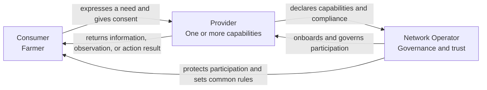
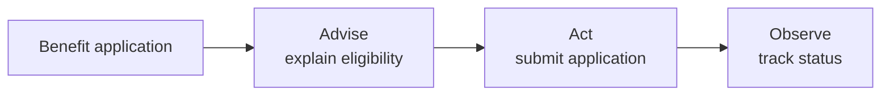
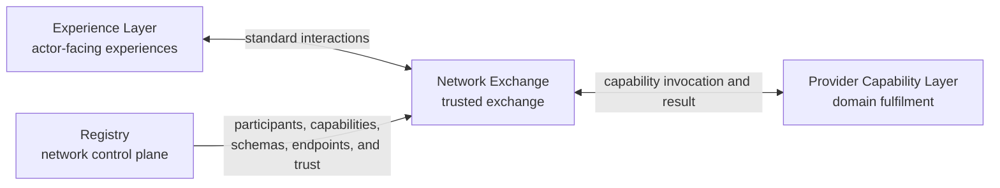

# OpenAgriNet architecture

Status: Accepted foundation, 2026-08-12

## The idea

OpenAgriNet is an ecosystem in which a Consumer seeks an agricultural outcome, a Provider supplies a capability that can satisfy it, and a Network Operator establishes the rules under which they participate. These are the three actor roles used to derive the architecture.

The architecture will not use a network-of-networks model as its starting point. Knowledge, livestock, mandi, weather, schemes, and similar domains are Provider capabilities, not separate actor types. Consumer-to-Provider outcomes use three composable interaction types: Advise, Observe, and Act. The trigger, completion pattern, channel, and representation are independent of the interaction type. Experience Layer, Network Exchange, and Provider Capability Layer separate actor experience, trusted exchange, and domain fulfilment. Provider publishing and Network Operator governance remain separate lifecycle interactions.

## Who does what

### Consumer

The Consumer is the farmer who seeks information, an observation, or an action from the ecosystem.

**Does:** Expresses a need, supplies the context and consent needed to fulfil it, and receives the result.

**Never does:** Manages provider registration, network governance, schemas, or ecosystem policy.

**Assumes:** The ecosystem protects the farmer's identity and context, makes available capabilities understandable, and returns results with enough provenance and status to be trusted.

### Provider

The Provider supplies one or more agricultural capabilities. A knowledge organisation, livestock service, mandi service, weather service, scheme service, or grievance service is a Provider with a different declared capability.

**Does:** Declares its capabilities, accepts compatible requests, supplies information or performs actions, and remains accountable for its results.

**Never does:** Sets rules for the whole ecosystem or gains access to a Consumer beyond the context and consent required for an interaction.

**Assumes:** The Network Operator publishes stable participation rules, schemas, and trust requirements, and the ecosystem can route eligible Consumer needs to the Provider's declared capabilities.

### Network Operator

The Network Operator governs participation in OpenAgriNet. It defines the common rules, schemas, trust requirements, and onboarding processes for Consumers and Providers.

**Does:** Establishes governance, approves or suspends participation, manages common schemas and policies, and provides the shared mechanisms needed for trusted interaction.

**Never does:** Becomes the source of provider information, performs a Provider's domain service, or owns a Consumer's agricultural decision.

**Assumes:** Consumers and Providers comply with the rules for their role, and governance decisions can be enforced and audited through shared platform mechanisms.

## Actor relationships

The roles describe responsibility, not organisation boundaries. One organisation may play more than one role, but it must act under the contract and permissions of one role in each interaction.

## Interaction model

An interaction type describes the outcome a Consumer expects from a Provider. It does not prescribe who initiates the interaction, how long it takes, or whether the Consumer uses a phone, web application, mobile application, or messaging channel.

### Domain interaction types

| Type    | Does                                                               | Never does                                  | Examples                                                                          |
| ------- | ------------------------------------------------------------------ | ------------------------------------------- | --------------------------------------------------------------------------------- |
| Advise  | Explains, guides, or recommends                                    | Changes an external or Consumer-owned state | Scheme information, crop advisory, livestock guidance, frequently asked questions |
| Observe | Retrieves or derives current, external, or Consumer-specific state | Changes the state it observes               | Weather, mandi price, milk records, application status, pest diagnosis            |
| Act     | Creates, updates, submits, books, transacts, or escalates          | Treats acceptance as proof of completion    | Apply for a benefit, book a service, raise a grievance, update a crop profile     |

A use case may compose more than one type. The architecture must preserve the boundary between the steps even when the Consumer experiences them as one conversation.

For example, a benefit application may Advise on eligibility, Act to submit the application, and Observe its status. A pest flow may Observe a crop image and then Advise on treatment. A market flow may Observe prices before the Consumer chooses to Act.

### Trigger modes

| Trigger | Starts when | Example |
|---|---|---|
| Request-driven | A Consumer asks or submits something | A farmer asks for today's weather |
| Event-driven | A Provider or platform event occurs | A severe-weather condition is detected |
| Scheduled | A configured time or calendar condition occurs | An irrigation reminder becomes due |

### Completion patterns

| Pattern | How the result arrives | Example |
|---|---|---|
| Immediate response | The result returns in the same exchange | Scheme information in web chat |
| Stream | The result arrives progressively in an open session | Voice during a phone call |
| Callback | The result is sent later to an agreed endpoint or session | Eligibility processing completes after the web request |
| Poll | The Consumer asks for the result using an interaction identifier | Application status tracking |
| Push | The result is sent without an open Consumer request | Weather alert or repayment reminder |

A notification is not a domain interaction type. It combines an event-driven or scheduled trigger, a push completion pattern, and a permitted channel.

### Channels and representations

| Channel            | Typical representations                    |
| ------------------ | ------------------------------------------ |
| Phone call         | Voice                                      |
| Web chat           | Text, cards, links, or audio               |
| Mobile application | Text, voice, cards, or device notification |
| Messaging          | Short text, links, or interactive messages |

The same Advise, Observe, or Act contract may be exposed through several channels. Channel adapters translate input and output representations but do not redefine the domain outcome.

### Supporting lifecycle interactions

Provider publishing, participant onboarding, governance, and platform operations support the domain interactions but are not Consumer-to-Provider interaction types. They will be specified as separate flows because they have different actors, authority, and operational obligations.

## Layered architecture

The three layers are logical ownership boundaries, not mandatory deployment units. Each layer owns one transformation and state of one kind.

### Experience Layer

The Experience Layer serves Consumer, Provider, and Network Operator experiences. Examples include farmer channels, a Provider publishing workbench, and a Network Operator governance console.

**Does:** Converts actor intent and information into standard interactions, presents results, and owns channel or user-interface session state.

**Never does:** Selects an unregistered Provider, routes around the Network Exchange, or executes Provider domain logic.

**Assumes:** Network and Provider functions expose stable contracts that do not depend on a particular channel or user interface.

### Network Exchange

The Network Exchange is operated by the Network Operator. The Registry is its control plane and records governed participants, capabilities, schemas, endpoints, keys, and participation status.

**Does:** Validates, discovers, routes, correlates, and delivers standard interactions and Provider events under network policy.

**Never does:** Interprets raw conversations, produces a Provider result, translates arbitrary Provider-native data, or owns authoritative Provider state.

**Assumes:** Experiences send valid standard interactions and Providers implement the capabilities and schemas they declare.

### Provider Capability Layer

The Provider Capability Layer fulfils declared Advise, Observe, and Act capabilities against authoritative Provider systems. A Knowledge Provider implements both publishing and retrieval here. Publishing reaches the Network Exchange only to register governed capability and catalog metadata; Provider documents, approved content, and retrieval projections remain inside the Provider boundary.

**Does:** Implements the standard capability contract, applies domain rules, owns domain workflow, and returns accountable results, status, events, provenance, and receipts.

**Never does:** Defines network governance, selects other Providers, or owns actor-facing channel presentation.

**Assumes:** The Network Exchange routes only eligible interactions and supplies the identity, context, and consent required by the declared capability.

A Provider may operate this layer itself or use a managed implementation. Physical hosting does not move domain responsibility or authoritative state into the Network Exchange.

| Layer | State it owns |
|---|---|
| Experience Layer | User-interface, channel, and conversation state |
| Network Exchange | Routing, delivery, and correlation state |
| Provider Capability Layer | Domain workflow and authoritative domain state |

## Locked decisions

- OpenAgriNet has three ecosystem actor roles: Consumer, Provider, and Network Operator.
- The Consumer is the farmer.
- Agricultural domains are capabilities of a Provider, not new actor types.
- The Network Operator governs the ecosystem but does not replace Providers.
- A network-of-networks model is outside this architecture's starting scope.
- Advise, Observe, and Act are the three composable Consumer-to-Provider interaction types.
- Trigger mode, completion pattern, channel, and representation are independent dimensions of an interaction.
- A notification is an event-driven or scheduled push, not a fourth domain interaction type.
- Publishing, onboarding, governance, and operations are supporting lifecycle interactions.
- OpenAgriNet has three logical ownership layers: Experience Layer, Network Exchange, and Provider Capability Layer.
- Experience Layer serves actor-facing experiences for Consumers, Providers, and the Network Operator.
- The Registry is the control plane for the Network Exchange.
- A Provider protocol adapter is internal to the Provider Capability Layer, even when offered as a managed implementation.

## Open items

| Item | Why it matters | Owner and tradeoff |
|---|---|---|
| Define the interaction contracts | The accepted types still need request, result, error, identity, consent, and status contracts | Architecture. One common envelope improves interoperability; type-specific contracts make boundaries clearer |
| Define the Provider capability model | Providers need a consistent way to declare Advise, Observe, and Act capabilities | Architecture and domain owners. A general model improves extensibility; a detailed model improves validation |
| Define the Registry information model and identity boundaries | Registry placement is accepted, but the records and separation between participant trust, Consumer identity, and consent remain open | Architecture and governance. One model simplifies administration; strict identity boundaries reduce data concentration and inappropriate access |
