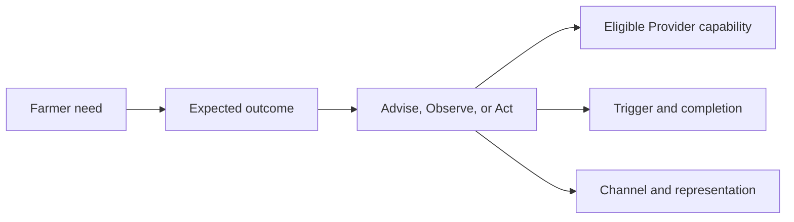
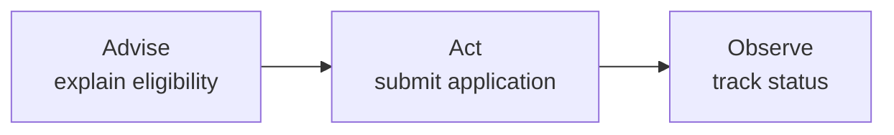
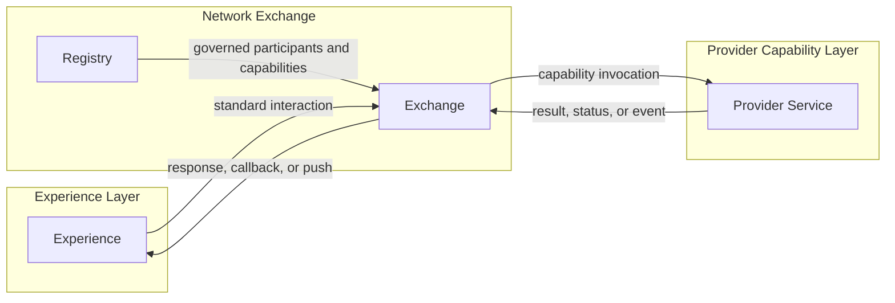
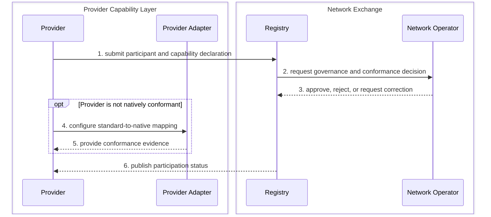
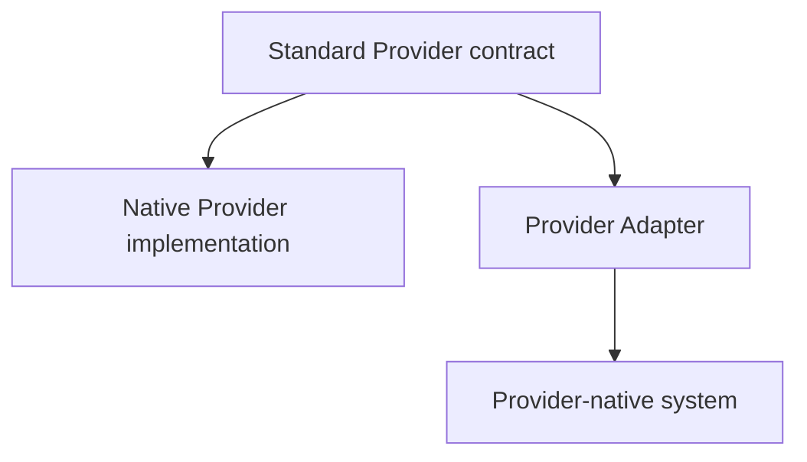
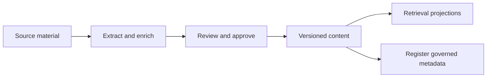

# Understanding OpenAgriNet architecture

Status: Proposed for review

## The idea

OpenAgriNet connects a farmer who needs an outcome with a Provider that can supply it, under rules established by a Network Operator. The architecture begins with these three roles and with the outcome being requested. It does not begin with existing applications, pipelines, AI models, or deployment boundaries.

This guide explains how that starting point leads to the proposed interaction model, layers, building blocks, and information boundaries. It is a companion to the normative [OpenAgriNet architecture](PROPOSED_ARCHITECTURE.md). It helps a reader understand the proposal; it does not define APIs, schemas, or conformance rules.

## Start with the agricultural outcome

A farmer may ask for information, inspect current state, or request a change. The same channel may support all three, but they create different obligations for the Provider.

| Farmer need | Expected outcome | Interaction type |
|---|---|---|
| “Which scheme applies to me?” | An explanation or recommendation | Advise |
| “What is today's mandi price?” | Current external state | Observe |
| “Book an artificial insemination visit” | A new booking in a Provider system | Act |
| “Where is my application?” | Current state of an earlier action | Observe |

The architecture therefore separates the meaning of an interaction from how it is triggered, completed, or presented.

## Who participates

| Actor | Job in the ecosystem | Example |
|---|---|---|
| Consumer | Seeks an agricultural outcome and supplies the required context and consent | A farmer using chat or telephony |
| Provider | Declares and fulfils an agricultural capability and remains accountable for the result | A knowledge, weather, mandi, livestock, scheme, booking, or credit Provider |
| Network Operator | Governs participation and the common rules for trusted exchange | The organisation operating the Registry and Exchange |

An agricultural domain is not a new actor. Knowledge and weather are different Provider capabilities, not different ecosystem roles.

One organisation may play more than one role. For example, a Network Operator may also operate a Knowledge Provider. The organisation then has two responsibilities: it governs the network as Network Operator and fulfils knowledge interactions as Provider. Co-hosting does not merge the roles, contracts, state, or accountability.

## A Provider exposes multiple capabilities

A Provider exposes a portfolio of capabilities. Advise, Observe, and Act describe the kinds of outcomes present in that portfolio; they do not label the Provider as a whole.

The current use cases produce this illustrative view:

| Provider | Capabilities represented | Advise | Observe | Act |
|---|---|:---:|:---:|:---:|
| Knowledge Provider | Scheme information, crop advisory, and frequently asked questions | Yes | No | No |
| Mandi Provider | Mandi prices, market intelligence, and market transactions | Yes | Yes | Yes |
| Weather Provider | Forecasts, historical weather, and climate advisory | Yes | Yes | No |
| Livestock Provider | Cattle advisory, milk-pouring data, and service booking | Yes | Yes | Yes |
| Scheme Provider | Eligibility guidance, benefit status, and applications | Yes | Yes | Yes |
| Credit Provider | Credit guidance and loan application | Yes | No | Yes |
| Grievance Provider | Grievance status, creation, and escalation | No | Yes | Yes |

“Yes” means that at least one capability in the Provider's portfolio supports that interaction type. It does not mean that every capability, or one combined operation, supports all three. “No” means that the current use cases do not demonstrate that interaction type; it is not a permanent restriction.

Knowledge ingestion, validation, translation, and publishing belong to the Knowledge Provider lifecycle. They are not Consumer-facing Advise, Observe, or Act interactions.

A single farmer journey may also combine capabilities. For example, a sowing recommendation can Observe weather and mandi prices before a Provider returns Advise. The normative architecture defines how capabilities are declared, governed, discovered, and fulfilled.

## How interactions are classified

### Domain interaction type

| Type | Provider obligation | What it does not imply |
|---|---|---|
| Advise | Explain, guide, or recommend without changing external state | That the Consumer followed the advice |
| Observe | Retrieve or derive current, external, or Consumer-specific state without changing it | That the observed state belongs to the Exchange |
| Act | Create or change state and report its authoritative progress or outcome | That accepting the request proves completion |

A journey may compose several interaction types. Each step keeps its own status and authority even when the farmer experiences one conversation.

### Trigger, completion, and channel

The interaction type is only one dimension. Three other choices describe how it runs.

| Dimension | Options | Example |
|---|---|---|
| Trigger | Request, event, schedule | A farmer asks for weather; a severe-weather event occurs; a farm-calendar reminder becomes due |
| Completion | Immediate response, stream, callback, poll, push | A chat response, live voice, a later booking callback, status polling, or a notification |
| Channel and representation | App, web, phone, messaging; text, voice, cards, media | The same advisory returned as text in chat or voice during a call |

A notification is not another domain interaction type. It is an Advise, Observe, or Act-related outcome delivered through an event-driven or scheduled push.

## How the architecture follows from the roles

The proposal separates three logical ownership layers.

| Layer | Question it answers | State it owns |
|---|---|---|
| Experience Layer | How does an actor express intent and receive progress or results? | Channel, presentation, session, and conversation state |
| Network Exchange | Which governed Provider can fulfil the interaction, and how is it delivered? | Participation, routing, correlation, and delivery state |
| Provider Capability Layer | How is the agricultural outcome fulfilled? | Domain workflow and authoritative domain state |

Within these layers are four stable building blocks.

The Registry belongs inside the Network Exchange layer. Discovery is an Exchange capability that uses governed Registry information. Knowledge is a Provider Service, even when the Network Operator hosts it.

## How representative use cases fit

### Weather observation

A farmer asks for village-level weather in a preferred language.

1. Experience captures the request, language, location, and permitted context.
2. Exchange validates the interaction and discovers an eligible weather capability using Registry information.
3. The Weather Provider returns the authoritative observation and its provenance.
4. Exchange delivers the result.
5. Experience presents it in the farmer's channel and language.

The weather record remains Provider state. The preferred language and conversation remain Experience state. Routing and delivery evidence remain Exchange state.

### Crop recommendation

A crop recommendation may first Observe weather, soil, location, and market conditions, then Advise what and when to sow. The Experience may make this feel like one answer, but the Provider result must preserve the evidence used and the distinction between observation and recommendation.

### Booking or benefit application

A booking or application is an Act. If the Provider accepts it for later processing, acceptance creates a durable obligation. The Exchange records delivery and correlation, while the Provider owns the booking or application workflow and its authoritative status. A later status check is an Observe interaction.

### Alert or reminder

A weather alert, scheme deadline, or repayment reminder begins with an event or schedule and completes through push. The Provider owns the event or schedule that justifies the message. The Exchange owns delivery attempts and delivery status. Experience renders it through an allowed channel. Consent and preference must be verified before delivery.

### Feedback and analytics

A farmer rating or comment is an Act because it creates a feedback record in the accountable Provider Service. An operator dashboard then Observes an analytical projection of those records, such as recurring issues or sentiment. The analytical store may aggregate feedback for reporting, but it does not replace the authoritative feedback records or become another business layer.

## Provider onboarding is a lifecycle flow

Provider onboarding happens before the Provider is eligible for runtime interactions. It is not an Advise, Observe, or Act interaction with a farmer.

The capability declaration needs to say enough for the network to decide eligibility and route compatible interactions. The later Registry and Provider capability specifications will define its exact fields.

At architecture level, it includes:

- Provider and role identity
- Capability identity and description
- Supported Advise, Observe, or Act interactions
- Supported schema profiles and versions
- Endpoint and trust information
- Supported trigger and completion patterns
- Policy, consent, and data requirements
- Conformance evidence
- Operational contact and evidence expectations
- Participation lifecycle status

## Native and adapted Providers

A Provider has three implementation choices. The responsibility stays on the Provider side in every choice.

| Option                    | Who runs it                                                    | What the Exchange sees              |
| ------------------------- | -------------------------------------------------------------- | ----------------------------------- |
| Native Provider interface | Provider                                                       | The standard Provider contract      |
| Provider-operated adapter | Provider                                                       | The same standard Provider contract |
| Managed adapter           | Network Operator or another operator on behalf of the Provider | The same standard Provider contract |

The Experience does not learn Provider-native interfaces. The Exchange does not carry Provider-specific mapping logic. A managed adapter may run in Network Operator infrastructure, but logically it remains part of the Provider Capability Layer.

## Knowledge has publishing and retrieval flows

A Knowledge Provider supports two distinct lifecycles.

### Publishing

Publishing turns source material into approved, versioned Provider content. It may use extraction, OCR, translation, review, enrichment, chunking, and embedding tools. These are capabilities of the Knowledge Provider, not Network Exchange components.

The Registry receives capability or catalog metadata needed for governance and discovery. It does not become the store for documents, passages, embeddings, or generated answers.

### Retrieval

Retrieval is runtime fulfilment of an Advise or Observe interaction. The Knowledge Provider retrieves approved content, applies its domain and safety rules, and returns a result with provenance. The Exchange routes and delivers that result without becoming its authority.

## Where AI, tools, and skills fit

AI is not another layer. A tool belongs to the building block whose outcome it changes.

| AI or tool use | Accountable building block |
|---|---|
| Speech recognition, language detection, response rendering, persona, and conversation assistance | Experience |
| Assisted capability matching or anomaly detection | Exchange or Operations, advisory only |
| PDF extraction, OCR, source translation, retrieval, reranking, and answer generation | Knowledge Provider Service |
| Pest diagnosis, recommendation, or domain inference | Relevant Provider Service |
| Participation approval and policy enforcement | Registry and Network Operator governance; AI may assist but does not become the authority |

An AI tool does not receive authority merely because it produced an output. Its accountable building block must define permitted data, output contract, evaluation, provenance, fallback, human escalation, safety checks, and operational evidence.

## How information authority stays clear

The reading rule is simple: Experience owns presentation and conversation state, the Exchange owns network delivery state, the Registry owns accepted participation records, and each Provider owns its domain result and workflow. Copies made for routing, presentation, search, or reporting do not become authoritative. The architecture document defines the complete information model, authority allocation, and unresolved authority questions.

## How observability fits

Each building block exposes evidence about the outcome it owns. Network-level operational tooling correlates that evidence for dashboards, alerts, diagnosis, audit, and reconciliation without becoming the authority for Registry or Provider state. The architecture document defines the required operational evidence and privacy boundaries.

## How the documents fit together

This guide explains the proposal. The documentation set should separate explanation, normative decisions, implementation contracts, conformance, and operations.

| Document | Reader question | Status |
|---|---|---|
| Understanding OpenAgriNet architecture | Why is the architecture shaped this way, and how do common use cases fit? | This guide, proposed for review |
| OpenAgriNet architecture | What roles, boundaries, authorities, and architecture decisions are proposed? | Proposed to be reviewed with DC |
| Provider participation guide | How does a Provider declare capabilities, onboard, adapt its systems, and become eligible? | To be written after onboarding contracts stabilize |
| Interaction patterns guide | How do immediate, streaming, callback, poll, push, composite, and failure flows work? | To be written from the representative flows |
| Information model specification | What concepts, identifiers, lifecycles, relationships, and schemas are normative? | Pending architecture approval |
| Interface and contract specifications | What exact APIs, events, errors, versions, and compatibility rules must implementations follow? | Pending architecture approval |
| Conformance specifications | How is a Provider, capability, adapter, or extension proven compatible? | Pending contract specifications |
| Operations and deployment guides | How is the ecosystem deployed, monitored, diagnosed, reconciled, and supported? | Pending operational and allocation design |

The Provider participation guide should eventually be the practical entry point for a new Provider. It should use the architecture concepts but focus on the onboarding sequence, capability declaration, native and adapted options, conformance evidence, activation, change, suspension, and withdrawal.

## How to review this guide

Review this guide for whether the reasoning is understandable, the use cases fit the interaction model, and the examples make the proposed architecture easier to discuss. Review the architecture document for the proposed decisions, requirements, component boundaries, information model, and pending architecture work.

## Open items

| Item | Why it matters | Owner and tradeoff |
|---|---|---|
| Confirm the guide's terminology with DC | The explainer and normative architecture must use the same words | Architecture and DC. Simpler terms improve comprehension; normative terms improve precision |
| Define the Provider participation guide boundary | The guide must be useful without duplicating Registry, capability, and conformance specifications | Architecture and Provider onboarding owners. More detail helps onboarding; duplication creates drift |
| Select the representative flows for the interaction patterns guide | The flow set must cover the use cases without becoming one diagram per use case | Architecture and domain owners. Fewer patterns simplify learning; more patterns expose edge cases |
